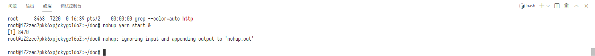
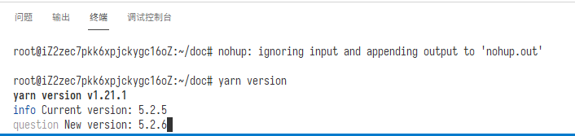

# CloudPSS 文档

本项目为 CloudPSS 文档系统及文档内容。

Master 分支预览地址：<https://cloudpss.github.io/Docs/>  
最新标签版本地址：<https://latest.docs.cloudpss.net/>  
文档地址：<https://docs.cloudpss.net/>

## 编辑指南

编辑时，请参考 <https://docs.cloudpss.net/meta-docs> 内容进行编写。

## 内网操作指南

本项目在内网部署了在线编辑 <https://docs-internal.cloudpss.net/> 和预览 <http://docs-internal.cloudpss.net:4000/> 服务。

### 启动预览服务

如访问预览服务地址无法打开，一般是因为预览服务未正常运行导致的。使用以下命令启动预览服务。

```sh
nohup pnpm start &
```



#### 更新文件列表

当文档的文件结构发生变化（增加、删除或移动 MarkDown 文件）时，需要运行以下命令更新文件列表。

```sh
pnpm build-manifest
```

### 编辑与提交

使用在线编辑服务可以对文档进行编辑并实时预览编辑结果。当编辑完成一个阶段后，按以下流程提交更改：


1. 切换到“源代码管理”页面
2. 选择需要提交的文件，点击“＋”（暂存更改）将其添加到暂存区，或点击“更改”一行右侧的“＋”（暂存所有更改）以将所有更改添加至暂存区。
   注：选中文件可在右侧查看更改的内容
3. 输入提交消息，格式为 `<type>: <message>`，如 `docs: 添加xxx元件文档`。对于文档更新，`<type>` 一般为 `docs`；`<message>`可依据更改内容自行编写。
4. 点击“✔”（提交）按钮提交更改。
5. 点击“🔄”（同步更改）按钮将更改内容推送至云端。

### 发布

当需要发布新新版本时，按以下流程操作：

1. 操作之前，确保所有需要发布的内容已经正确提交。
2. 运行以下命令，输入发布的版本号。包含 `-` 的版本（如 `5.0.0-alpha.1`、`5.0.0-rc.2`）将视为预览版本，将发布至 <https://latest.docs.cloudpss.net/>，其他版本将发布至 <https://docs.cloudpss.net/>
   ```sh
   yarn version
   ```
   
3. 点击“🔄”（同步更改）按钮将更改内容推送至云端。
4. 在 <https://github.com/CloudPSS/Docs/actions> 检查发布状态
