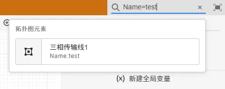

## SimStudio 更新至 v3.5.0 版本

1. SimStudio 接入了全新任务管理服务和消息流服务：

   1. SimStudio 中的计算功能支持从 FuncStudio 动态读取可用的计算方案列表；

   2. 支持读取任务管理服务设置的任务策略，支持选择计算节点、计算资源和任务优先级

   3. 支持从消息流服务读取任务输出，支持断点续传功能，用户运行计算任务后，可关闭当前页面，在后续打开时再次接收和查看结果。

2. 添加了线形元件支持，可以将两端口元件转换为连接线形式。支持设置线条路由类型（无/正交）、连接类型（无/平滑/圆角）属性

   

3. 在“实现”页面的“图纸选项”中，新增开启/关闭“引脚标签”显示选项。

   

4. 更新了结果页面的显示功能和性能：

   1. 重构计算结果展示页面，优化了图形渲染性能；

   2. 新增对复杂样式设置的支持；

   3. 添加了多标签页功能，支持在计算结果展示页面显示拓扑标签页，支持在拓扑标签页中搜索和定位元件；

   4. 多标签容器支持垂直标签布局；

   5. 添加树形容器；

   6. 新增对更多类型绘图接口的支持；

   7. 新增将表格类结果导出为 CSV 文件的功能；

   8. 新增将结果整体导出为 ZIP 文件的功能（见结果页面右上角“…”按钮）；

      

5. 在“运行”页面的计算结果页面支持在新窗口中打开（见结果页面右上角“…”按钮）。

   

6. 优化了“打开”对话框的性能；

7. 搜索功能更新，新增 `<参数名/引脚名>=<keywords>` 语法，支持对特定参数、特定连接关系的元件和值进行搜索定位。

   

8. 优化错误检查性能，修复错误过多时无法显示的问题。

9. 支持打开历史运行结果及拓扑快照的功能；在打开的快照中，可以获取当次运行结果及其对应的算例拓扑、参数。

   

10. 优化了选择、多选控件在选项过多时的性能。

11. 元件库的“模块-基础”分组新增“模块虚拟端口”元件，为封装后的模块提供虚拟端口。

## 用户中心更新至 v3.5.0 版本

1. 管理员账户新增任务管理、节点管理、策略管理功能。

2. 修复界面显示 app 数据无过滤的问题。

3.  修复 cloudpss-doc 未安装时导致搜索结果失效的问题。

## CloudPSS SDK 更新至 v3.1.0 版本

1. `Runner` 类添加 `terminate` 方法，用以结束当前运行的任务。

2. `cloudpss` 命名空间下新加 `currentJob`，用以获取当前的 `FunctionExecution` 实例

3. `cloudpss.function` 新增 `FunctionExecution` 类，代替原 `Job` 类，优化了 `FunctionExecution` 类中方法名称，使之更符合规范。以下是 `FunctionExecution` 类与原 `Job` 类之间的对应变化关系。原 `Job` 类将在未来版本停止兼容。

  

## CloudPSS 官方计算功能更新

1. 潮流计算内核新增“生成潮流文件”功能，可基于 CloudPSS 算例生成 IEEE 格式的潮流计算文件。

   

2. 电磁暂态仿真官方元件库新增元件24个，包括频率相关架空线、频率相关地缆线、频率相关等值网络、多维RLC元件、励磁设备电压补偿环节 GVCOMPEN、BPA励磁控制器FM\~FT卡、BPA励磁控制器FU\~FV卡、基于注入谐波源的扫频模块、双端LCC直流模型、单极双端LCC直流模型、直驱风场等值模型、含外部控制的直驱风场等值模型、双馈风场等值模型、含外部控制的双馈风场等值模型、含外部控制的光伏模型、MMC直流单端模块、MMC半桥子模块、阶梯函数发生器、多维常量输入、多维单步长延时模块、多维代数解环点、数据提取模块、状态空间方程模型、事件日志元件。

3. 其他

   1. 修复了变压器电磁暂态仿真模型中分接头切换导致的数值问题。

   2. 对三相可控静态负载元件新增了部分参数及状态监测。

   3. 对三相断路器元件新增了部分参数及状态监测。
