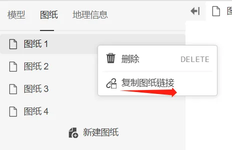
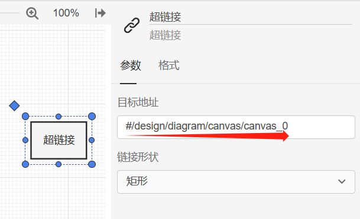
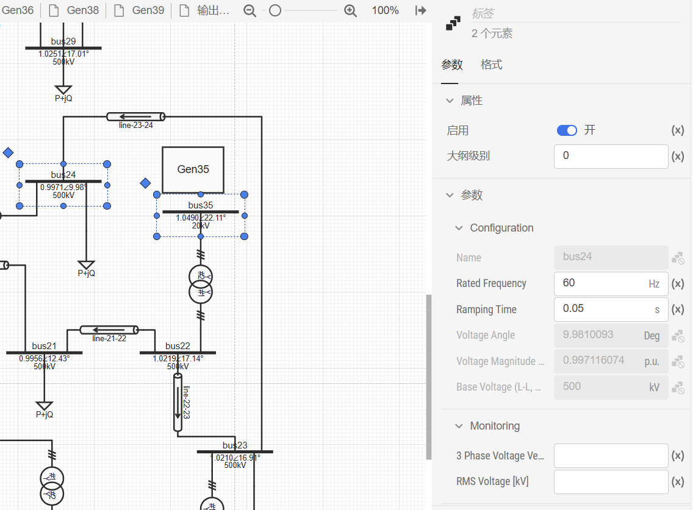
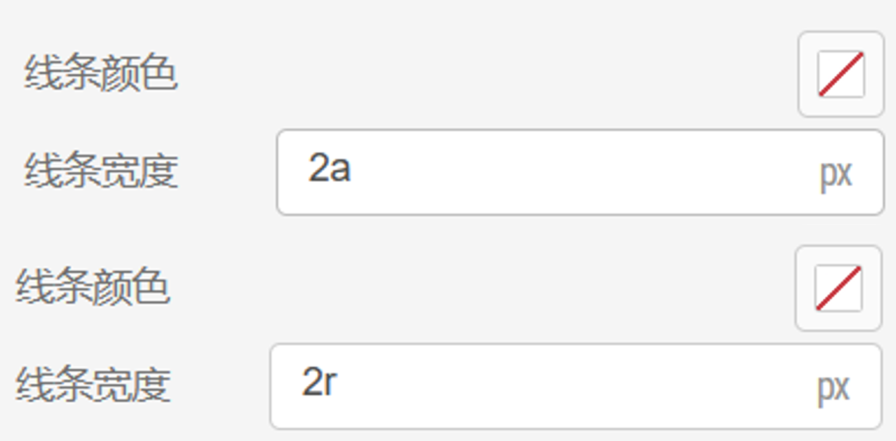
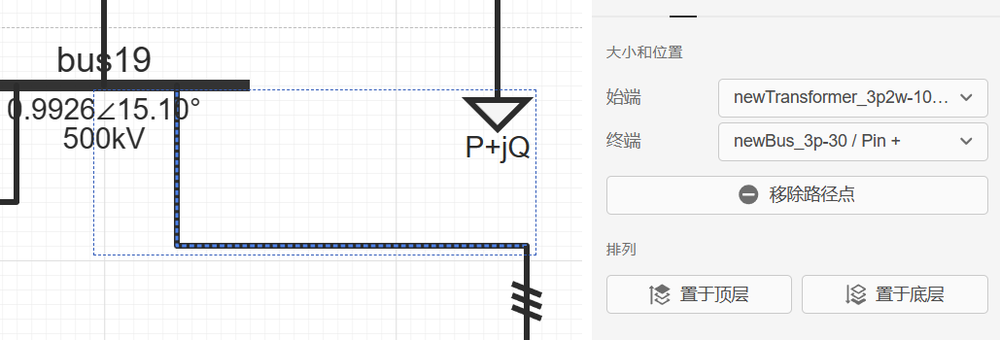
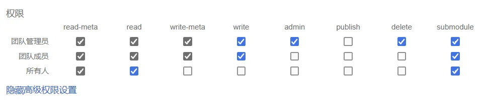
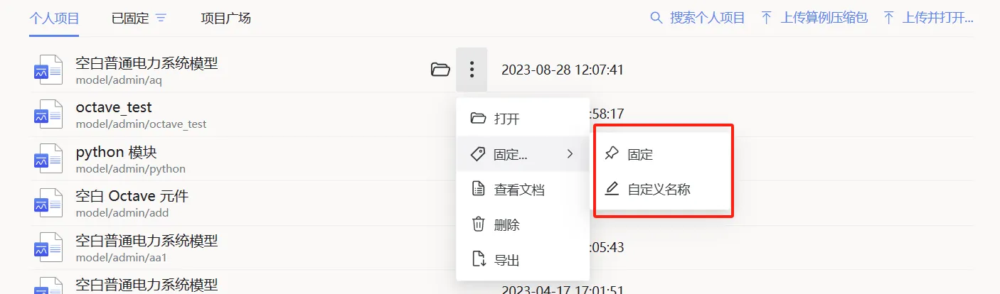

## SimStudio 更新至 v4.0.0 版本

1. SimStudio 工作台支持通过后台 `modify` 消息删除元件

2. 添加“复制图纸链接”功能（鼠标右键单击弹出功能按钮），可复制至‘超链接’元件的目标地址，形成图纸超链接

   

   

3. SimStudio 工作台中的元件现支持多选编辑
   
   1. 多选后，可统一设置所选元件的‘启用’、‘大纲级别’属性
   2. 多选后，不同元件中，值相同的参数可统一快速编辑
   
   

4. SimStudio 缩放功能优化
   
   1. 优化了图形缩放的性能，最小缩放级别现调整为 0.1%
   2. 添加了元件“大纲级别”选项
   3. 添加了响应缩放的像素相对单位“apx”和“rpx”（默认为“px”），用于设置线宽、字体大小在缩放中的不同效果：其中以“px”为单位的尺寸不随缩放变化，以“apx”为单位的尺寸在缩放中始终保持大小不变，“rpx”为单位的尺寸会随缩放比例动态调整尺寸大小
   
      

5. 元件的“格式面板”中添加了字体和字号的设置功能，单位为‘px’、‘apx’ 或‘rpx’

6. 在“实现”页面的“图纸选项”中，新增开启/关闭“页面分割线”显示选项

7. 在“实现”页面的“图纸选项”中，新增“默认拖拽画布功能” 开启/关闭选项，用于控制与画布的交互方式：若关闭此选项（默认关闭），则默认鼠标拖动可进行移动元件、连线等操作，需按下 <kbd>Ctrl</kbd> 键进行画布拖动操作；若开启此选项，则默认鼠标拖动为拖动画布操作，按下 <kbd>Ctrl</kbd> 键拖动鼠标可进行移动元件、连线等操作。用户可根据操作习惯进行切换

8. 连接线、线型元件现可通过“格式面板“中的“始端”和“终端”下拉框设置连接关系
   

## FuncStudio 更新至 v4.0.0 版本

1. 在 FuncStudio 内的表达式中使用全局参数现在需要添加 `$` 前缀
   
## AppStudio 更新至 v4.0.0 版本

1. 优化了 AppStudio 应用发布功能，现点击“发布”按钮可直接生成应用短链接
   
## 用户中心更新至 v4.0.0 版本

1. CloudPSS 4.0 权限系统升级，细化资源权限，实现资源组织内分享、协助项目
   1. 新增“组织”功能，可在“用户中心”->“设置”->“组织管理”页面进行组织创建、配置，允许用户创建自己的分享组，让资源在组织内分享
   2. SimStudio、FuncStudio 和 AppStudio 均接入了 CloudPSS 4.0 权限管理系统，在“总览”页面下的“高级权限设置”中支持团队共享项目的复杂权限配置
   
      

   3. 强化了 CloudPSS SDK Token 的权限管理，用户可在申请 Token 时配置 Token 可使用的功能权限；允许删除已申请的 Token
2. 优化了个人项目、项目广场中的“项目固定/收藏”功能，允许收藏夹自定义名称

   

1. 优化了项目广场的搜索功能，提升了搜索性能
2. 用户管理页面，增加了删除功能和批量上传用户功能 （仅支持独立部署的 CloudPSS 设备）
3. 新增了许可证管理功能，增加了产品许可信息和许可证失效提示（仅支持独立部署的 CloudPSS 设备）
4. 接入 CloudPSS 4.0 权限系统，支持“协作项目”及复杂权限设置

## CloudPSS 官方计算功能更新

1. 移除了 www.cloudpss.net 上的仿真间隔功能，不再限制连续两次仿真的时间间隔
2. 电磁暂态仿真内核添加基于 Python 的用户自定义元件支持（仅支持独立部署的 CloudPSS EMTLab 设备） 
3. 电磁暂态仿真内核现添加调试功能，方便用户自定义元件的单步调试（仅支持独立部署的 CloudPSS EMTLab 设备）
4. 添加了事件驱动仿真工具箱，其中包含事件驱动仿真元件库、事件驱动仿真 SDK（仅支持独立部署的 CloudPSS EMTLab 设备）
5. 开放了 CloudPSS 元件开发和上传接口（仅支持独立部署的 CloudPSS EMTLab 设备）

## 综合能源仿真规划平台 IESLab 升级至 v2.1 版本

1. 平台入口统一更换至用户中心，增加“IESLab 2 建模仿真”和“IESLab 2 规划设计”两项应用。IESLab 2.1 相关功能更新详见后续更新日志
   
## 其他
1. 优化平台数据加载性能，提高了平台响应速度
2. 优化平台资源管理，统一了资源权限配置方法