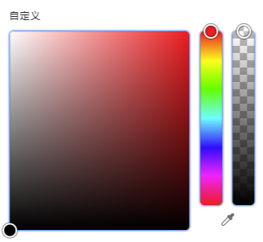
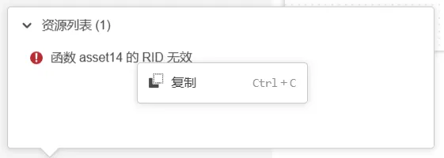
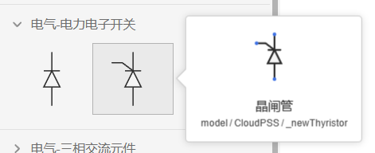
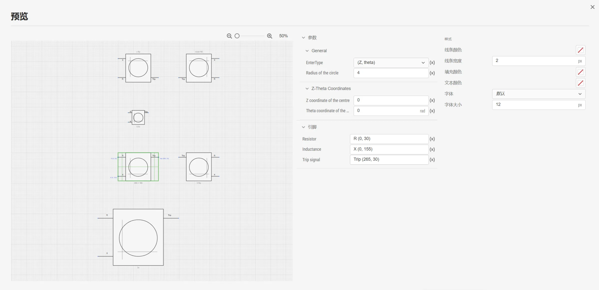
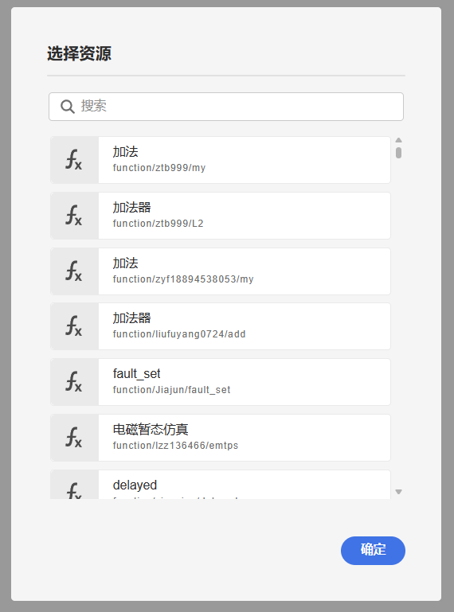

## XStudio 更新至 v4.3 版本

1. 公共更新
   1. 颜色选择控件支持透明度设置，添加了取色器功能
   
      

   2. 错误检查功能添加了右键菜单，支持复制错误消息

      
   
   3. 优化了打开对话框性能
   4. 优化了结果页面性能

2. SimStudio 更新
   1. SimStudio 元件库浮层添加元件 RID 展示功能，方便用户区分重名元件
   
      
   
   2. 优化了元件预览页面，支持设置样式，支持查看元件放大、缩小、翻转等多种状态
   
      

   3. 优化拓扑错误检查功能，支持了对线性元件的复杂校验

3. AppStudio 更新
   1. 优化了资源界面的函数配置功能，支持通过对话框搜索、选择函数
   
      

   2. 添加了图片控件和内嵌网页控件
   3. 预览界面改为非全屏显示

## CloudPSS DSLab 预览版发布

发布新型配电系统源网荷储协同仿真平台 DSLab 预览版，相关功能特性详见 CloudPSS 公众号。

## 用户中心更新至 v4.0.2 版本

1. 个人云空间新增协作项目选项卡，用于展示组织管理的资源
2. 高级搜索功能增加 `is:collaboration` 的语法支持
3. 个人中心增加 DSLab“源网荷储协同”应用，增加 DSLab 云空间页面，用于管理 DSLab 项目数据
4. 个人中心主页新闻内容更新