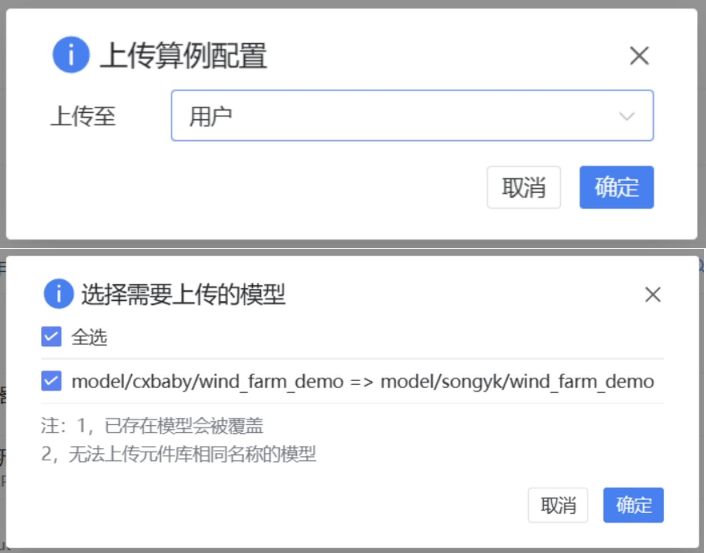

## XStudio 更新至 v4.3 版本

1. 公共更新
   1. 支持了资源文件加密功能
   2. 优化了接口编辑页面，添加了富文本预览提示，值支持使用表达式，添加编辑约束功能
   3. 修复了表格删除内容后填入无效空值的问题

2. SimStudio 更新
   1. 拓扑建模工作台升级 X6 版本，大幅优化了拓扑建模页面性能
   2. 移除了虚拟引脚前需要添加 `@` 或 `#` 的限制，4.3 版本后，虚拟引脚与一般控制引脚的用法统一
   
## 用户中心更新至 v4.0.3 版本

1. 云空间页面更新
   1. 云空间中，原“固定”功能修改为“收藏”功能
   2. 新增协作项目标签的下拉框，方便切换显示不同组织的协作项目
   3. 项目下拉选项增加“另存为模型”功能
   4. SimStudio 云空间新增“元件”、“模型”项目标签，方便用户在云空间的项目列表中快速区分项目类型
   5. 修改了部分界面文本修改，功能指示更清晰
   6. 修改了云空间页面项目数据拉取方式，优化了项目列表加载速度和使用体验
   
2. 搜索功能更新
   1. 新增了当前项目的前台检索功能，支持按日期和关键字进行检索
   2. 高级搜索功能增加 `owner:username` 的语法支持
   3. 搜索界面新增搜索历史，最多保存最近 10 次的搜索纪录

3. 导入、导出功能更新
   1. 修改了导入流程，“上传算例压缩包”、“上传并打开…”功能合并，支持从一个入口上传单一项目文件或者压缩包形式的项目文件，支持选择上传到个人或组织下，上传压缩包时可以选择是否对当前已有算例进行覆盖

      

   2. 修改了导出流程，导出增加资源审计，支持配置加密功能
   
      

   3. 导入功能支持读取加密和未加密的内容，根据配置要求输入密码或者拒绝上传请求
   4. 新增了在云空间页面导出资源、上传算例压缩包的进度通知

4. CloudPSS 客服系统修改为知你客服
5. 增加对新版本文档系统的搜索支持
6. 增加自定义证书管理功能
7. 整体页面修改，优化页面布局和高分辨率适配效果
