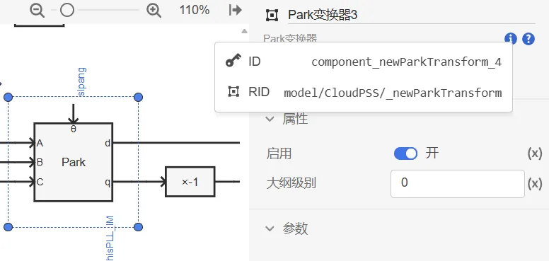

## XStudio 更新至 v4.4 版本

1. 公共更新
   1. 为 plot 结果类型添加 append_rotate、prepend_rotate 属性，支持通过轮转方式添加数据
   2. plot 结果类型支持对 xAxis、yAxis 设置其他属性，具体方法参考[Plotly文档](https://plotly.com/javascript/reference/layout/xaxis/)
   3. 上传加密文件输入密码错误时，支持重新输入密码

2. SimStudio 更新
   1. 修复拓扑页面元素复制粘贴导致连接关系错误的问题
   2. 选中元件时支持展示并复制元件的 ID 和 RID
   

3. AppStudio 更新
   1. 在场景和子舞台属性配置中添加“变量”选项，可用于向子舞台内传参、在子舞台不同场景间共享数据等用途。在场景内可使用表达式`<场景名>.<变量名>`引用，如`scene_1.variable_1`；在子舞台“变量”属性使用对象字面量定义变量，如 `{ variable_1: 1}`

## EMTLab 平台更新<!-- truncate -->

1. 添加了保护-基础元件库，包含直线继电器、圆形继电器、多边形继电器 3 类基础继电器元件
   
2. 添加了保护-模块元件库，包含电流保护、零序电流保护、距离保护、差动保护、零序电压保护、复压过流保护、母线差动保护、10kV 备自投、过压保护、低压保护、重合闸11类保护模块
   
3. 添加了辅助图形元件库，包含多边形、直线、圆形3类图形，支持在示波器中添加辅助图形显示
   
4. 添加了 X-Y 型输出通道及示波器，支持绘制二维 X-Y 波形图，如阻抗轨迹、变压器B-H曲线等
   
5. 电气-三相交流元件分组新增短路故障模块、接地变压器元件
   
6. 添加了110kV变电站一、二次系统模板案例

## DSLab 平台更新

1. 发布源网荷储协同仿真平台DSLab 2.0预览版，相关功能特性详见 CloudPSS 公众号

## IESLab 平台更新

1. 发布 IESLab 规划优化平台预览版，支持冷热电氢协同规划，相关功能特性详见 CloudPSS 公众号

## 用户中心更新至 v4.4 版

1. 个人中心主页典型案例更新，新增110kV变电站一、二次系统案例
   
2. 个人中心主页增加“IESLab 规划优化”平台入口，增加 IESLab 规划优化云空间页面，用于管理IESLab规划优化项目数据
   
3. 个人中心主页新闻更新，新增 2024 周年更新内容

## 发布 CloudPSS 知识库