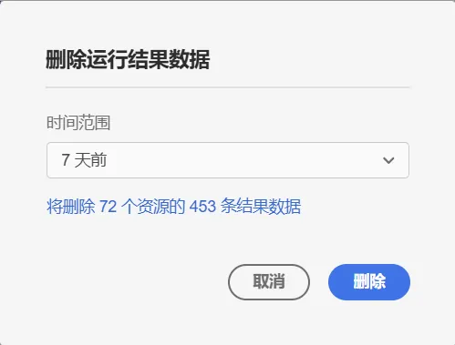
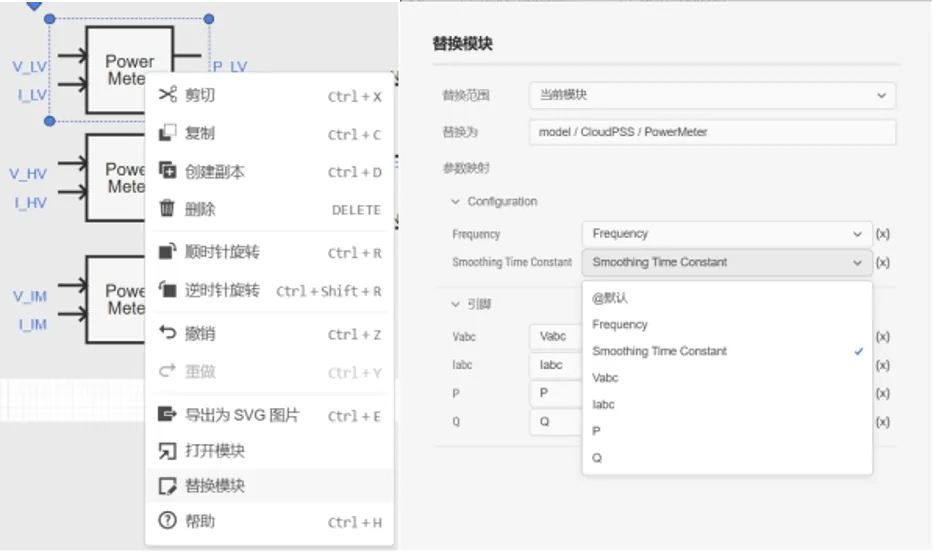
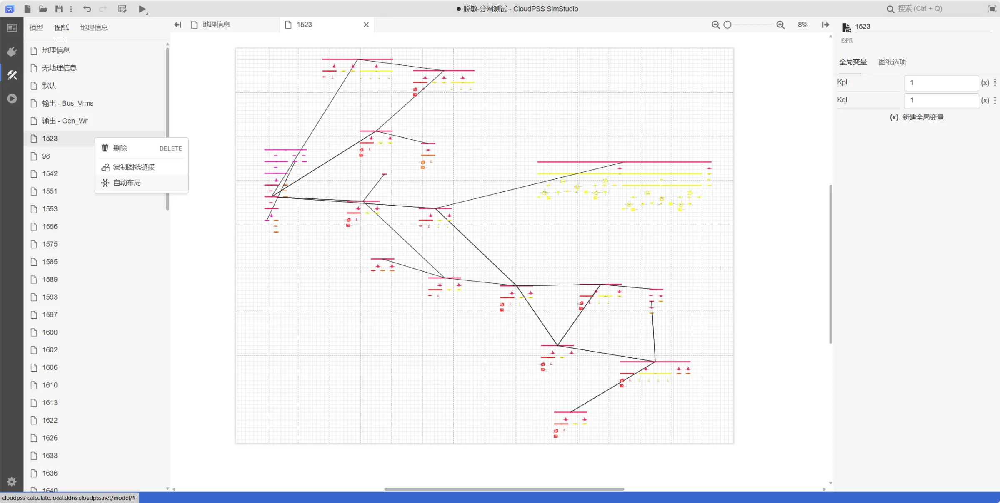
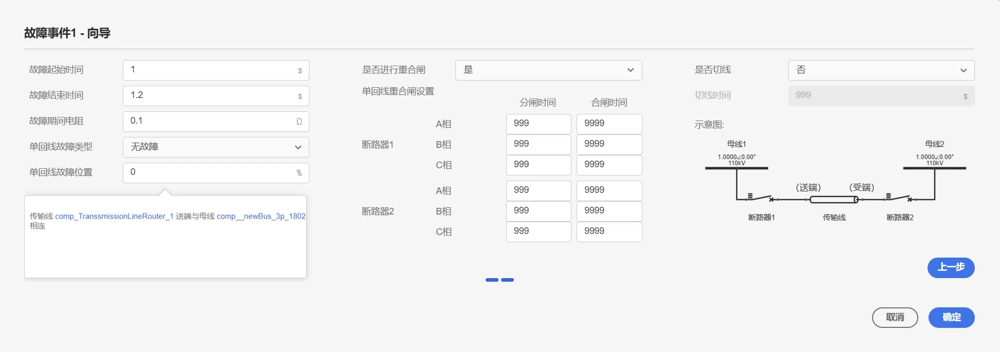

## XStudio 更新至 v4.5 版本

1. 公共更新
   1. 添加向导功能，支持通过向导配置 SimStudio 元件参数或 AppStudio 控件属性，降低复杂元件、控件参数的配置难度
   2. 添加 F2 快捷键，快速跳转到页面中选中元素的名称编辑框；未选中状态将跳转 SimStudio 图纸、AppStudio 场景名称编辑框
   3. 接入 Server Manager 通知脚本，在新版本的 Server Manager 中，系统新增了故障报警功能。当服务器发生异常或故障时，系统会实时捕捉错误信息并触发报警机制，确保用户能够第一时间收到故障通知。故障报警功能主要表现形式为应用内提示，用户可以手动关闭低级别的告警信息；高级别故障信息不可关闭，当且仅当故障消除才会消失。当前该新功能已应用于 XStudio、用户中心和 server manager。
   4. 在工作台状态栏添加“存储管理”功能，支持删除指定时间范围的运行结果数据
   
   

   5. 添加隐藏向导对话框功能，部分支持的对话框（如故障事件元件）可折叠至状态栏
   6. 优化打开版本未找到的提示
   7. 优化参数组浮窗提示内容
   8. 更新帮助连接，指向新版知识库
   

2. SimStudio 更新
   1. 电磁暂态实时仿真曲线查看器（Signal Monitor）嵌入 SimStudio 平台
   2. 为引脚/虚拟引脚的浮窗文档添加了引脚维数展示
   3. 优化了无合适运行方案时的错误提示
   4. 新增了“模块替换”功能，可通过配置参数映射逻辑，快速替换当前模型文件中的指定和元件/模块
   
   

   5. 优化了元件表性能，不再支持展示和编辑复杂类型参数
   6. 图纸新增了“自动布局”功能。该功能仅支持由 BPA 或 PSASP 转换的算例
   
   

   7. 添加了图纸拖动排序功能
   8. 优化拓扑图中的数字渲染，默认保留 6 位有效数字
   9. 优化拓扑页面多选时拖动的体验，多选元素时不再支持创建连接线
   10. 若干常规性问题修复及性能优化
   <!--  -->

3. FuncStudio 更新
   1. 添加输入流支持，被调用的函数可以从标准输入流 stdin 读取输入流数据

4. AppStudio 更新
   1. 添加资源时，改为使用菜单代替对话框
   2. 支持添加“模型”类型资源，支持 SimStudio 模型，使用方式与函数资源类似
   3. “函数”、“模型”资源的 start(...) 方法支持额外参数，用于控制所使用的参数方案、计算方案等
   4. 为“函数”、“模型”资源添加 send(data) 方法，支持向任务的输入流写入数据
   5. 为“函数”、“模型”资源添加 local(data) 方法，支持向任务的输出流写入数据
   6. 为“函数”、“模型”资源添加 abort(timeout) 方法，支持设置任务中止的超时参数
   7. 为“函数”、“模型”资源添加 emtp.recording 属性和 emtp.startRecording()、emtp.stopRecording() 方法，支持电磁暂态实时仿真录波功能
   8. 为“函数”资源添加自动运行功能，支持在满足指定条件时自动启动任务
   9. 为“按钮”和“操作按钮”控件添加“运行按钮”向导。拖入上述控件到场景后，点击右上角的向导按钮，即可弹出向导功能页面，支持对绑定的资源快速设置按钮的点击事件。特别地，针对电磁暂态实时仿真算例，支持绑定开始、停止、录波等功能
   10. 为“输入框”、“滑块”、“进度条”、“进度环”控件添加“实时仿真输入输出”向导，支持快速设置绑定实时仿真的输入输出
   11. 添加“示波器”控件，可绑定模型资源中的实时仿真输出通道，简化实时仿真输出配置
   12. 添加“录音器”、“音频播放器”控件，支持录制和播放音频，支持接入语音输入输出流
   13. 结束预览时，自动终止所有运行中的任务
   
## EMTLab 平台更新<!-- truncate -->

1. 新增基于自研清翼编译器（Tsing-E）的电磁暂态仿真内核，支持代码自动生成、编译及执行全流程，仿真效率进一步提升 3 倍（仅支持清翼版 CloudPSS MiniRT/CloudPSS ProRT）
   
2. 电磁暂态仿真实时仿真曲线查看器（Signal Monitor）更新至 v2.0 版本，支持在 SimStudio 运行结果页面监控实时仿真数据，包括输出配置、输入下发、录波等功能，详细功能介绍参见说明文档
   
3. 支持使用 AppStudio 快速构建自定义实时仿真监控应用
   
4. 新增对 ADPSS 二进制封装元件的导入支持
   
5. 新增安控模块库，包含故障事件、监视模块、判断模块和操作模块 4 类元件，可快速配置故障事件和安控策略
   
6. 新增故障事件配置向导。当用户将故障事件元件拖入图纸后，会自动触发向导流程，引导用户快速准确地完成复杂故障、切除设备、重合闸等配置

7. 新增安控监视和安控操作模块的配置向导。当用户将上述元件拖入图纸后，会自动触发向导流程，引导用户快速准确地完成批量电气量监控、批量切机切负荷等操作
   
8. 量测分组新增综合量测、三相功率量测（瞬时功率）元件，原三相功率量测元件（_newPowerMeter_3p）改名为三相功率量测（基于锁相环）元件

9. 控制-基本数学函数分组新增多维信号计算元件，支持一/二输入的多维信号一般代数运算（加、减、乘、除、内积、矩阵乘、矩阵左除运算）

10. 电磁暂态仿真方案新增节点编号优化方法配置选项，支持“高效”（默认）、“稳定”两类配置选项。该配置仅在离线仿真模式可用

11. 输出通道编辑对话框中，多选控件新增“仅展示选中选项”的标签

12. 支持删除电磁暂态仿真中保存的断面
    
13. 优化了 EMTLab 内核性能

<!-- ## DSLab 平台更新

## IESLab 平台更新 -->

## 用户中心更新至 v4.5 版

1. 个人中心主页典型案例更新，新增安控建模仿真案例
   
2. 修复微信登陆跳转错误的问题
   
3. 修复登录后，跳转至原始链接时 hash 字段丢失问题。（丢失会导致在 simstudio 等界面无法聚焦到原本的元件）

4. 上传非压缩包的算例时支持读取原有项目名称
   
5. 修复无法增加组织成员的问题
   
6. 任务管理页面修复任务 ID 搜索，新增时间搜索和模糊搜索
   
7. 策略管理页面修复表单验证问题
   
8. 新增 XStudio 资源历史记录功能。云空间会保存所有 XStudio 工程的历史版本和修改保存记录，方便用户追溯
   
9.  云空间中新增了资源 RID 复制按钮
    
10. 上传 IESLab、DSLab 算例文件时，自动更新 revision 的 author 为当前用户
    
11. 新增系统日志通知接口，显示设备的严重警告信息（仅支持独立部署的 CloudPSS 设备）
    
12. 用户管理页面更新（仅支持独立部署的 CloudPSS 设备）
    1.  新增批量用户上传功能，可指定初始组织
    2.  增加用户有效期管理功能
    3.  增加批量操作和搜索功能

## 知识库更新

1. 新增 DSLab 帮助文档
   
2. 新增安控建模元件库帮助文档
   
3. 知识库“案例”模块开放，新增 EMTLab、IESLab、XStudio 典型案例（模板案例）介绍
   
4. 更新了实时仿真曲线查看器（Signal Monitor）文档
   
5. 更新了 AppStudio 中“按钮”、“操作按钮”、“输入框”、“滑块”、“进度条”、“进度环”、“示波器”控件帮助文档，添加了实时仿真向导相关使用说明和案例