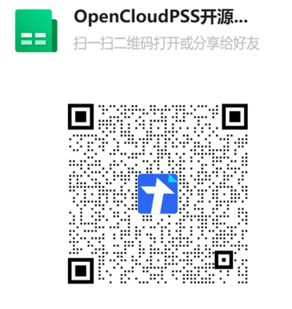

## XStudio 更新

1. 公共更新
   1. 结果页面添加收藏功能，在使用存储管理功能删除运行结果数据时，已收藏的结果不会被删除
   
2. SimStudio 更新
   1. 元件图形设置支持通过 `__ICON` `__PREVIEW` 变量为图标和预览图设置不同的渲染结果
   
   

   2. 结果页面元件链接支持通过中键打开内部元件

3. FuncStudio 更新
   1. 非调试模式下不再记录 stdout，缓解日志占用磁盘空间过多问题
   2. 添加 `cloud:javascript` 实现类型的 TS 类型定义
   
4. AppStudio 更新
   1. 输入控件添加“只读”属性
   2. 优化“指示器”控件属性及其向导
   3. “进度条”控件添加进度值取整
   4. 支持运行静态模型资源

## EMTLab 平台更新<!-- truncate -->

1. 潮流实现添加直流潮流模型
2. 计算方案调试参数添加转义功能，支持通过转义字符 `\` 在变量值中插入空格、换行等特殊符号
3. 上传lib库时支持上传至对象存储
4. 电磁暂态实时仿真添加触发窗口功能
5. 电磁暂态实时仿真支持采样功能

## 用户中心更新

1. 导入导出功能支持处理对象存储

## OpenCloudPSS 更新

1. 官方发布模型更新

   1. 发布直驱风机01型-快速详细模型-标准模型 v2b1 版本、直驱风机01型-平均模型-标准模型 v2b1 版本、直驱风机01型-标准封装模型 v2b1 版本；
   2. 发布双馈风机01型-快速详细模型-标准模型 v1b1 版本、双馈风机01型-平均模型-标准模型 v1b1 版本、双馈风机01型-标准封装模型 v1b1 版本；
   3. 发布光伏发电01型-快速详细模型-标准模型 v1b1 版本、光伏发电01型-平均模型-标准模型 v1b1 版本、光伏发电01型-标准封装模型 v1b1 版本；
   4. 发布电压穿越状态判断模型 v1b1 版本、电压穿越控制模型 v1b1 版本
   5. 发布CSEE标准算例-功角失稳 v1b1 版本、CSEE标准算例-功角振荡 v1b1 版本、CSEE标准算例-高/低频问题 v1b1 版本、CSEE标准算例-电压崩溃问题 v1b1 版本、CSEE标准算例-持续低电压问题 v1b1 版本、CSEE标准算例-暂时工频过电压 v1b1 版、CSEE标准算例-稳态工频过电压 v1b1 版本

2.  第三方研究用模型更新

    1. 发布跟网/构网型并网变流器-平均模型 v1b1 版本、跟网型储能变流器-平均模型 v1b1 版本、构网型储能变流器-平均模型 v1b1 版本

用户可扫描下方二维码进入“OpenCloudPSS 开源模型库”小程序，获取算例与文档地址

## 知识库更新

1. EMTLab 平台文档更新
   1. 新增监视模块、判断模块、操作模块等安控元件文档

2. IESLab 平台文档更新
   1. 完善规划优化平台风光元件说明

3. DSLab 平台文档更新
   1. 新增 DSLab 各功能模块基本原理介绍
   2. 完善负荷预测算法原理和参数说明

4. OpenCloudPSS 文档更新
   1. 新增直驱风机 01 型-快速详细模型-标准模型 v2b1 版本、直驱风机01型-平均模型-标准模型 v2b1 版本、直驱风机01型-标准封装模型 v2b1 版本案例文档；
   2. 新增双馈风机 01 型-快速详细模型-标准模型 v1b1 版本、双馈风机01型-平均模型-标准模型 v1b1 版本、双馈风机01型-标准封装模型 v1b1 版本案例文档；
   3. 新增光伏发电 01 型-快速详细模型-标准模型 v1b1 版本、光伏发电01型-平均模型-标准模型 v1b1 版本、光伏发电01型-标准封装模型 v1b1 版本案例文档；；
   4. 新增发布电压穿越状态判断模型 v1b1 版本、电压穿越控制模型 v1b1 版本案例文档
   5. 新增 CSEE 标准算例-功角失稳 v1b1 版本、CSEE标准算例-功角振荡 v1b1 版本、CSEE标准算例-高/低频问题 v1b1 版本、CSEE标准算例-电压崩溃问题 v1b1 版本、CSEE标准算例-持续低电压问题 v1b1 版本、CSEE标准算例-暂时工频过电压 v1b1 版、CSEE标准算例-稳态工频过电压 v1b1 版本案例文档

5. CloudPSS  SDK 文档更新
   1. 修改 IESLab SDK 案例相关内容