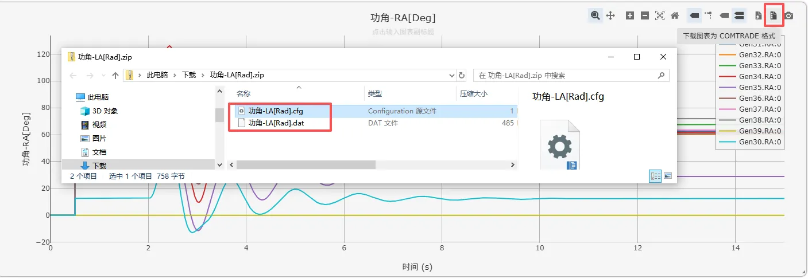
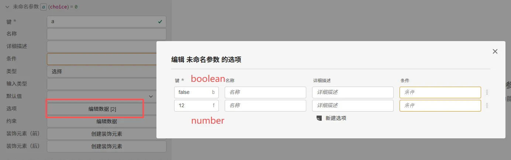
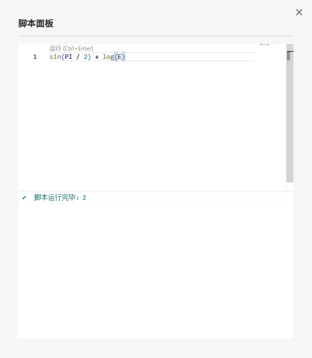
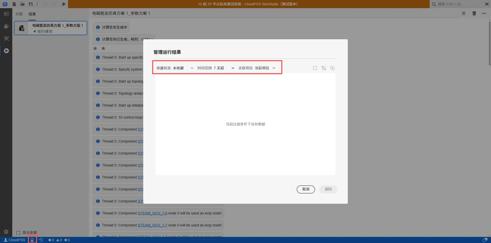
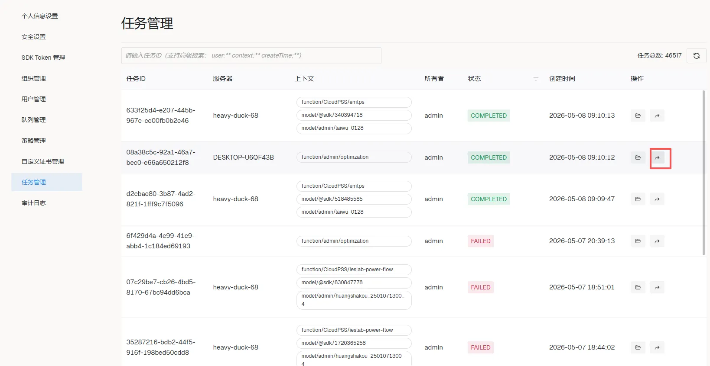

## XStudio 更新至 v5.0 版本

1. 公共更新
   1. 表达式引擎从 MathJS 迁移到 MiraScript, 具体语法可查阅 [MiraScript 速查表](https://mira.cloudpss.net/cheatsheet/)
   2. 优化接口页面切换参数类型时的行为, 避免切换参数类型导致的默认值类型不匹配问题
   3. 支持在空间不足时为右键菜单添加滚动条
   4. 修复表格编辑对话框的“删除行”功能在选择多行时功能异常问题
   5. 修复表格编辑对话框撤销功能无法恢复删除的行的问题
   6. 删除图表控件的“在 Chart Studio 中编辑”按钮
   7. 图表控件添加下载为 COMTRADE 格式功能
   
   

   8.  接口页面选择类型的选项编辑对话框更新，支持设计 boolean 和 number 类型的选项
  
   

   9.  添加“脚本面板”（<kbd>F10</kbd>）功能，支持编辑 MiraScript 脚本并在线运行
   
   

   10. 新的模板系统，支持通过树结构组织模板
   11. 添加结果管理对话框，替换之前的“删除运行结果数据”功能
   

<!-- truncate -->

2. SimStudio 更新
   1. 传输线潮流模型添加 “参数已修正” 选项
   2. 修复撤销包含连接线的图形编辑时的异常
   3. 修复通过连接线上箭头调整连接关系导致无法继续编辑的问题
   4. 电磁暂态实时仿真录波支持录制为 COMTRADE 格式
   5. 优化电磁暂态实时仿真波形控件性能
   6. 优化线型元件标签位置
   7. 支持自定义线型元件标签

3. FuncStudio 更新
   1. 支持从任务中心跳转查看历史运行结果

4. AppStudio 更新
   1. 完善搜索功能，支持搜索场景和控件