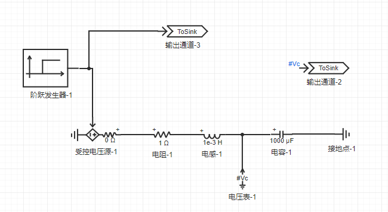
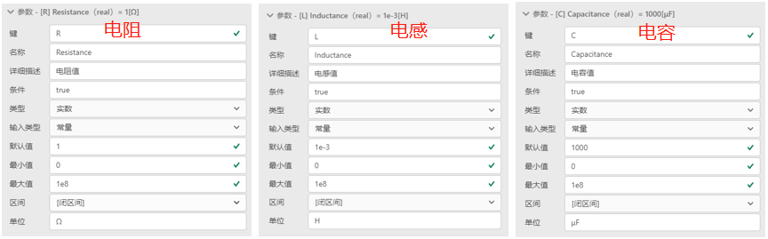
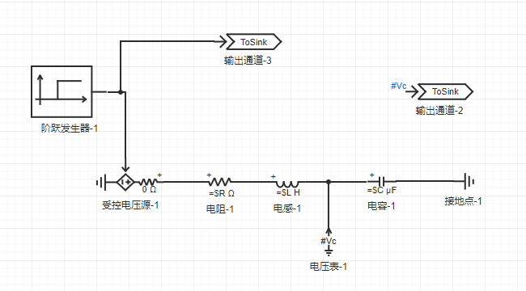
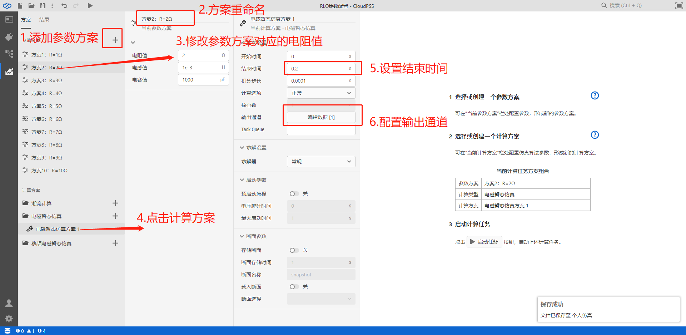

::: info

**CloudPSS SimStudio新增参数方案配置功能，在同一个仿真项目中可配置多套仿真参数方案，并执行并发的多场景仿真运算。参数方案配置可方便用户实现多个仿真参数结果的对比。**

:::

本章以不同阻抗参数RLC电路的阶跃响应仿真为例，介绍参数方案配置的详细使用方法。

参数方案配置的一般流程为：（1）搭建算例，选取需要进行参数方案配置的元件参数；（2）配置参数列表，并将选取的元件参数设置为以\=$符开头的全局参数；（3）配置不同的参数方案并仿真。分别介绍如下：

## 搭建算例，选取需要进行参数方案配置的元件参数

拖拽元件至拓扑编辑窗口，搭建如下图所示的仿真，其中阶跃发生器在0.1s由0上升为100。

受控电压源在0.1s时刻由0V上升到100V，将导致电容电压从0V以不同的暂态特性到达稳态值100V，暂态特性与RLC的阻抗值有关。通过仿真需求分析，选取电阻、电感、电容的值作为进行参数方案配置的元件参数。

## 配置参数列表，并将选取的元件参数设置为以\=$符开头的全局参数

在`接口`标签页的参数编辑栏内，添加对应电阻、电感、电容阻抗值的参数键，如下图所示。

将电阻、电感、电容的参数阻抗参数配置为以\=$符开头的全局参数，如下图所示。

配置完毕的仿真拓扑图如下图所示

## 配置不同的参数方案并仿真

在`运行`标签页，点击`新建参数方案`并创建10个参数方案，依次重命名为“方案1：R=1Ω”，“方案2：R=2Ω”...，“方案10：R=10Ω”。点击参数方案，将参数列表中的电阻值依次修改为1Ω，2Ω...，10Ω。点击`电磁暂态仿真方案1`，设置结束时间为0.2s，选择`输出通道`为电容电压，且采样频率为10000。

依次选取`参数方案`，并点击`启动任务`，将会生成10个仿真结果如下图所示。

可在结果页面的左侧的仿真结果标签页自由查看不同参数方案下的仿真结果。
