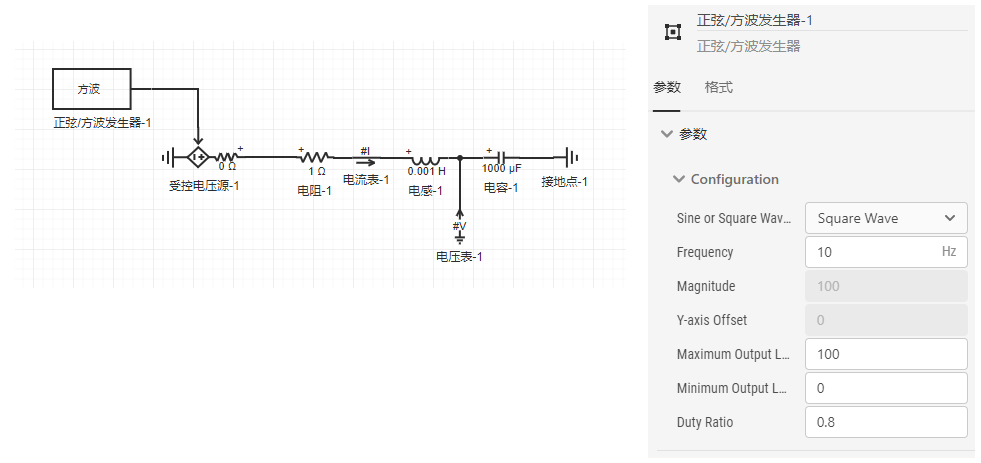
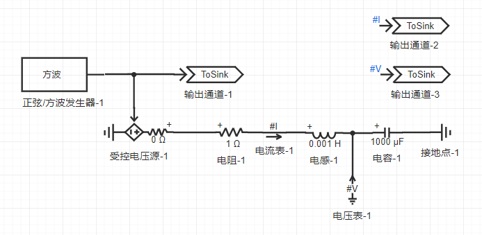
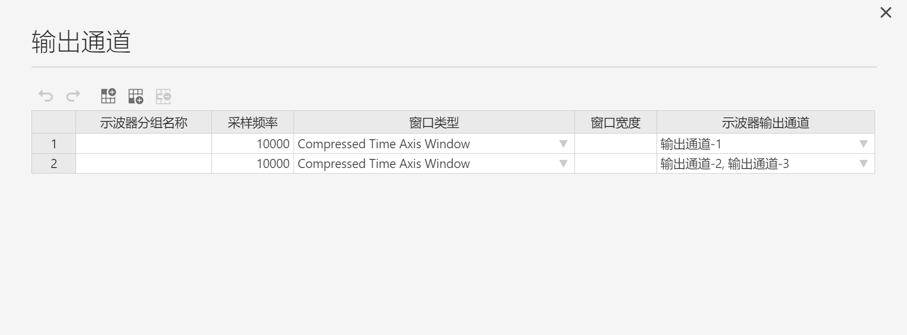
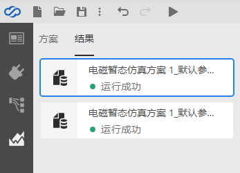

CloudPSS SimStudio提供了灵活稳定的模块封装和模块调用功能，在大型仿真算例中使用这些功能可使得仿真图结构清晰、界面简洁。
关于**模块封装的介绍**和**如何构建一个模块封装**，详见[模块封装](../Mask.md)帮助文档。

## 模块导入

在模块封装构建完成并保存后，用户可以在模型库中找到已封装好的模块，模块在模型库中的分组由封装该模块的用户的用户名和该模块的元件标签决定。在左侧模型库中最下方，点击`添加更多`，会弹出`模型订阅管理`窗口，找到所需模块的分组，点选`显示`按钮即可在左侧模型库中显示。  

直接拖拽模块至拓扑编辑窗口的图纸上，模块可像其它元件一样进行连线、参数设置、旋转和格式修改等操作。

## 模块的查看与修改

若想要查看一个模块内部的拓扑或对模块封装进行修改，可以在图纸上[[鼠标右键]]该模块，选择`打开模块`，会弹出一个新的工作台页面，并自动打开该模块的项目文件。

:::tip

如果模块由其它用户封装，模块查看与修改的前提是该模块的权限被设置为`允许查看内部细节`，否则会在页面右下角弹出`打开失败`的提示。

:::

在打开的模块项目文件中，可以在左侧菜单栏的`总览`标签页，修改模块的名称、权限、描述和说明文档；在`接口`标签页，修改模块的图标、引脚和参数定义；在`实现`标签页，修改模块的拓扑结构。模块修改与构建模块封装的要领一致，可参考[模块封装](../Mask.md)帮助文档。

模块修改完成并保存后，会同步到模型库中。若模块在修改前已经在图纸上应用，则需要[[鼠标右键]]图纸上的该模块，选择`更新元件`进行修改内容的同步。

## 如何利用一个已封装好的模块搭建算例

在[模块封装](../Mask.md)帮助文档中，我们构建了一个可选式正弦/方波发生器的模块封装。本例用该可选式正弦/方波发生器作为受控信号，搭建一个含受控源的RLC电路算例。

### 步骤1：搭建基本拓扑图

在`实现`标签页，拖拽受控电压源、电阻、电感、电容和接地点元件到图纸上，电阻值设为1Ω，电感值设为0.001H，电容值设为1000μF。再拖拽一个电压表和电流表量测元件到图纸上，进行如图所示连线和参数设置。电压表和电流表的参数设置与用法可参考[量测和输出系统](../Measure.md)帮助文档。

### 步骤2：导入封装好的模块

在模型库最底部点击`添加更多`打开模型订阅管理窗口，点选`显示`可选式正弦/方波发生器的模块元件标签，即“元件封装”，点击关闭按钮或空白处关闭模型订阅管理窗口。在模型库中找到“元件封装”的分组，拖拽正弦/方波发生器元件到图纸中，输出信号连接至受控电压源的控制信号处。拓扑和正弦/方波发生器的参数设置如图所示。

### 步骤3：添加输出通道

在模型库中拖拽3个输出通道元件到图纸上，输出通道-1的引脚连接至正弦/方波发生器输出端口；输出通道-2的引脚设为#I，即观测电流表；输出通道-3的引脚设为#V，即观测电压表。输出通道的描述和使用方法可参考[输出通道](../../../components/comp_PSS/comp_PSSOutput/OutputChannel/index.md)元件帮助。

### 步骤4：仿真方案配置与示波器分组配置

在拓扑图搭建完毕后，点击左侧菜单栏的`运行`标签页进入仿真运行和结果页面。新建一个参数方案，由于算例简单，因此无需进行参数配置。新建一个电磁暂态仿真方案，设置仿真的开始时间、结束时间和积分步长，点击输出通道的`编辑数据`，进行示波器分组的配置。 

### 步骤5：仿真结果确认

点击页面顶部的`启动任务`按钮或[[Ctrl]]+[[R]]，开始进行仿真计算。在`结果`中查看仿真结果和示波器分组的波形。  

在正弦/方波发生器的参数中选择输出类型为**方波**，输出波形和电压、电流波形如下图所示。

在正弦/方波发生器的参数中选择输出类型为**正弦**，输出波形和电压、电流波形如下图所示。

在`结果`页面，保留了两次仿真运行的结果，方便查看或作对比。

