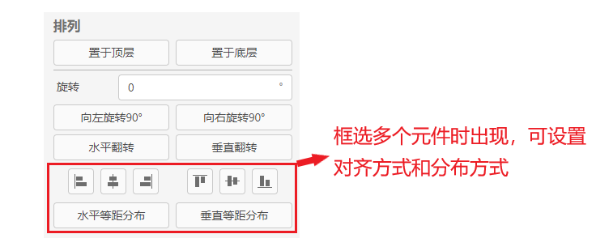
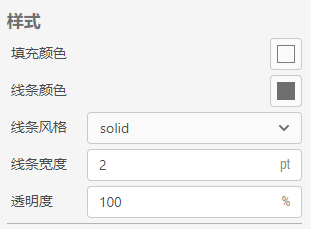
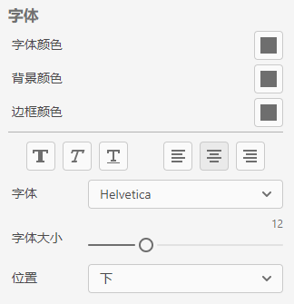

格式栏主要负责对元件和文本的格式进行设置，主要有三大功能，分别是排列、样式和字体。

## 排列

当不同元件重叠在一起时，排列功能可以设置它们的重叠先后顺序，选择`置于顶层`或`置于底层`。排列功能还可以设置元件的旋转角度，可以点击`向左旋转90°`、`向右旋转90°`、`水平翻转`和`垂直翻转`按钮，也可以直接在旋转对话框中输入任意角度值（顺时针）。  
当框选多个元件时，排列功能可以设置它们的对齐方式和分布方式，如`居中`、`居左`、`水平`等距分布或`垂直`等距分布等。

## 样式

主要包含填充`颜色`和`线条`设置。可以对元件的底色进行填充，修改元件边框的颜色以及线条的样式和粗细，还可以设置不同的透明度。

## 字体

当需要对元件文本的字体格式进行修改时，格式栏同样提供了有关字体的设置功能，包含`字体颜色`、`背景颜色`以及`边框颜色`，还有不同字体及字体`大小`、`加粗`、`斜体`、`下划线`、`对齐方式`等设置。还可以设置文本出现在元件的哪个`位置`，如上、中、下、左、右等。

