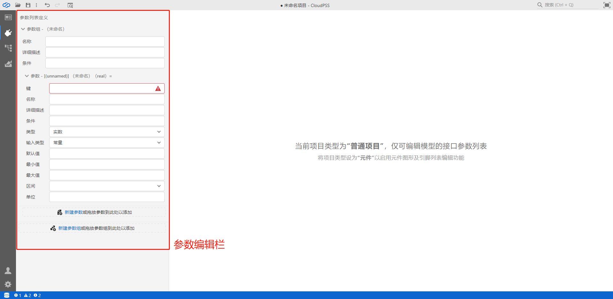
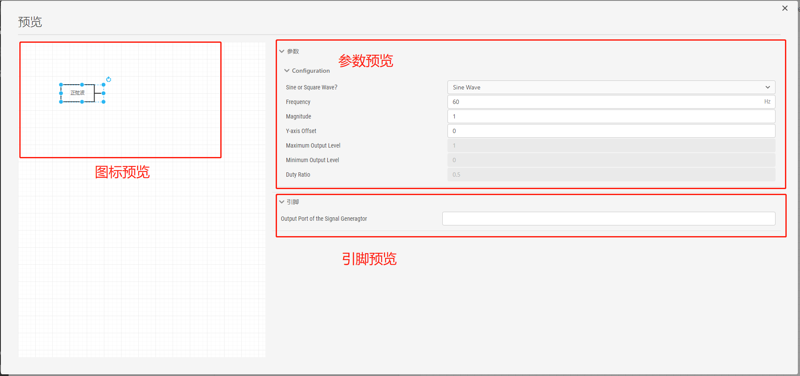

::: info

**`接口`标签页可实现当前项目的对外封装，可用于给普通项目编辑参数，并在多参数方案仿真时使用，也可用于元件项目的模块封装。**
:::

对于不同的项目类型，`接口`标签页的组成内容不同。对于`简单项目`，`接口`标签页会隐藏；对于`普通项目`，`接口`标签页仅包含参数编辑栏，该参数编辑栏可用于进行仿真参数方案配置。

对于`元件`项目，`接口`标签页由三部分组成：参数编辑栏、引脚编辑栏、图标绘制窗口，如下图所示。

分别介绍如下：

### 1)	参数编辑栏
参数编辑栏提供了当前项目的参数设计功能。参数编辑栏提供了实数、整数、文本、布尔、选择、多选、表格以及虚拟引脚类型的参数，提供了相关参数的名称、条件、默认值等配置选项。配置好的参数，可在仿真主拓扑中元件的参数框内通过“=$”符加“参数键值”进行引用。

参数编辑栏主要有两种用法：

**用法1**: 用于给普通项目编辑参数，并在多参数方案仿真时使用。操作方法详见[参数方案配置](../../Basic/ParameterCal/index.md)功能帮助。

**用法2**: 用于元件项目的模块封装。模块封装功能的具体使用方法详见[模块封装](../../Basic/Mask/index.md)功能帮助。

### 2)	引脚编辑栏
引脚为模型/元件对外连接的端口，一个模型/元件可以没有对外引脚。引脚编辑栏提供了对引脚的名称、数据维数、数据类型、端口连接类型的定义。引脚的显示与否可受条件表达式控制，以便根据不同的参数配置选项来显示不同的对外引脚。

### 3)	图标绘制窗口
图标绘制窗口提供了模型/元件图标的绘图工具，支持图形、线、点、引脚、文字等元素的添加，以及线条/填充颜色的图形格式配置。各元素的显示与否可受条件表达式控制，以便根据不同的参数配置选项来显示不同的元件图标。

在进行`接口`标签页的配置过程中，可通过右击图标绘制窗口选择“预览”选项或点击“预览”快捷按钮，实现对模块封装情况的预览。用户可通过预览功能及时查看模块参数配置以及各部分联动是否正常。一个典型的预览界面如下图所示。

