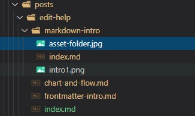

```ts
let a = 1
```
## 命名

文件和文件夹全部使用小写字母，多个单词使用连接号（`-`）代替空格。

## 组织结构

文档内容存放于 `/docs` 文件夹，其下各文件夹为不同语言的文档。可以任意建立多层文件夹形成树形的组织结构。

每个文件夹中的 `index.md` 为该文件夹的默认文档，如 `posts/example/index.md` 在浏览时使用 `posts/example` 即可访问。

因此，当一个文档（如 `foo/bar.md`）需要包含媒体文件时，建议建立同名的文件夹（`foo/bar/`） 进行存放，并将文档移动到文件夹内（`foo/bar/index.md`）。如图：



即图片存储于和页面同名（此处为`markdown-intro`）的文件夹内。

## 本地化

为了保证多语言访问的一致性，各语言文档的目录结构应保持一致。在进行本地化时，除了需要对 `/docs` 文件夹中的文档进行翻译以外，还需要翻译 `/src/locale` 中的内容，并在 `/src/locale/index.yml` 中添加相应语言的定义。