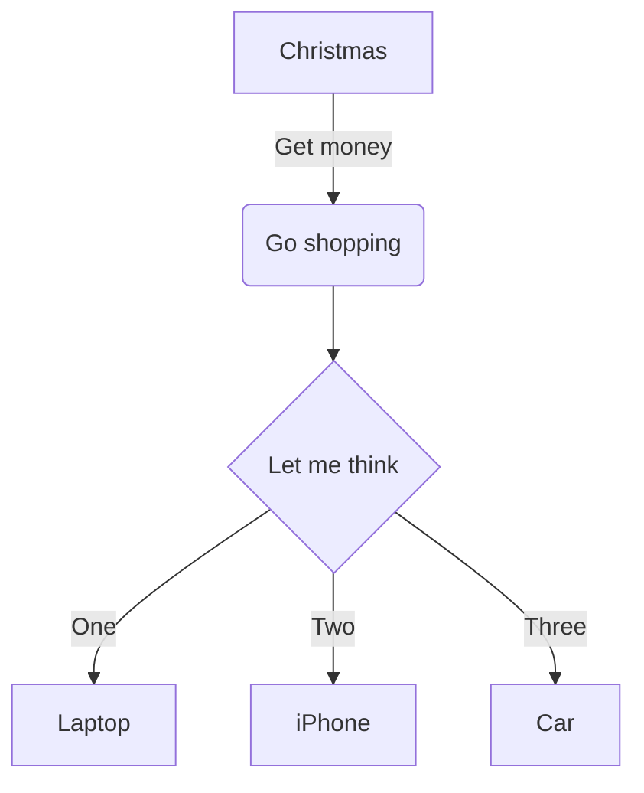
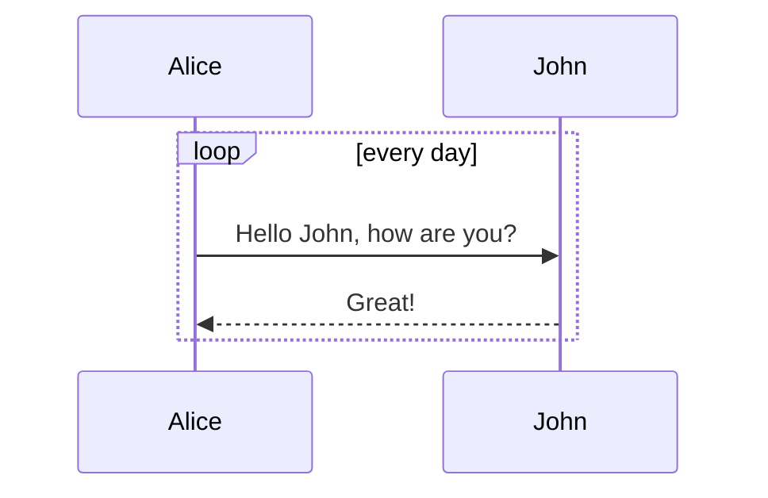
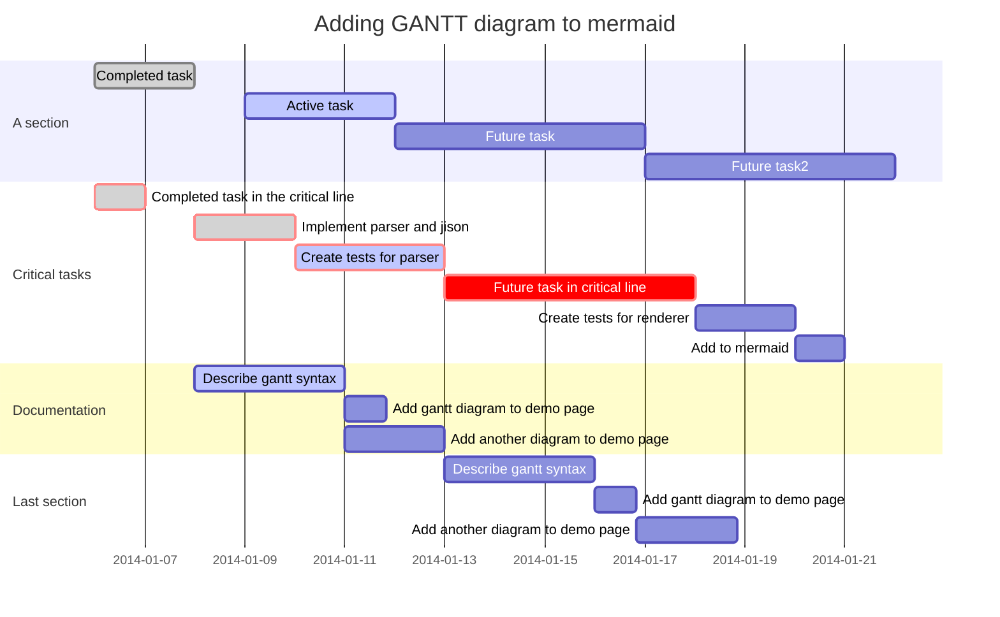
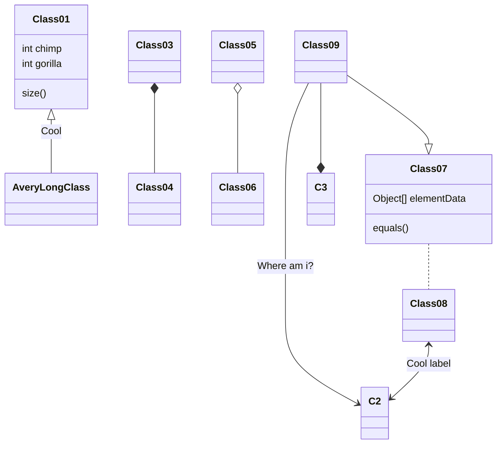

Examples from <http://mdp.tylingsoft.com/>.

## mermaid charts

### Flowchart



[Flowchart Syntax](http://knsv.github.io/mermaid/#flowcharts-basic-syntax)

### Sequence diagram



[Sequence Diagram Syntax](http://knsv.github.io/mermaid/#sequence-diagrams)

### Gantt diagram



[Gantt Diagram Syntax](http://knsv.github.io/mermaid/#gant-diagrams)

### Class diagram



Class diagram is powered by [mermaid](https://github.com/knsv/mermaid).

## Charts

[Documentation for charts](http://www.chartjs.org/docs/)

### Line Chart

```chart
{
  "type": "line",
  "data": {
    "labels": [
      "January",
      "February",
      "March",
      "April",
      "May",
      "June",
      "July"
    ],
    "datasets": [
      {
        "label": "# of bugs",
        "fill": false,
        "lineTension": 0.1,
        "backgroundColor": "rgba(75,192,192,0.4)",
        "borderColor": "rgba(75,192,192,1)",
        "borderCapStyle": "butt",
        "borderDash": [],
        "borderDashOffset": 0,
        "borderJoinStyle": "miter",
        "pointBorderColor": "rgba(75,192,192,1)",
        "pointBackgroundColor": "#fff",
        "pointBorderWidth": 1,
        "pointHoverRadius": 5,
        "pointHoverBackgroundColor": "rgba(75,192,192,1)",
        "pointHoverBorderColor": "rgba(220,220,220,1)",
        "pointHoverBorderWidth": 2,
        "pointRadius": 1,
        "pointHitRadius": 10,
        "data": [
          65,
          59,
          80,
          81,
          56,
          55,
          40
        ],
        "spanGaps": false
      }
    ]
  },
  "options": {}
}
```

[Documentation for Line Chart](http://www.chartjs.org/docs/#line-chart)

### Bar Chart

```chart
{
  "type": "bar",
  "data": {
  "labels": [
    "Red",
    "Blue",
    "Yellow",
    "Green",
    "Purple",
    "Orange"
  ],
  "datasets": [
    {
    "label": "# of Votes",
    "data": [
      12,
      19,
      3,
      5,
      2,
      3
    ],
    "backgroundColor": [
      "rgba(255, 99, 132, 0.2)",
      "rgba(54, 162, 235, 0.2)",
      "rgba(255, 206, 86, 0.2)",
      "rgba(75, 192, 192, 0.2)",
      "rgba(153, 102, 255, 0.2)",
      "rgba(255, 159, 64, 0.2)"
    ],
    "borderColor": [
      "rgba(255,99,132,1)",
      "rgba(54, 162, 235, 1)",
      "rgba(255, 206, 86, 1)",
      "rgba(75, 192, 192, 1)",
      "rgba(153, 102, 255, 1)",
      "rgba(255, 159, 64, 1)"
    ],
    "borderWidth": 1
    }
  ]
  },
  "options": {}
}
```

[Documentation for Bar Chart](http://www.chartjs.org/docs/#bar-chart)

### Radar Chart

```chart
{
  "type": "radar",
  "data": {
    "labels": [
      "Eating",
      "Drinking",
      "Sleeping",
      "Designing",
      "Coding",
      "Cycling",
      "Running"
    ],
    "datasets": [
      {
        "label": "My First dataset",
        "backgroundColor": "rgba(179,181,198,0.2)",
        "borderColor": "rgba(179,181,198,1)",
        "pointBackgroundColor": "rgba(179,181,198,1)",
        "pointBorderColor": "#fff",
        "pointHoverBackgroundColor": "#fff",
        "pointHoverBorderColor": "rgba(179,181,198,1)",
        "data": [
          65,
          59,
          90,
          81,
          56,
          55,
          40
        ]
      },
      {
        "label": "My Second dataset",
        "backgroundColor": "rgba(255,99,132,0.2)",
        "borderColor": "rgba(255,99,132,1)",
        "pointBackgroundColor": "rgba(255,99,132,1)",
        "pointBorderColor": "#fff",
        "pointHoverBackgroundColor": "#fff",
        "pointHoverBorderColor": "rgba(255,99,132,1)",
        "data": [
          28,
          48,
          40,
          19,
          96,
          27,
          100
        ]
      }
    ]
  },
  "options": {}
}
```

[Documentation for Radar Chart](http://www.chartjs.org/docs/#radar-chart)

### Polar Area Chart

```chart
{
  "type": "polarArea",
  "data": {
    "datasets": [
      {
        "data": [
          11,
          16,
          7,
          3,
          14
        ],
        "backgroundColor": [
          "#FF6384",
          "#4BC0C0",
          "#FFCE56",
          "#E7E9ED",
          "#36A2EB"
        ],
        "label": "My dataset"
      }
    ],
    "labels": [
      "Red",
      "Green",
      "Yellow",
      "Grey",
      "Blue"
    ]
  },
  "options": {}
}
```

[Documentation for Polar Area Chart](http://www.chartjs.org/docs/#polar-area-chart)

### Pie Chart

```chart
{
  "type": "pie",
  "data": {
    "labels": [
      "Red",
      "Blue",
      "Yellow"
    ],
    "datasets": [
      {
        "data": [
          300,
          50,
          100
        ],
        "backgroundColor": [
          "#FF6384",
          "#36A2EB",
          "#FFCE56"
        ],
        "hoverBackgroundColor": [
          "#FF6384",
          "#36A2EB",
          "#FFCE56"
        ]
      }
    ]
  },
  "options": {}
}
```

[Documentation for Pie Chart](http://www.chartjs.org/docs/#doughnut-pie-chart)

### Doughnut Chart

```chart
{
  "type": "doughnut",
  "data": {
    "labels": [
      "Red",
      "Blue",
      "Yellow"
    ],
    "datasets": [
      {
        "data": [
          300,
          50,
          100
        ],
        "backgroundColor": [
          "#FF6384",
          "#36A2EB",
          "#FFCE56"
        ],
        "hoverBackgroundColor": [
          "#FF6384",
          "#36A2EB",
          "#FFCE56"
        ]
      }
    ]
  },
  "options": {}
}
```

[Documentation for Doughnut Chart](http://www.chartjs.org/docs/#doughnut-pie-chart)

### Bubble Chart

```chart
{
  "type": "bubble",
  "data": {
    "datasets": [
      {
        "label": "First Dataset",
        "data": [
          {
            "x": 20,
            "y": 30,
            "r": 15
          },
          {
            "x": 40,
            "y": 10,
            "r": 10
          }
        ],
        "backgroundColor": "#FF6384",
        "hoverBackgroundColor": "#FF6384"
      }
    ]
  },
  "options": {}
}
```

[Documentation for Bubble Chart](http://www.chartjs.org/docs/#bubble-chart)
