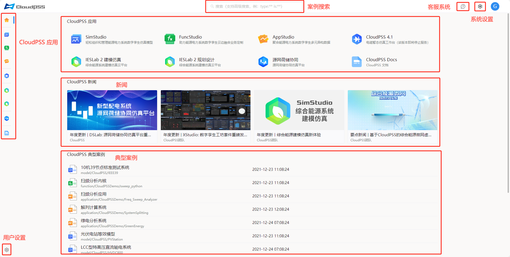

用户登录成功后，页面将跳转至 **CloudPSS 首页**，展示如下图所示。该界面包含了多个部分：CloudPSS 应用、CloudPSS 新闻、CloudPSS 典型案例、案例搜索以及用户设置、系统设置、客服系统等。

## CloudPSS 应用

CloudPSS 应用包括 `SimStudio`、`FuncStudio`、`AppStudio`、`CloudPSS 4.1(该版本已停止更新)`、`IESLab 2 建模仿真` 、`IESLab 2 规划设计` 、`源网荷储协同(DSLab)`和 `CloudPSS Docs`。用户可以通过点击应用标签或左侧的功能按钮进行页面跳转，进入相应的应用中心，如下图所示。

## CloudPSS 新闻

**新闻动态**：展示由 CloudPSS 管理员发布的最新新闻信息。

## CloudPSS 典型案例

展示 CloudPSS 功能应用的典型案例项目。点击项目即可进入应用工作台。

## 案例搜索

用户可以在搜索栏内搜索 CloudPSS 的应用，包括典型案例项目和帮助文档。此外，支持[高级搜索功能](../others/advanced-search/index.md)。

## 用户设置

通过点击页面左下角的 `用户设置` 按钮，用户可以进入账户设置页面修改个人信息，账户安全设置，SDK token管理、组织管理和任务管理。

点击页面右上角用户头像，用户可以退出当前登录的账号或进行个人设置，如下图所示。

## 系统设置

点击用户头像左侧的系统设置按钮，用户可以切换软件系统语言和主题。用户首次登录时默认使用亮色主题，可以在此处切换为暗色主题，且该设置将在下次登录时保留。

## 客服系统

点击系统设置左侧的客服按钮，用户可以快速访问系统内置的客服系统。该功能为用户提供直接的支持和咨询服务。

