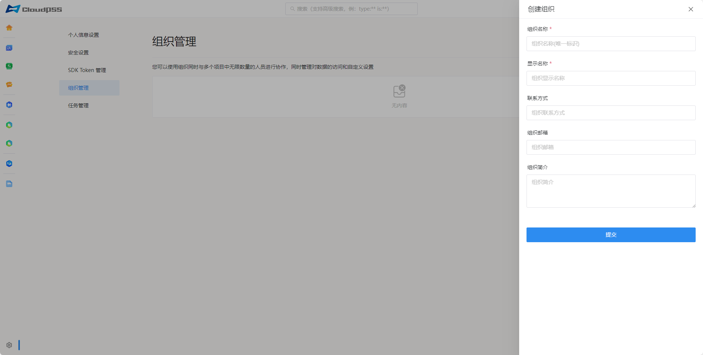
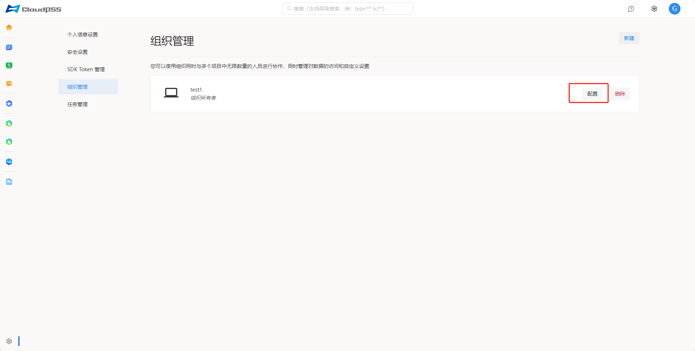
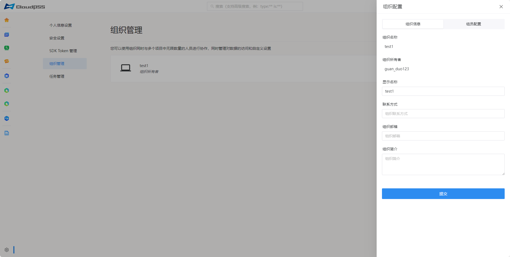
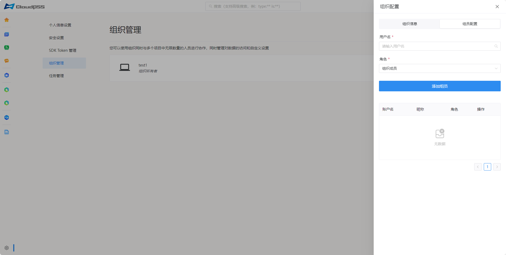

点击页面左下角的账户`设置`按钮，然后点击左侧的`组织管理`按钮，进入组织管理页面。

## 新建组织

点击页面右上角的`新建`按钮，弹出如下页面。

输入组织名称(唯一标识，不可重复、必填项)、显示名称(必填项)、联系方式、组织邮箱、组织简介。

## 配置组织

点击组织页面右侧的`配置`按钮。弹出如下的组织配置页面。

组织信息页面允许修改组织显示名称、联系方式、组织邮箱、组织简介；组织名称和组织所有者不可变更。

组员配置页面允许检索用户并分配组织角色(组织成员/组织管理员)。

## 删除组织

点击组织页面右侧的`删除`按钮。

