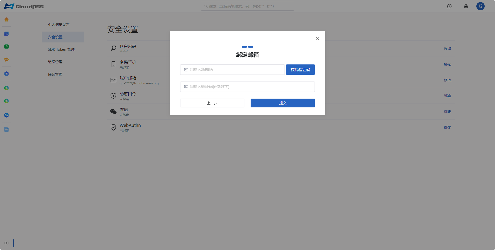
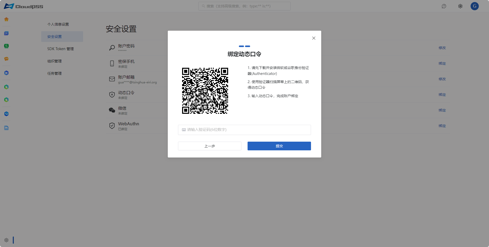
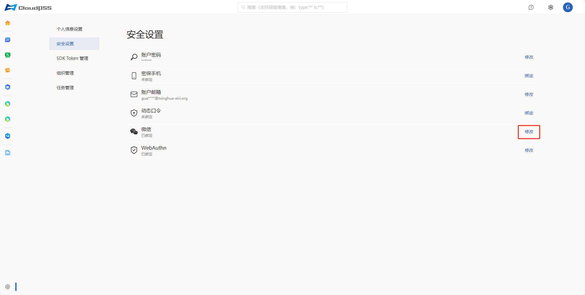

点击页面左下角的账户设置按钮，然后点击左侧的`安全设置`按钮，进入账户安全设置页面。

在本页面可以修改如下绑定的内容：

+ 账户密码

+ 密保手机

+ 账户邮箱

+ 动态口令

+ 微信

+ WebAuthn(网页身份认证器)

## 修改账户密码流程

按照以下步骤执行操作：

1. 点击账户密码右侧的`修改`按钮。

2. 弹出如下密码验证界面，输入原密码；如果忘记了原密码，可以采用下方的其他验证方式，譬如邮箱/手机号/动态口令/WebAuthn；点击`下一步`。
   
3. 身份认证成功，弹出如下重置密码界面；输入新密码(至少6位密码，区分大小写)；点击`提交`。

## 绑定密保手机流程

按照以下步骤执行操作：

1. 点击密保手机右侧的`绑定`/`修改`按钮。

2. 弹出如下密码验证界面，输入密码；如果忘记了原密码，可以采用下方的其他验证方式，譬如邮箱/手机号/动态口令/WebAuthn；点击`下一步`。
   
3. 身份认证成功，弹出如下绑定手机界面，获取验证码后输入手机验证码；点击`提交`。
   

   

## 绑定账户邮箱流程

按照以下步骤执行操作：

1. 点击账户邮箱右侧的`绑定`/`修改`按钮。

2. 弹出如下密码验证界面，输入密码；如果忘记了原密码，可以采用下方的其他验证方式，譬如邮箱/手机号/动态口令/WebAuthn；点击`下一步`。
   
3. 身份认证成功，弹出如下绑定账户邮箱页面，获取验证码后输入邮箱验证码；点击`提交`。
   

   

## 绑定动态口令流程

按照以下步骤执行操作：

1. 点击动态口令右侧的`绑定`/`修改`按钮。

2. 弹出如下密码验证界面，输入密码；如果忘记了原密码，可以采用下方的其他验证方式，譬如邮箱/手机号/动态口令/WebAuthn；点击`下一步`。
   
3. 身份认证成功，弹出如下绑定账户动态口令页面；按照提示执行以下操作。
   
4. 下载并安装微软或谷歌身份验证器(Authenticator)。

5. 使用验证器扫描屏幕上的二维码，获得动态口令。

6. 输入动态口令(6位数字验证码)，点击`提交`。
   

   

## 绑定微信流程

按照以下步骤执行操作：

1. 点击微信右侧的`绑定`/`修改`按钮。

2. 弹出如下密码验证界面，输入密码；如果忘记了原密码，可以采用下方的其他验证方式，譬如邮箱/手机号/动态口令/WebAuthn；点击`下一步`。
   
3. 身份认证成功，弹出如下绑定微信页面，使用微信扫一扫，完成绑定。
   

   

## 绑定WebAuthn流程

按照以下步骤执行操作：

1. 点击WebAuthn右侧的`绑定`/`修改`按钮。

2. 弹出如下密码验证界面，输入密码；如果忘记了原密码，可以采用下方的其他验证方式，譬如邮箱/手机号/动态口令/WebAuthn；点击`下一步`。
   
3. 身份认证成功，弹出如下绑定WebAuthn页面，按照提示执行以下操作。

4. 将安全密钥介质插入USB端口，然后点击`下一步`。

5. windows弹出安全密钥设置界面，点击`确定`。

6. 此时安全密钥介质开始闪烁，轻触上面的金属盘，完成绑定。

   

