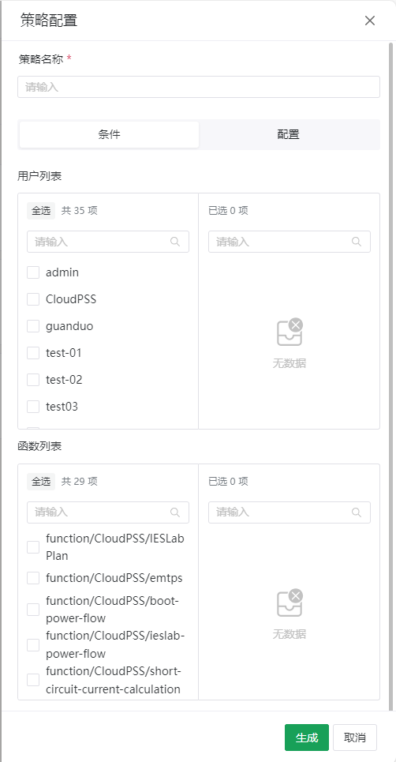
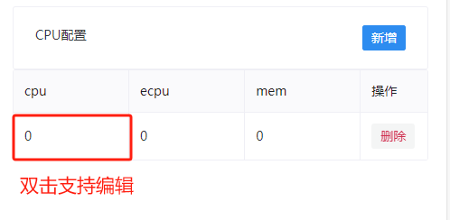
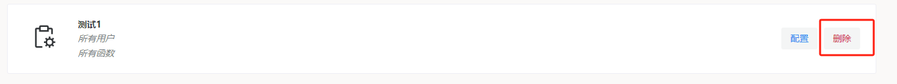

点击页面左下角的账户`设置`按钮，然后点击左侧的`策略管理`按钮，进入策略管理页面。

## 新建策略

按照以下步骤执行操作：

1. 点击页面右上角的`新建`按钮；弹出如下图所示列表按需填写。

2. 输入策略名称，用户列表内勾选该策略允许的用户，函数列表勾选该策略允许的函数(FuncStudio)；支持检索用户/函数功能。

3. 选择队列，输入最小优先级、最大优先级、允许执行时间(秒)，选择可见性(PUBLIC/PRIVATE/HIDDEN)；CPU配置支持新增、删除和双击编辑功能；点击`生成`按钮。

策略配置中的参数说明如下：

+ 条件：此处设置策略生效的条件。注意不选择任何用户/函数表示允许所有用户/函数使用该策略。当同时配置用户列表和函数列表时，策略生效需两者同时满足。

+ 配置：此处设置满足条件的用户/函数可使用的任务调度参数

  + 队列、优先级、CPU配置：表示可使用的队列、可指定的优先级范围及资源选项；

  + 允许执行时间：使用该策略执行的任务的最大执行时间，任务调度参数中无需配置此项，当启动的任务满足多条策略要求时，使用其中最大的允许执行时间；

  + 可见性：表明该策略是否对用户可见，此选项仅影响XStudio中选项显示。

    + PUBLIC：该策略对所有用户可见，不满足条件的用户显示为灰色不可选中状态；

    + PRIVATE：该策略对满足条件的用户可见；
    
    + HIDDEN：该策略隐藏，这意味着在XStudio前端无法使用此策略，仅能通过SDK调用。

## 配置策略

按照以下步骤执行操作：

1. 选择待更新的策略，点击右侧`配置`按钮。

2. 输入策略名称，用户列表内勾选该策略允许的用户，函数列表勾选该策略允许的函数(FuncStudio)；支持检索用户/函数功能。

3. 选择队列，输入最小优先级、最大优先级、允许执行时间(秒)，选择可见性(PUBLIC/PRIVATE/HIDDEN)；CPU配置支持新增、删除和双击编辑功能；点击`生成`按钮。

## 删除策略

选择待更新的策略，点击右侧`删除`按钮。

