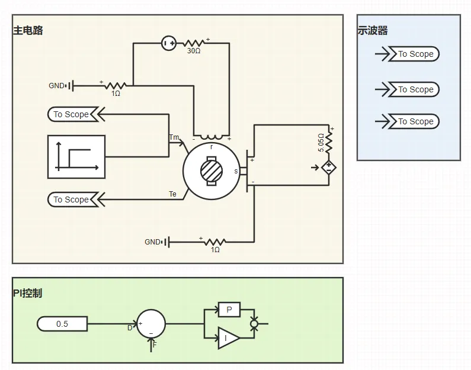
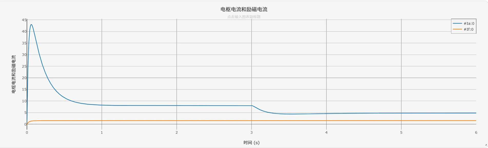
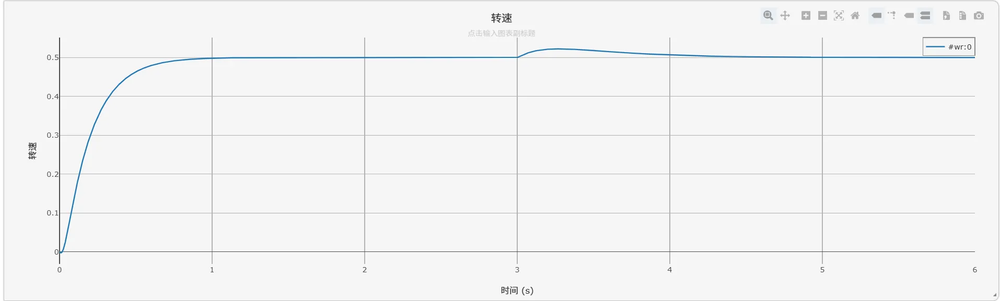
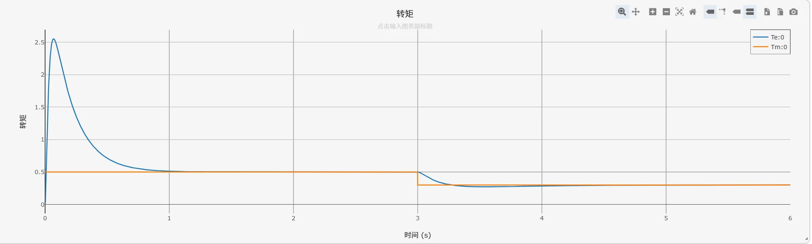

## 描述

直流电机具有调速范围宽、控制精度高、动态响应快、启动转矩大等优点，广泛应用于工业传动、伺服控制、电动汽车等领域。

本算例基于PI控制实现他励直流电机的转速闭环控制，通过调节电枢电压实现电机转速的精确跟踪，同时验证系统在负载扰动下的转速恢复能力。

## 模型介绍

直流电机驱动测试算例主功率拓扑由直流电压源、他励直流电机、PI 控制器、受控电压源以及机械负载构成，仿真拓扑如下图所示。其中，电枢回路由受控电压源供电，PI 控制器根据转速参考值与实际转速之间的偏差输出控制信号，调节电枢电压，从而实现转速闭环控制。励磁回路由独立直流电源供电，使励磁电流在仿真过程中基本保持稳定。

他励直流电机元件内部包含电枢支路和励磁支路。电枢电流决定电磁转矩，励磁电流决定等效磁通，转子转速与等效磁通共同决定电枢反电动势。仿真中，负载机械转矩作为外部扰动信号输入电机模型，用于检验转速闭环系统在负载变化下的动态恢复能力。

## 仿真

设定`运行`标签页参数方案列表中的`机械转矩切换时刻 [s]`为3.0，`转速参考值`为0.5（标幺值）。点击`启动任务`开始仿真计算。

电枢电流与励磁电流的仿真结果如下图所示：

转速的仿真结果如下图所示：

电磁转矩与机械转矩的仿真结果如下图所示：

根据仿真结果，电机启动阶段转速从 0 开始快速上升，此时电磁转矩输出达到峰值，电枢电流也相应出现启动冲击。随着转速升高，电枢反电动势逐渐增大，电枢电流和电磁转矩逐步减小，最终转速稳定在参考值 0.5 附近，电磁转矩与机械转矩达到平衡，验证了 PI 控制器的转速跟踪性能。

当仿真运行至 3.0 s 时，机械转矩发生阶跃变化，电磁转矩随之快速调整。转速出现小幅偏移后，经 PI 控制器调节重新恢复到参考值附近并保持稳定，说明转速闭环系统具有一定的抗负载扰动能力。励磁电流在整个仿真过程中基本保持恒定，符合他励直流电机的运行特性。