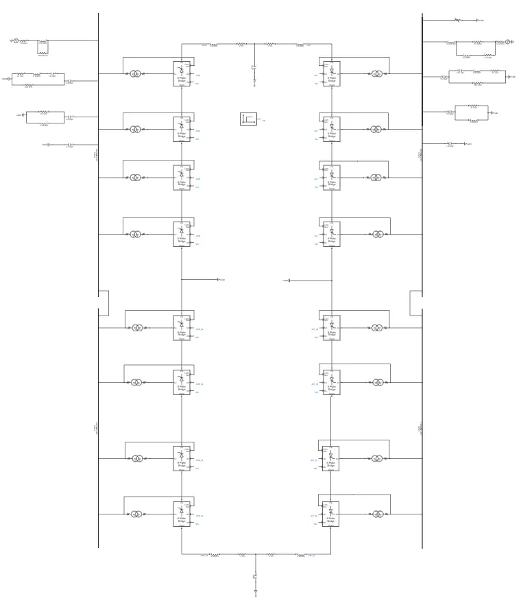
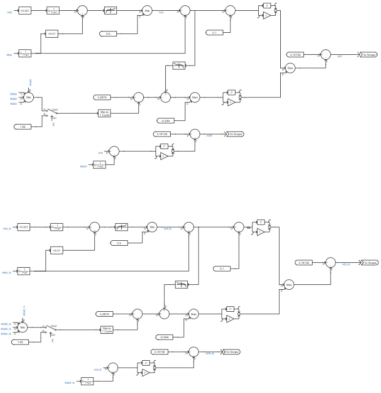
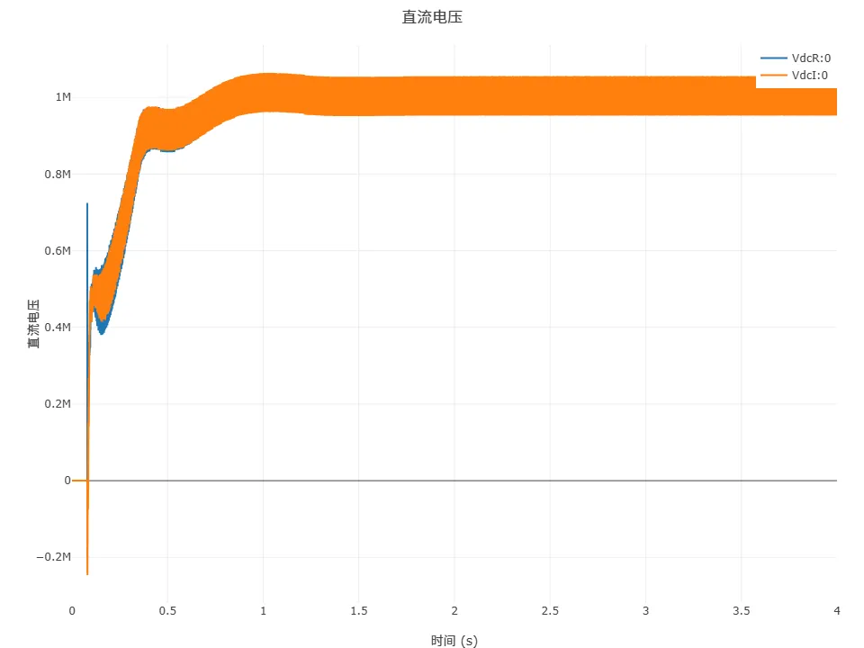
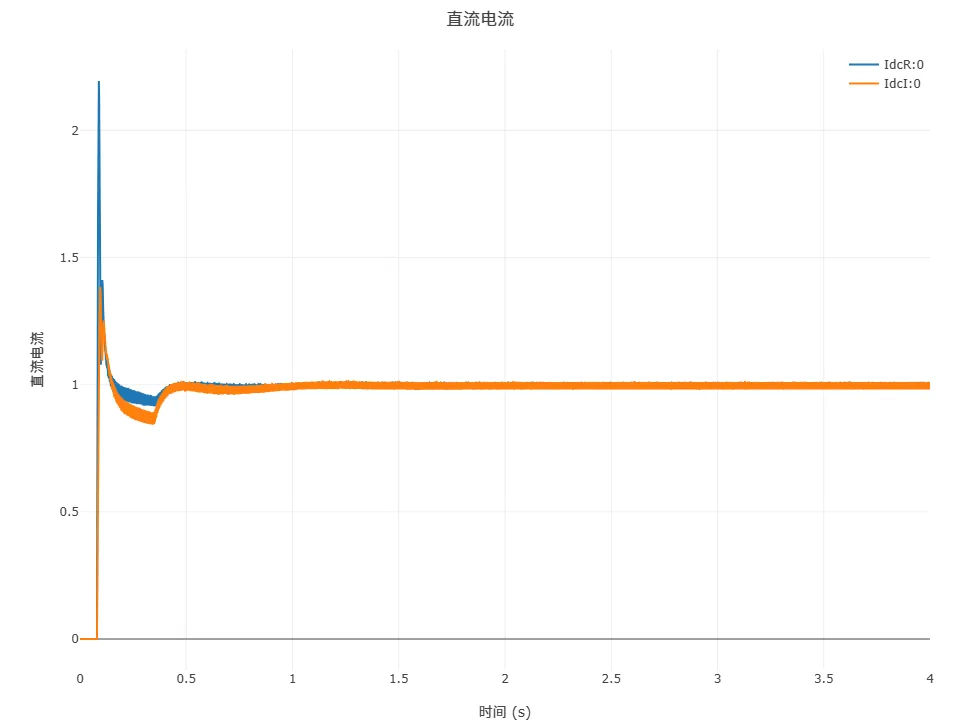
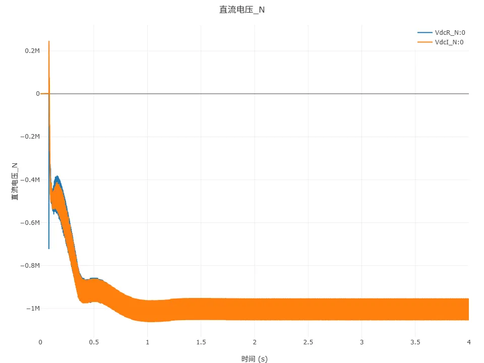
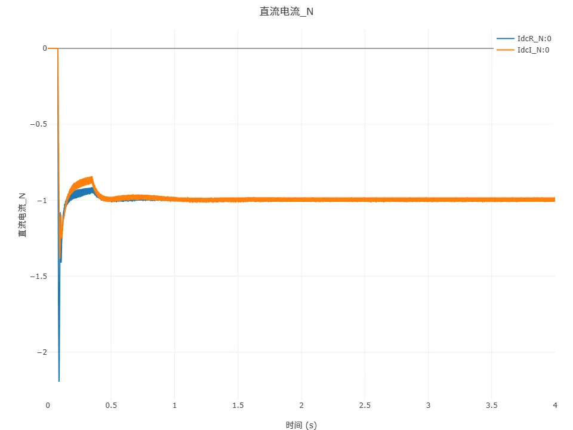
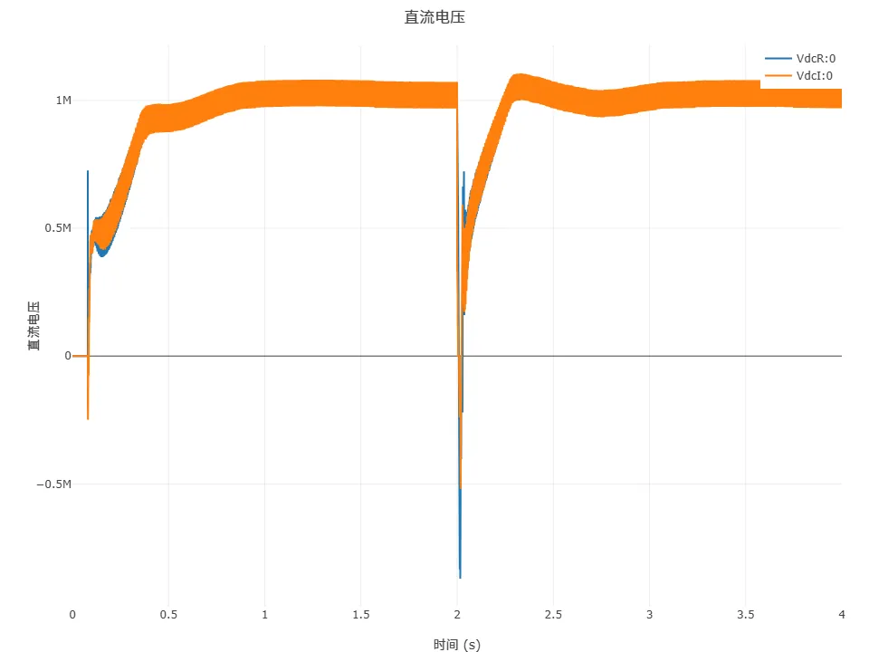
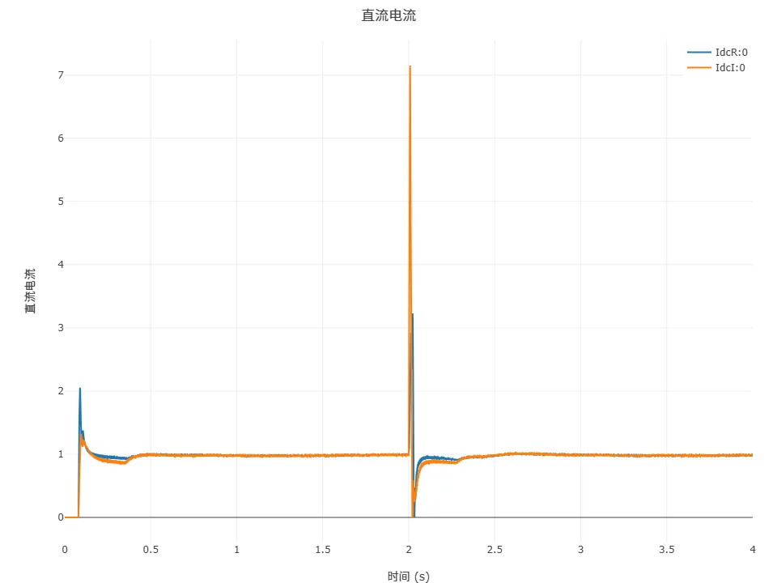
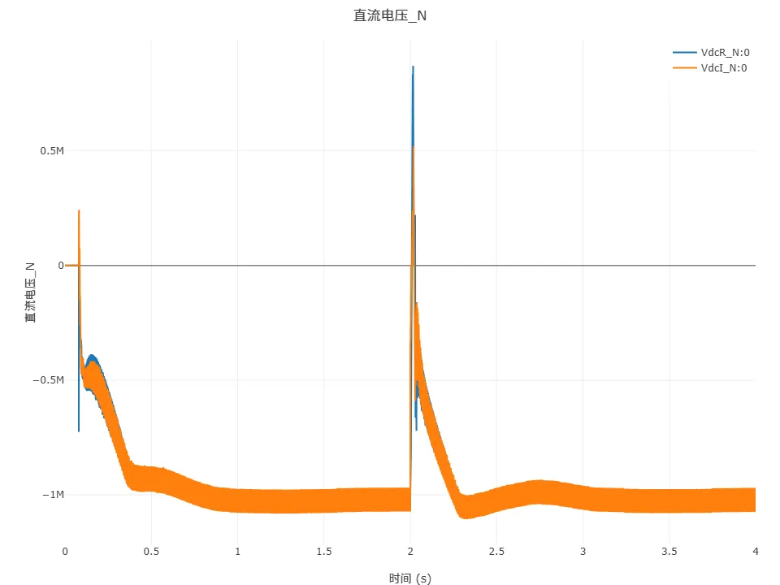
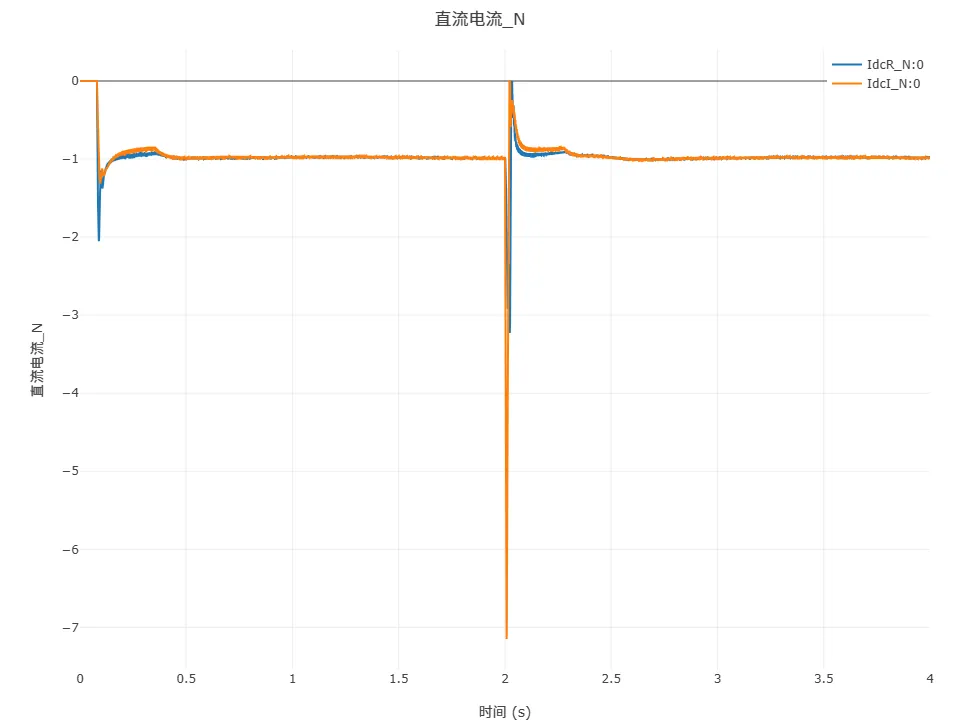

## 案例描述

基于电网换相换流器的高压直流（LCC-HVDC）输电系统具备输送功率大、技术成熟等优势。CloudPSS 标准测试系统涵盖单极 12 脉动、单极双 12 脉动、双极 12 脉动、双极双 12 脉动四种仿真模型，本案例聚焦双极双 12 脉动系统。该系统采用双极并联、每极配置 4 组 6 脉动换流器的结构，实现更稳定地输送更高电压和更低谐波含量，在大容量远距离输电场景中优势显著。

## 使用方法说明

### 计算参数

**仿真步长**：为了准确捕捉换流阀开关瞬间的电磁暂态过程，建议步长需满足 Δt ≤ 1/(50×$f_{switch}$)，其中$f_{switch}$为开关频率（典型值$n\times f_{ac},12×50=600Hz$）。电磁暂态仿真建议采用 1μs\~50μs 步长，避免因步长过大导致换相过程计算失真；当步长过小时可能引发数值不稳定。
  
### 参数方案

| 参数项    | 数值   | 单位 | 备注             |
| ----------- | --------- | ------- | ------------------- |
| 故障开始时间 | 2    | s  | 输入范围 1s - 100s |
| 故障结束时间 | 2.02 | s  | 输入范围 1s - 100s |

## 算例介绍

### 算例简介

#### 算例背景

本案例基于 CIGRE HVDC 标准测试系统，构建双极双 12 脉动 LCC-HVDC 系统，由两个换流站及等值直流线路构成。每个换流站采用双极并联架构，每极包含 4 组 6 脉动换流器，串联形成 12 脉动换流单元，可将交流侧谐波次数提升至 24 次、48 次等，显著降低谐波滤波器设计复杂度并提升输送容量。适用于交直流故障模拟、换相失败分析等场景。
#### 应用场景

*   换流站谐波抑制策略验证（对比不同系统谐波含量）；
*   直流系统控制策略优化（定电流、定关断角参数整定）；
*   暂态故障下的系统稳定性评估（如直流短路、换相失败）。
### 模型构成

双极双 12 脉动模型中，12 脉波桥换流器经换流变压器接入交流母线，母线并联交流滤波器组与电容器组，分别用于滤除谐波和无功补偿。整流侧与逆变侧通过正、负极直流线路连接。

在直流系统的控制系统模型中，整流侧采用定电流控制，逆变侧一般情况下采用定熄弧角控制，并配有低压限流保护环节，如下图所示。

### 系统原理

#### 脉动换流原理

**电压叠加**：每极 4 组 6 脉动换流器串联形成 12 脉动单元，双极并联输出电压叠加。理论直流电压表达式为 $V_{dc} = \frac{2 \times 3 \times \sqrt{2} V_{t} \cos\alpha}{\pi} \times 2$，输出电压稳定性高，纹波系数小。

**谐波特性**：直流侧谐波主要集中在 24 次及以上，相较于其他系统，谐波含量显著降低。

#### 无功与谐波

**无功需求**：换流器运行需从交流系统吸收大量无功，双极双 12 脉动系统因功率较大，需更精准的无功补偿方案。

**谐波滤波**：滤波器组针对性滤除 24k±1 次等高次谐波，有效提升电能质量。

### 控制策略

**整流侧**：采用定直流电流控制，通过 PI 调节器维持 $I_{dcR}$ 稳定，调节触发角 $\alpha$ 实现电流控制。

**逆变侧**：实施定熄弧角控制，确保熄弧角 $\gamma$ 恒定（$\gamma = \beta - \omega L_i I_{dc} / V_{t}$），防止换相失败。

**低压限流保护（LVRT）**：当直流电压 $V_{dc}$ 低于设定阈值时启动，限制故障期间直流电流，保护设备安全。

## 仿真

### 稳态运行测试

设置仿真步长 10μs，启动电磁暂态仿真后，直流系统快速进入稳态：

**直流电压**：整流侧与逆变侧电压绝对值均为 1MV，双极并联后呈现一正一负特性。

**直流电流**：约 0.4s 达到稳态，额定电流绝对值 1kA，双极电流方向相反。

### 换相失败故障测试

换相失败故障是 LCC-HVDC 中最为常见的故障类型。在逆变侧交流母线上设置三相短路故障，并在`运行`标签页的参数方案列表中设置故障起止时间，该交流故障可以引起直流系统发生换相失败故障。仿真结果如下图所示：

**直流电压**：故障时 $V_{dcI}$ 骤降至 -1MV（极性反转），故障切除后约 0.4s 恢复至额定值。

**直流电流**：故障期间 $I_{dc}$ 飙升至 7.4kA（约 7.4 倍额定值），低压限流保护启动后迅速下降，电压恢复后电流缓慢回升。

### 分析总结

#### 单极 12 脉动、双极 12 脉动、单极双 12 脉动、双极双 12 脉动系统对比

| **对比维度**    | **单极 12 脉动**         | **双极 12 脉动**        | **单极双 12 脉动**         | **双极双 12 脉动**          |
| ----------- | -------------------- | ------------------- | --------------------- | ---------------------- |
| **核心技术**    | LCC       | LCC      | LCC        | LCC         |
| **基本控制策略**  | 整流侧定电流、逆变侧定熄弧角  | 整流侧定电流、逆变侧定熄弧角 | 整流侧定电流、逆变侧定熄弧角   | 整流侧定电流、逆变侧定熄弧角    |
| **电压等级**    | 1倍 | 1倍   | 2倍 | 2倍 |
| **稳定性** | 1倍 | 2倍   | 1倍 | 2倍 |

<!-- ## 五、更新记录

| 版本 | 更新时间       | 修改内容             |
| ------- | --------------- | --------------------- |
| v1 | 2025-07-03 | 初始版本，模型测试与文档撰写   | -->

<!-- import DocCardList from '@theme/DocCardList';

<DocCardList /> -->