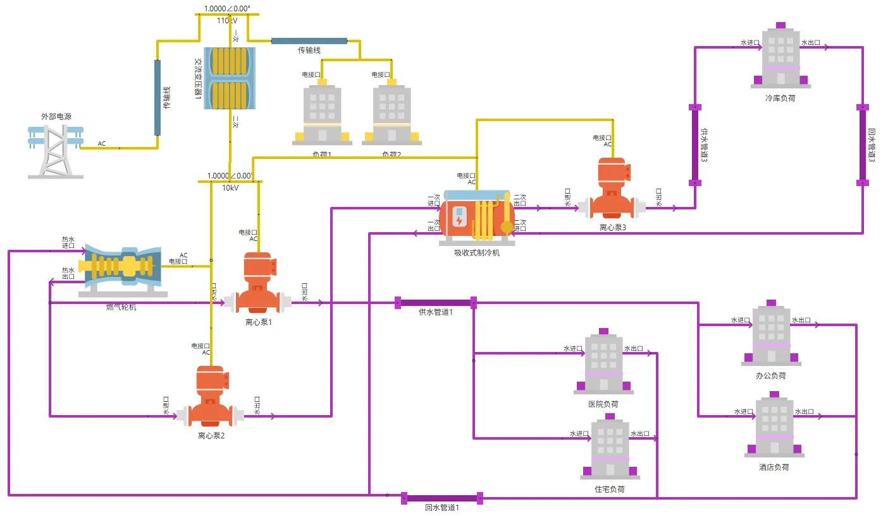
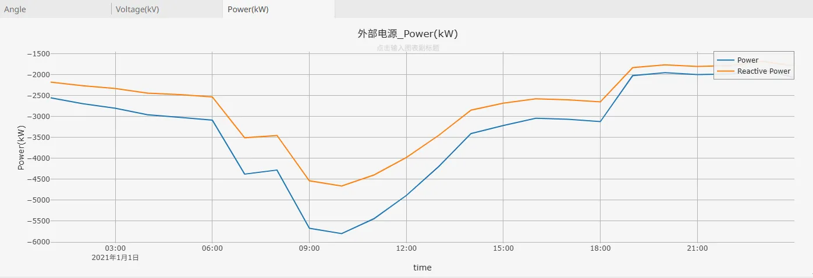
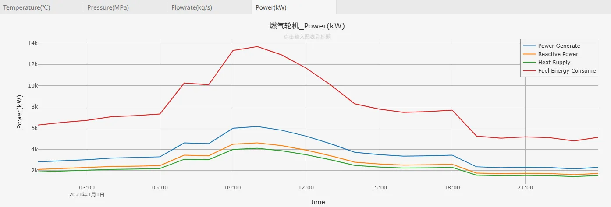
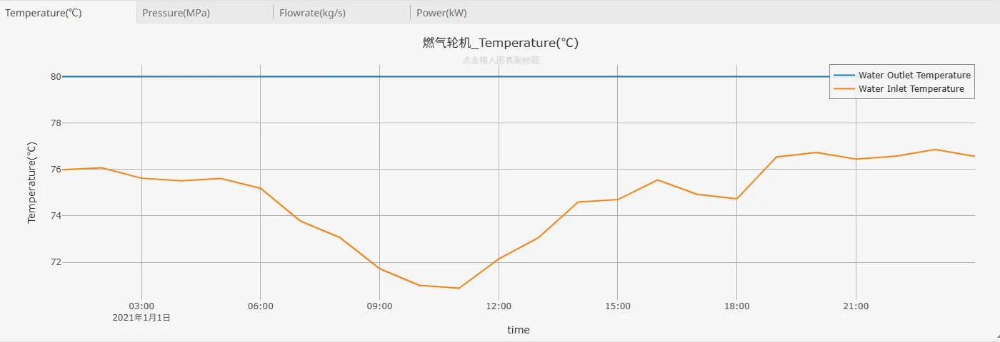
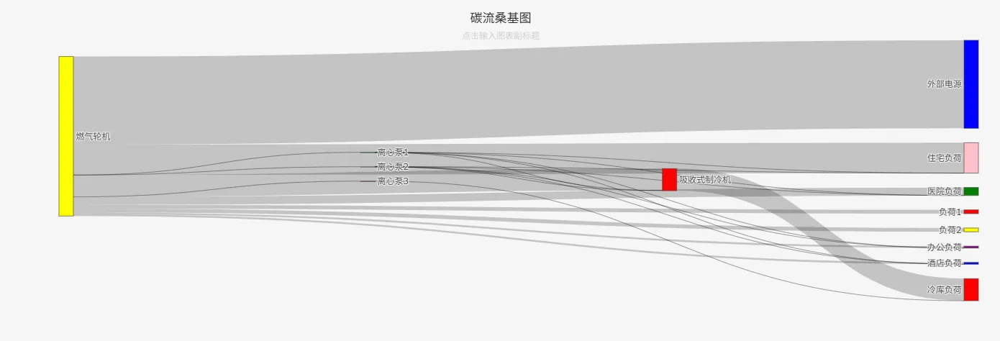

## 描述

冷热电三联供系统（简称CCHP，英文为 Combined Cooling, Heating and Power）是一种综合能源利用系统，通过集中产生和同时提供电力、热能和冷能，实现能源的高效利用。它是一种分布式能源系统形式，能够大幅提高能源的利用效率并减少环境污染。

本算例通过对燃机轮机三联供系统进行建模，其中燃气轮机在发电的同时会利用余热加热水用于供给给下游的热负荷，同时另外一部分热量会用于吸收式制冷机制冷。

## 模型介绍

该模型是一个典型的冷热电三联供综合能源系统，对应某工厂、仓库及配套医院住宅区域，其供电、供冷和供热需求面积约100000m2。模型的拓扑结构图如下所示：

**发电与供电**：燃气轮机作为系统中的核心供能设备，通过燃烧燃气产生热能和电能，热能用于供热或驱动吸收式制冷机制冷，输出的电能接入系统供电网络，为系统中用电设备（比如离心泵、制冷机等）及 “负荷 1、负荷 2” 等供电，满足电力需求，实现电 - 热联产。由于该模型中燃气轮机工作在“以热定电”模式，为平衡电能盈缺，外部电网以平衡电源的模式接入，通过传输线连接 110kV / 10kV 变压器，实现公共电网电能的下送或者系统中富裕电能的反送。

**供热与制冷**：燃气轮机产生 80℃ 的热水，一部分经 “离心泵 1” 驱动，通过供水管道输送至 “医院、住宅” 等负荷的热水需求端，完成供热后经 “回水管道 1” 回流，形成供热循环，另一部分经 “离心泵 2” 驱动，送至吸收式制冷机进行制冷。吸收式制冷机产生 10℃ 的冷水通过 “离心泵 3” 驱动，利用管道将冷水输送到 “冷库” 负荷，实现制冷功能，回水继续参与循环。

## 仿真

选择冬天某日，对上述模型执行 1 天 24 小时的连续稳态仿真，时间步长设置为 60min，可以获得各设备、负荷状态参数的连续变化结果。在该系统中，由于白天（尤其是上午）热负荷和冷负荷较大，导致燃气轮机在白天发电较多，出现反送高峰，如下所示：

而冷热负荷的上升也带来供热系统回水温度的降低，如下图所示，白天和夜晚回水温度可相差近 6℃：

此外，系统对碳流足迹进行了跟踪，采用碳流桑基图进行了显示，可以看出系统中的碳源为燃气轮机，碳流走向主要分为两个部分，一部分流向公共电网，另一部分经离心泵 1、2、3 等，以及吸收式制冷机，最终输送到住宅负荷、医院负荷、负荷 1、负荷 2、办公负荷、酒店负荷、冷库负荷等不同终端。

