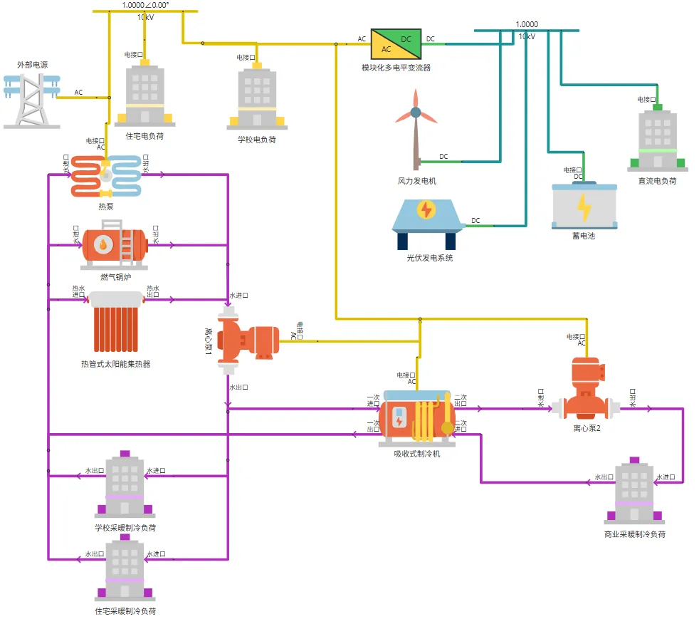
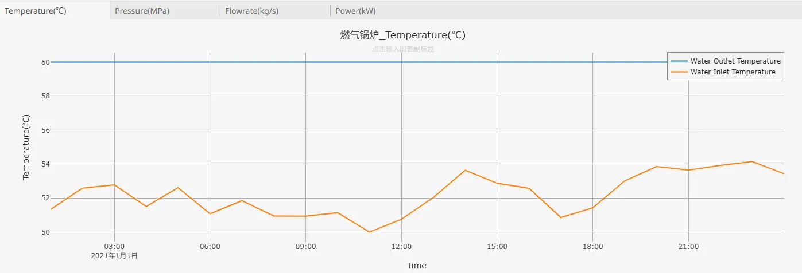
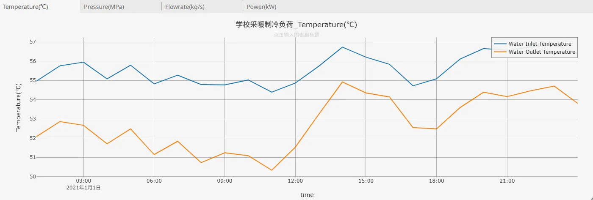
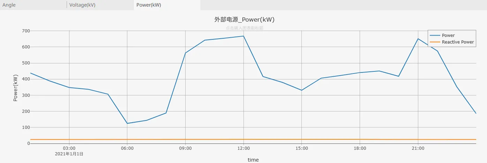
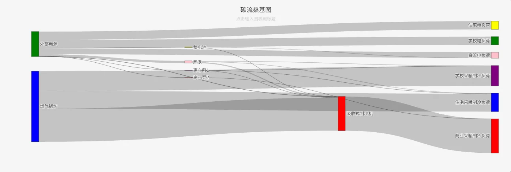

## 描述

园区级综合能源系统是指在特定园区（如工业园区、科技园区、产业园区等）范围内，通过整合电、热、冷、气、可再生能源（如太阳能、风能、地热能等）等多种能源形式，依托先进的能源转换、存储、传输技术和智能管控平台，实现能源生产、输配、消费、回收等环节协同优化的能源系统。其核心是打破传统单一能源供应模式的壁垒，通过多能互补、梯级利用和高效调控，提升能源利用效率、降低能源消耗与碳排放，同时增强园区能源供应的稳定性和经济性，最终构建一个清洁、高效、智能、可持续的区域能源生态体系。

本算例主要对一个工商业区块的能源系统进行建模，该系统中包括风光储等新能源设备，主要能源形式由冷、热、电组成，通过仿真计算可以对系统运行状态进行预测和分析。

## 模型介绍

该模型包含冷、热、电三种形式的能源子系统，主要组成设备包括光伏、风机、蓄电池、热泵、锅炉、光热板、吸收式制冷机等，其拓扑结构图如下所示：

**发电与供电**：公共电网通过 10kV 线路接入系统经线路为住宅、学校电负荷供电，而风力发电机、光伏发电系统产生的直流电，经模块化多电平变流器（MMC）转换为交流电，并入 10kV 供电网络，同时直流电可直接为直流电负荷、蓄电池（DC 连接 ）供电；蓄电池可存储电能，必要时反向供电，多能源协同，满足园区电负荷及设备用电需求 。

**供热与制冷**：供热侧，燃气锅炉、热泵工作在定功率模式，与热管式太阳能集热器三者并联对回水进行加热后混合，通过离心泵 1 输送，为学校、住宅采暖制冷负荷提供热媒；制冷侧，吸收式制冷机利用供热侧热能，经离心泵 2 为商业采暖制冷负荷供应冷媒，实现冷热能源在园区的循环输配与供需匹配。

## 仿真

选择冬季某日，对上述模型执行 1 天 24 小时的连续稳态仿真，时间步长设置为 60min，可以获得各设备、负荷状态参数的连续变化结果。在该系统的供热网络中，由于热泵、燃气锅炉、热管式太阳能集热器都相当于定功率模式运行，此时供热量与热负荷并不完全匹配，在仿真计算时内核会随机将某个热源转换成定温度模式进行工作从而实现供用热的匹配，在本次计算中内核将燃气锅炉的运行模式进行调节，如下图所示：

由于三个热源设备处于并联关系，因此实际混入供热网络的热水温度会发生随时发生波动，如下图所示：

在电力供应方面，系统中的风光出力较少，仍然主要由公共电网提供电力，如下图所示：

在碳足迹追踪方面，公共电网和燃气锅炉作为系统中的主要碳源，主要的碳量是消耗在商业采暖制冷负荷上，如下图所示：

