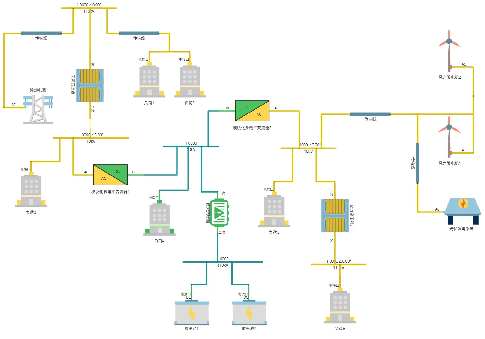
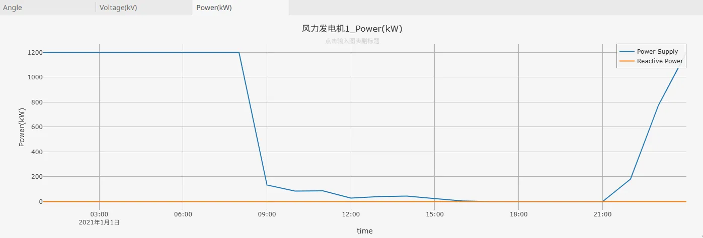
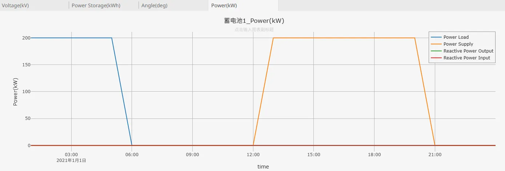
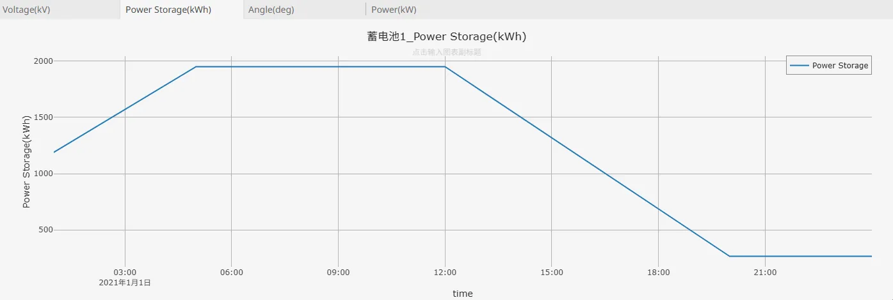
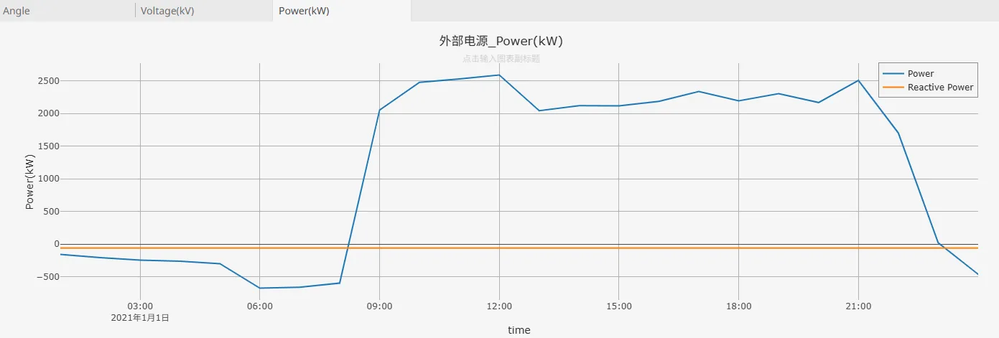

## 描述

从配电网角度来看，交直流混联系统是指在中低压配电网络中，同时存在交流配电线路与直流配电线路，通过交直流换流器、变流器等设备实现两者的连接与能量交互，形成能兼容不同类型负荷与电源的配电网络。这种系统可直接接入分布式光伏、储能电池、电动汽车充电桩等直流电源或负荷，减少交直流转换环节带来的损耗，同时保留交流线路对传统家用电器、工业电机等交流负荷的供电能力，能更灵活地适应多元化用电需求，提升配电网对分布式能源的消纳能力和运行效率，是配电网向智能化、高效化发展的重要形式。

本算例主要对一个低压配电网中的交直流混联系统进行了建模，该系统中存在“交流-直流-交流”的变换模式，相对来说比较复杂。

## 模型介绍

该配电网交直流混联系统，构建了融合交流与直流配电的多元电能传输网络，涵盖交流、直流两类子系统，核心设备包含外部电源、交流变压器、模块化多电平变流器（MMC）、风力发电机、光伏发电系统、蓄电池组，以及不同类型交直流负荷。拓扑结构图如下所示：

外部电源作为基础电能输入，经 110kV 输电线路接入，通过交流变压器转换电压，以 10kV 等电压等级线路，为负荷 1、2、3、5、6 这类传统交流负荷供电，保障常规用电场景。风力发电机、光伏发电系统产生的交流电，经传输线汇入系统，借助模块化多电平变流器，灵活实现交直流电能转换：一方面，变流器可将交流电转为直流电，接入直流母线，为负荷 4 这类直流负荷直接供电，也可向蓄电池组充电，存储多余电能；另一方面，当直流侧电能有外送需求时，变流器又能把直流电逆变为交流电，馈入交流网络，补充交流侧供电。

蓄电池组作为关键储能单元，通过直流线路连接系统，在电能富余时吸纳存储，用电高峰或新能源发电不足时，反向向直流侧或经变流器向交流侧供电，起到 “削峰填谷” 作用。各类交直流设备协同配合，适配园区内多元化交直流负荷用电特性，突破传统单一交流配网局限，提升对分布式新能源的消纳能力，优化电能分配效率，构建出灵活、高效、具备多能互补特性的配电网供能体系 。

## 仿真

选择冬季某日，对上述模型执行 1 天 24 小时的连续稳态仿真，时间步长设置为 60min，可以获得各设备、负荷状态参数的连续变化结果。在该系统中，整个用电负荷在白天较大而夜间较小，风电出力则在夜间较大而白天较小，因此需要通过储能在夜间进行充电，并在白天进行放电，从而尽可能减小系统中从公共电网购买的电能。如下图所示：

由于储能容量有限，因此无法实现风电的全额消纳，在夜间仍然会出现电量上网现象，另外也因为源荷电量的不平衡，因此白天的时候还需要从电网购电，如下图所示：

