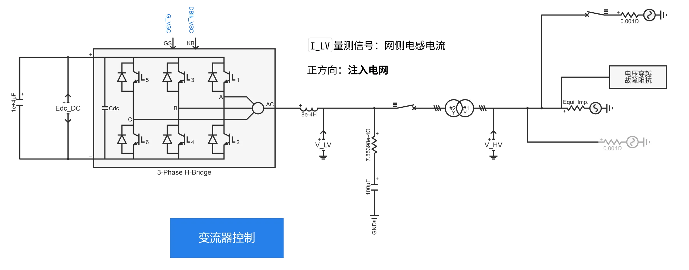
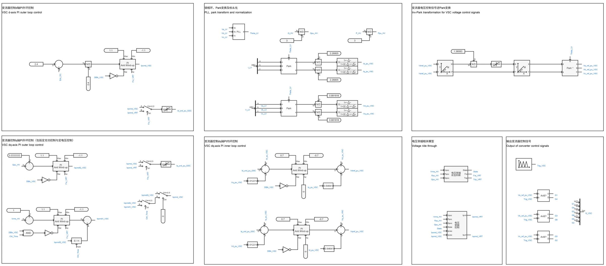
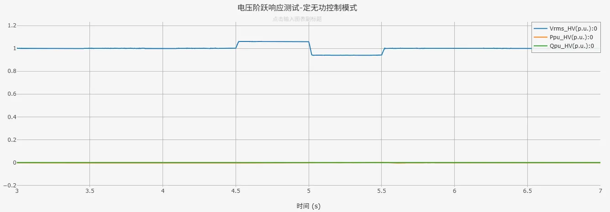
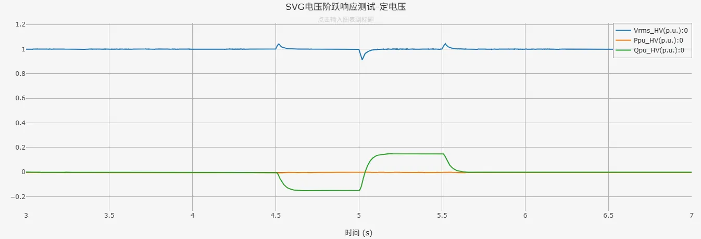
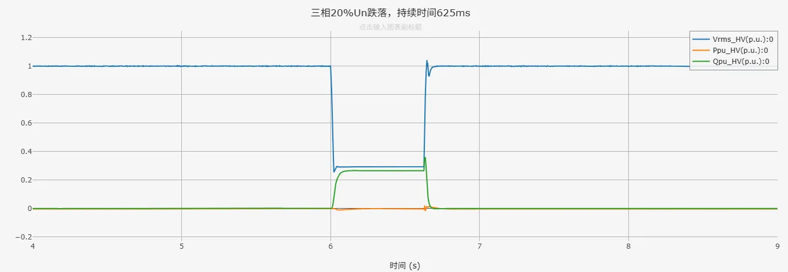
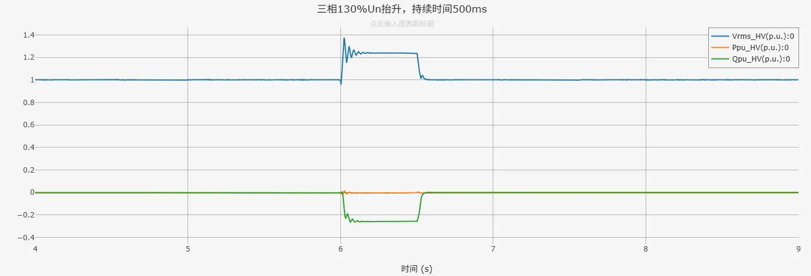

## 案例介绍

包含直流电容、变流器控制及其控制、电压穿越状态判断、电压穿越控制，以及电压穿越故障阻抗等模块的**跟网型SVG01型-快速详细模型-标准模型-v1**的典型案例。
   + [电压穿越状态判断模块](../../../../20-wind-power-system/70-voltage-ride-though-model/10-vrt_sd-stdm-v1/index.md)  
   + [电压穿越控制模块](../../../../20-wind-power-system/70-voltage-ride-though-model/20-vrt_ctrl-stdm-v1/index.md)

## 使用方法说明

### 适用场景  

支持多短路比下的单机并网测试，适用于以下分析场景： 
   + 高低电压穿越测试  
   + SVG控制策略验证  
   + 不同电网强度下的SVG运行特性分析  
   + 动态电压支撑与稳压特性测试 

### 适用范围  
   + 建议步长范围：1~10μs  
   + 高低压穿越成功的短路比≥1.5 

### 功能概述  
   + 电压穿越控制详细参数、变流器PI控制参数、直流电容大小等参数均开放可调  
   + 支持并网方式的切换
   + 高低电压穿越判断，脱网保护控制，定电压控制等可切换启用/禁用状态

## 算例介绍

**SVG01型-快速详细模型-标准模型-v1**由电气主拓扑、变流器控制、电压穿越状态判断模块、电压穿越控制模块，以及电压穿越故障阻抗等五个部分组成。

**电气主拓扑**由直流电容、IGBT开关详细建模的变流器、交流滤波器、升压变压器及单元测试组成。  
并网方式可选择与理想电压源或戴维南等值电压源相连，其中戴维南等值电压源的阻抗大小由用户设置的短路比、阻抗比计算得到。两种并网方式的切换以及短路比、阻抗比的大小均可在参数组中进行设置。单元测试中还包含适用于与戴维南等值电压源相连时的电压穿越故障阻抗模块，不限制短路比的大小，目前暂不支持高电压穿越的工况。  

**变流器控制**由锁相环、Park变换、变流器dq轴内外环控制、变流器电压控制信号逆Park变换、输出变流器控制信号，以及电压穿越状态判断模块、电压穿越控制模块等部分组成，实现对SVG直流电压和输出无功功率的控制；电压穿越期间，将参与dq轴内环PI控制的变流器控制电流指令值替换为电压穿越控制电流指令值  
+ 定无功控制时，变流器q轴外环输入为用户给定的无功功率指令值，与输出无功功率作差后经PI控制得到q轴电流指令值。  
+ 启用定电压控制时，变流器q轴外环先以定无功控制启动，保证系统稳定启动至初始状态。在`Ctrl_Time`后切换至定电压控制，变流器q轴外环输入为用户给定的电压参考值，与并网点电压作差后经PI控制得到q轴电流指令值

## 算例仿真测试

### 电压阶跃响应测试结果

对**SVG01型-快速详细模型-标准模型-v1**进行了电压阶跃响应测试，设置电网电压4.5s时升高至1.06p.u.，5s时降低至0.94p.u.。  
以下为SVG标准模型分别在定无功控制模式和定电压控制模式下的仿真结果。其中，蓝色曲线Vrms_HV为并网点电压、黄色曲线P_HV为并网点处有功功率、绿色曲线Q_HV为并网点处无功功率。  

  

  

由仿真结果可以看到，SVG标准模型在定无功模式下，电压波动时无功功率输出保持不变；在定电压模式下，能够响应电压波动迅速调节无功功率输出，将电网电压维持在设定值附近，表明**SVG01型-快速详细模型-标准模型-v1**具备良好的动态补偿特性。

### 高低压穿越测试结果

对**SVG01型-快速详细模型-标准模型-v1**进行高低压穿越测试，测试结果如下列各表所示（✓代表穿越成功，×代表穿越失败）。  

|          |  SCR=2  |  SCR=1.5  |  SCR=1  |
|:--------:|:-------:|:---------:|:-------:|
|  穿越情况 |    ✓    |    ✓     |   ×     |  

由上表测试结果可以看到，SVG标准模型可在短路比≥1.5时，在高低压穿越测试中穿越成功。  
以下为SCR=2时，**SVG01型-快速详细模型-标准模型-v1**在三相20%Un跌落、三相130%Un抬升工况下的仿真结果。其中，蓝色曲线Vrms_HV为并网点电压、黄色曲线P_HV为并网点处有功功率、绿色曲线Q_HV为并网点处无功功率。  

  

  

由仿真结果可以看到，SVG标准模型在电网电压跌落、抬升期间，输出有无功功率能够按照故障电压穿越能力的要求响应电压变化，且并网点电压能够在故障切除后恢复至初始状态，表明**SVG01型-快速详细模型-标准模型-v1**穿越成功。  

## 模型地址
点击打开模型地址：[**SVG01型-快速详细模型-标准模型-v1**](cloudpss:/model/open-cloudpss/SVG_01-fdm-std-v1b1)  

## 附录

### 参数

import Parameters from './_parameters.md'

<Parameters/>

