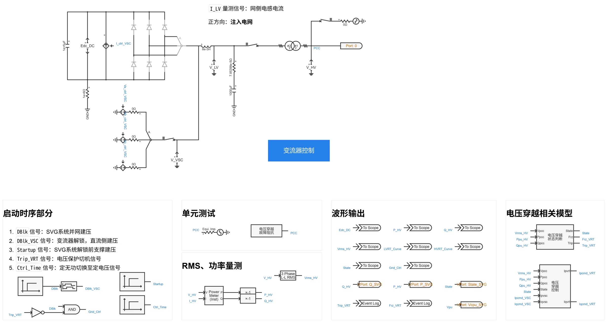
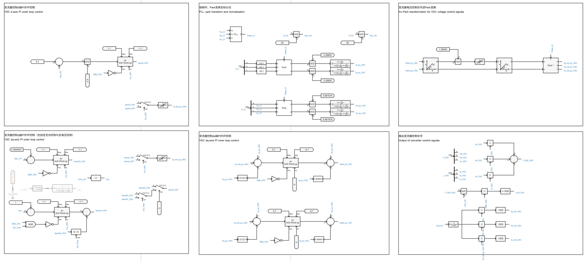
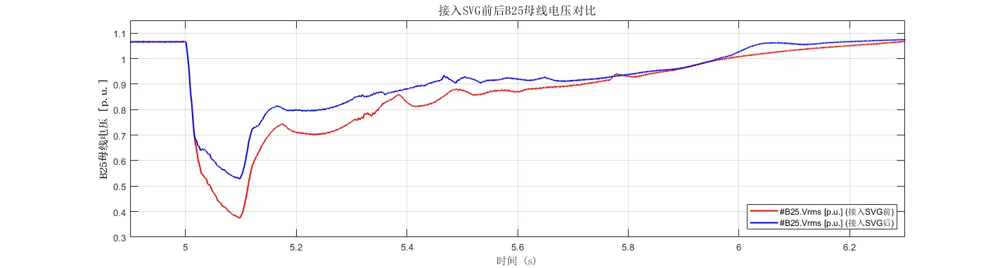
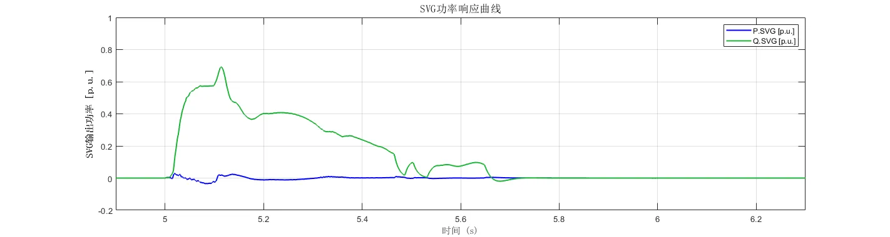

## 元件介绍
在[SVG01型-平均模型-标准模型-v1](../../10-svg/10-svg_01/30-svg_01-avm-std-v1/index.md)的基础上，进行元件封装和倍乘等值，建立潮流初始化模型，增加定电压控制时SVG控制节点母线引脚，形成**SVG01型-标准封装模型-v1**典型案例。  

## 使用方法说明

### 适用场景  

元件支持单机或接入大规模电力系统算例的仿真测试，适用于以下分析场景：  
   + 高低电压穿越测试  
   + SVG控制策略验证  
   + 不同电网强度下的SVG运行特性分析  
   + 动态电压支撑与稳压特性测试  
   + 考虑系统功角、频率、电压的电网稳定性分析  
   + 接入电力系统后的支撑能力评估  

### 适用范围  
   + 建议步长范围：1~50μs  
   + 高低压穿越成功的短路比≥1.5  

### 功能概述  
   + 电压穿越控制详细参数、变流器PI控制参数、直流电容大小等参数均开放可调    
   + 高低电压穿越判断，脱网保护控制，定电压控制等可切换启用/禁用状态
   + 定电压控制时，SVG控制节点母线引脚可调，实现对远方母线电压的控制
  
## 算例介绍

**SVG01型-标准封装模型-v1**由电气主拓扑、变流器控制、[电压穿越状态判断模块](../../../20-wind-power-system/70-voltage-ride-though-model/10-vrt_sd-stdm-v1/index.md)、[电压穿越控制模块](../../../20-wind-power-system/70-voltage-ride-though-model/20-vrt_ctrl-stdm-v1/index.md)，以及电压穿越故障阻抗等五个部分组成。  
与SVG01型-平均模型-标准模型-v1相比存在以下不同：  
+ **元件封装**：将模型进行封装，并在升压变压器高压侧添加与外部相连的模块端口  
+ **倍乘等值**：按设备额定容量、并联数量变化倍数，线性缩放电阻、电感、电容等参数，并保持电压、电流标幺值不变（有名值需要折算），在简化模型规模的同时，使等效模型在并网点呈现与真实多机系统相似的功率输出和动态响应，从而满足系统级稳定性分析的需求   
+ **SVG控制节点母线引脚**：启用定电压控制时，将需要控制的母线与该引脚相连，并写回潮流计算结果，即可实现控制节点母线电压有效值、基准值的输入

**电气主拓扑**由直流电容、等效受控电压源/电流源建模的变流器、交流滤波器、升压变压器及单元测试组成。  

**变流器控制**由锁相环、Park变换、变流器dq轴内外环控制、变流器电压控制信号逆Park变换、输出变流器控制信号，以及电压穿越状态判断模块、电压穿越控制模块等部分组成，实现对SVG直流电压和输出无功功率的控制；电压穿越期间，将参与dq轴内环PI控制的变流器控制电流指令值替换为电压穿越控制电流指令值。  
+ 定无功控制时，变流器q轴外环输入为无功功率指令值，与输出无功功率作差后经PI控制得到q轴电流指令值  
+ 启用定电压控制时，变流器q轴外环先以定无功控制启动，保证系统稳定启动至初始状态。在`Ctrl_Time`后切换至定电压控制，变流器q轴外环输入为电压参考值（默认与控制节点母线电压幅值一致），与控制节点母线电压（单元测试时默认控制并网点电压）作差后经PI控制得到q轴电流指令值  

  
## 算例仿真测试

在[CSEE-CLV](../../../../20-academic-cases/50-csee-standard-cases/60-csee_vs_clv-v1/index.md)标准算例中，将总额定容量为500MVA的**SVG01型-标准封装模型-v1**接入WT19风电场区域内的**B25母线**进行系统级测试，仿真结果表明封装模型可以按照潮流计算结果进行暂态初始化，电压跌落期间能够提供动态无功支撑，验证了模型的正确性。  

  

  

## 模型地址

点击打开模型地址：[**SVG01型-标准封装模型-v1**](cloudpss:/model/open-cloudpss/SVG_01-avm-stdm-v1b1)   

## 附录

### 参数

import Parameters from './_parameters.md'

<Parameters/>

### 引脚

import Pins from './_pins.md'

<Pins/>
