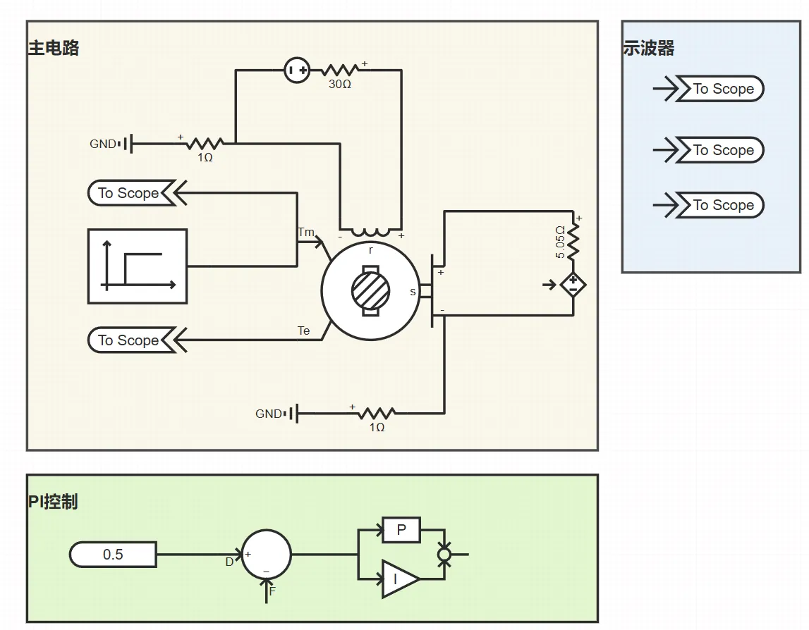
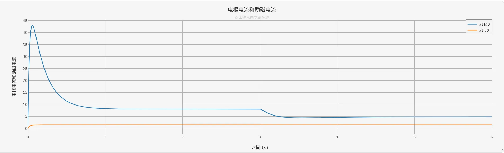
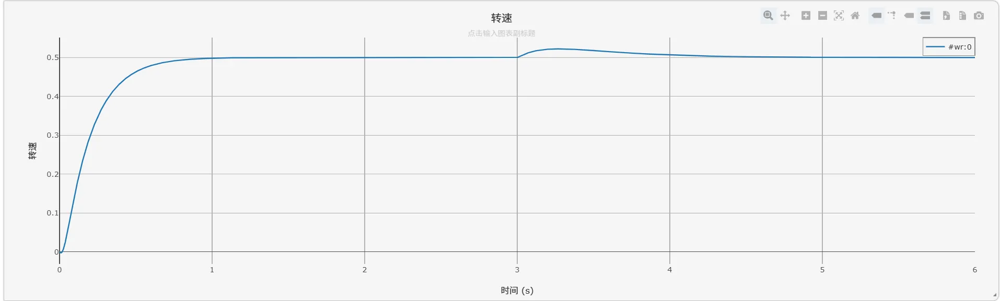
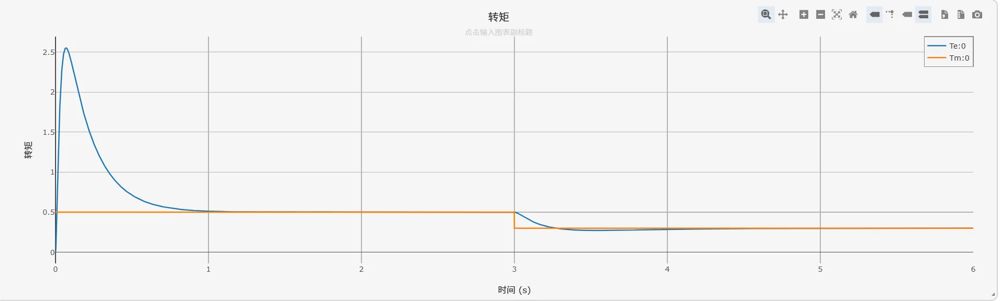

## 描述

直流电机具有调速范围宽、控制精度高、动态响应快、启动转矩大等优点，广泛应用于工业传动、伺服控制、电动汽车等领域。

本算例基于PI控制实现他励直流电机的转速闭环控制，通过调节电枢电压实现电机转速的精确跟踪，同时验证系统在负载扰动下的转速恢复能力。

## 模型介绍

直流电机驱动测试算例主功率拓扑由直流电压源、他励直流电机、PI控制器以及负载构成，仿真拓扑如下图所示。其中，转速外环采用PI控制器，将转速参考值与实际转速的偏差经过比例积分调节后输出控制信号，调节电枢回路电压以控制电机转速。励磁回路由独立直流电源供电，维持励磁电流恒定，保证电机主磁通不变。

## 仿真

设定`运行`标签页参数方案列表中的`机械转矩切换时刻 [s]`为3.0，`转速参考值`为0.5（标幺值）。点击`启动任务`开始仿真计算。

电枢电流与励磁电流的仿真结果如下图所示：

转速的仿真结果如下图所示：

电磁转矩与机械转矩的仿真结果如下图所示：

根据仿真结果，电机启动阶段转速从0开始快速上升，此时电磁转矩输出为最大值（约2.5倍额定转矩），电枢电流也相应出现峰值。随着转速升高，电枢反电动势逐渐增大，电枢电流和电磁转矩逐步减小，最终转速稳定在参考值0.5，电磁转矩与机械转矩达到平衡，验证了PI控制器的转速跟踪性能。

当仿真运行至3.0 s时，机械转矩发生阶跃变化（负载减小），此时电磁转矩随之快速调整，转速出现小幅上升后经PI控制器调节重新恢复到参考值并保持恒定，验证了转速闭环系统的抗扰动能力。励磁电流在整个仿真过程中基本保持恒定，符合他励直流电机的运行特性。