## 案例介绍

**跟网/构网型并网变流器-平均模型v1**由跟网型储能变流器-平均模型-v1和构网型储能变流器-平均模型-v1整合而成，用户可在模型参数方案中选用变流器控制类型。  
   + [跟网型储能变流器-平均模型-v1](../10-pcs_gfl-acad_dps_lqp-v1/index.md)  
   + [构网型储能变流器-平均模型-v1](../20-pcs_gfm-acad_dps_lqp-v1/index.md)

**跟网/构网型并网变流器-平均模型v1**模型整体架构如下图所示。

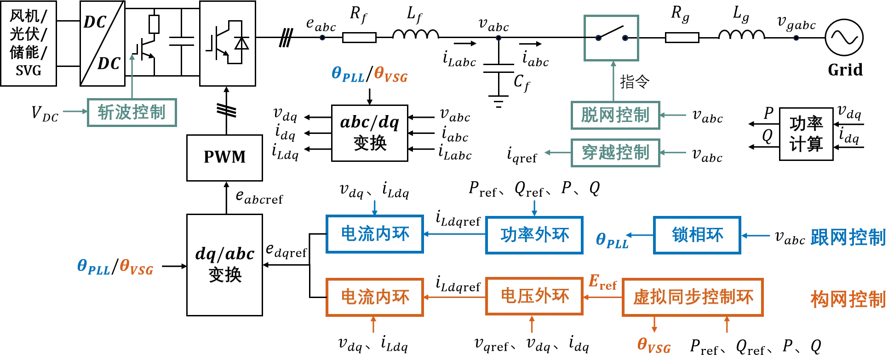  

模型已封装为元件，具备单元测试回路，可单独使用，也可在其他算例中调用。  

## 使用方法说明

### 适用场景

**跟网/构网型并网变流器-平均模型v1**支持单机或接入大规模电力系统算例的仿真测试，适用于以下分析场景：
   + 小信号稳定性分析
   + 不同短路比下的变流器并网适应性测试
   + 考虑系统功角、频率、电压的电网稳定性分析
   + 高比例新能源接入下的系统支撑能力评估
   + 跟网型与构网型控制策略的对比研究  

### 适用范围  

**跟网型并网变流器-平均模型v1**的适用范围：  
   + 建议步长范围：1-50μs  
   + 当前参数设置下建议短路比范围：>3

**构网型并网变流器-平均模型v1**的适用范围：  
  + 建议步长范围：1–50 μs  
  + 当前参数设置下建议短路比范围：2~7

### 功能概述  

   + 变流器并网系统的发电单元除储能外，还可以接入风机、光伏或SVG，以满足不同的研究需求  
   + 跟网型变流器控制可以附加频率-有功和电压-无功的支撑控制，提升系统的稳定性和可靠性  
   + 构网型变流器控制的构网控制方式支持虚拟同步控制与下垂控制的切换 

  
## 算例介绍

**跟网/构网型并网变流器-平均模型v1**由电气主拓扑、标幺制、倍乘等值、通用控制模块、跟网型控制模块、构网型控制模块、量测与输出等七个模块组成。  
跟网型与构网型模型在变流器控制部分有所不同：
+ 跟网型变流器控制：
   + 通过锁相环跟踪电网电压相角，以电网电压为同步基准
   + 采用功率外环和电流内环，实现输出功率的控制
 + 构网型变流器控制：
   + 无需锁相环，通过功率同步环节自主生成电压相角和幅值
   + 采用电压外环和电流内环，实现输出功率的控制

**电气主拓扑**由蓄电池、直流电容、受控电流源组成的直流侧和受控电压源、交流滤波器、电压源组成的交流侧，以及功率设定和单元测试构成，实现平均化变流器等效建模。  
+ **功率设定**输出由用户设定的输出有功、无功功率参考值，并包含输出小信号扰动功率的功能  
+ **单元测试**中设置经线路阻抗与理想电压源相连，连接阻抗的大小由用户设置，系统的短路比在**量测与输出**模块中计算并输出。  
  
  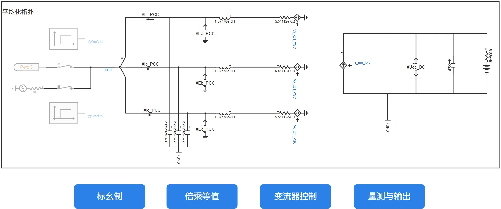

  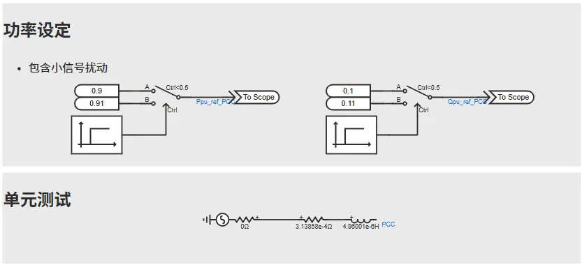  

**标幺制**处理使仿真中除时间外的电气量均为标幺值，便于参数的通用化设置。为使得所构建的变流器模型适用于各种电压等级及功率送出场景，需要构造一个物理概念清晰、使用方便的变流器模型标幺制系统，将控制环节中的量测值、参考值、元件参数、控制参数等均转换为标幺值，经过调试和优化可以得到一套通用的控制参数，实现变流器模型标幺化。

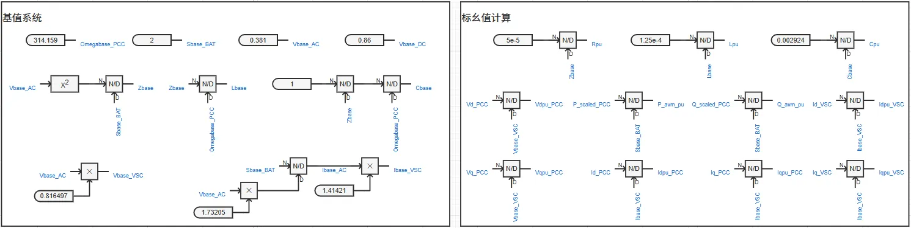

**倍乘等值**的基本原理为：按设备额定电压、额定容量、并联数量变化倍数线性缩放电阻、电感、电容等参数，并保持电压、电流标幺值不变（有名值需要折算），可在简化模型规模的同时，使等效模型在并网点呈现与真实多机系统相似的功率输出和动态响应，从而满足系统级稳定性分析的需求。

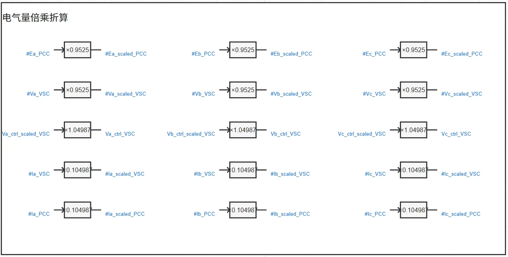

**通用控制模块**包括坐标变换、功率计算、调制模块和平均化控制等部分组成，为跟网型控制与构网型控制通用的变流器控制模块。  

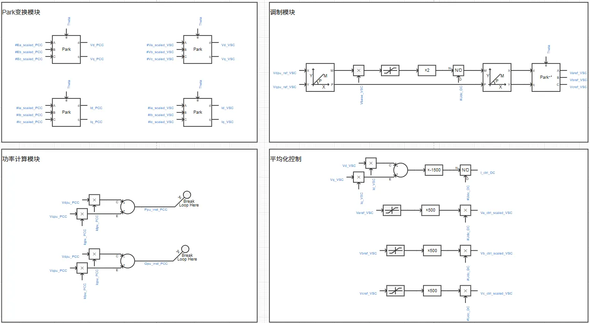

**跟网型控制模块**由锁相环、功率外环控制、电流内环控制等部分组成，实现输出功率的控制，此外还可附加支撑控制，提升系统的稳定性和可靠性。

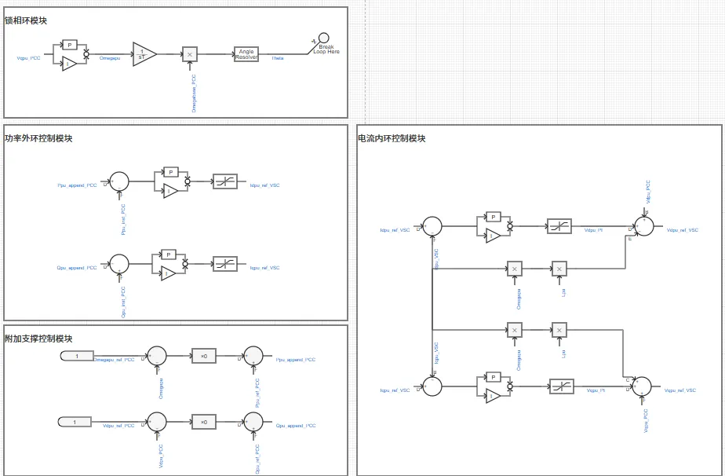  

**构网型控制模块**由功率同步环节、电压外环控制、电流内环控制等部分组成，实现输出功率的控制。其中功率同步环节包含有功-频率控制和无功-电压控制两个部分，控制策略可选择虚拟同步控制或下垂控制，两种控制策略的切换可在参数组中进行设置。

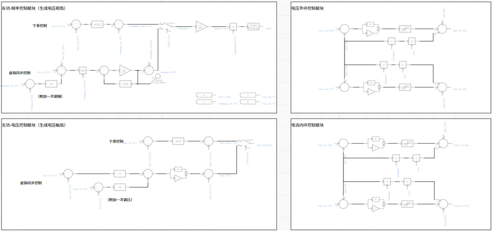

**量测与输出**模块量测控制环节所需电气量，计算并输出用户关注的电气量。

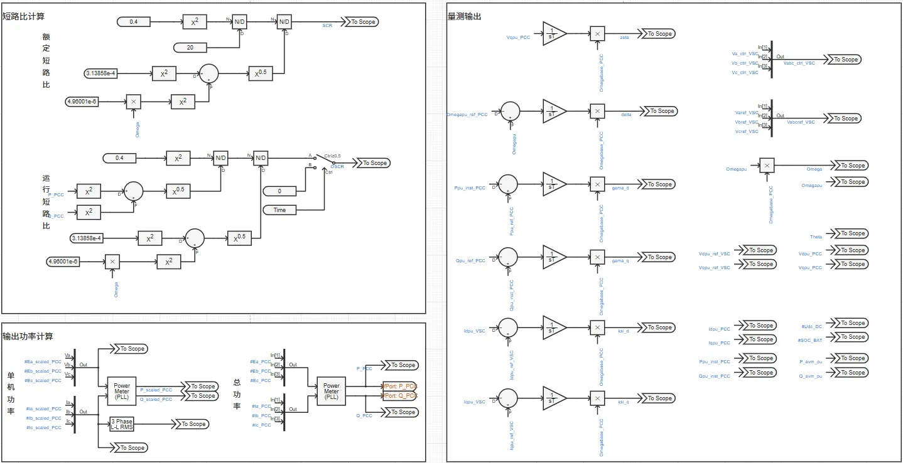  

## 算例仿真测试

### 接入标准算例仿真验证

在拓扑如图所示的CSEE-RAS（新型电力系统标准算例：功角稳定）标准算例中，将风机、光伏替换为**跟网/构网型并网变流器-平均模型v1**，并在B03区新增储能和静止无功发生器，均采用**跟网/构网型并网变流器-平均模型v1**。  
在10s时刻设置B03区2号火电机组掉机故障，分别对选用全跟网型控制，以及80%跟网型控制、20%构网型控制进行测试，以对比构网型设备接入前后系统频率的暂态响应和稳定性。

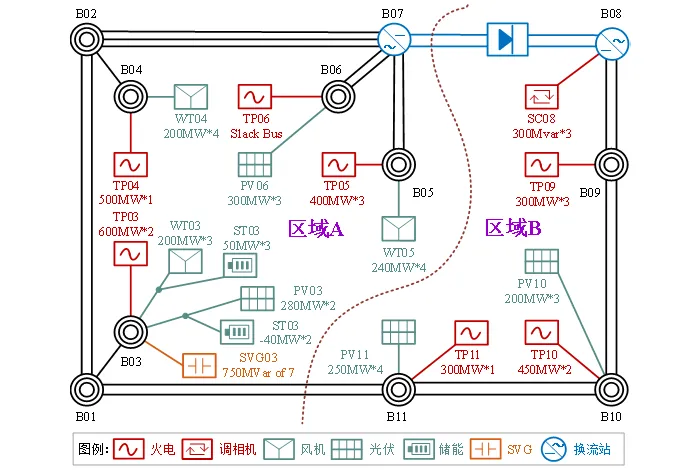

由下图可得，当系统中均为跟网型设备时，系统稳定频率偏低，并且发生掉机故障后系统频率失稳；当系统中接入出力占比为20%的构网型设备后，故障后系统频率仍保持在稳定范围内，即所构建的构网型设备能够较好地支撑系统频率。

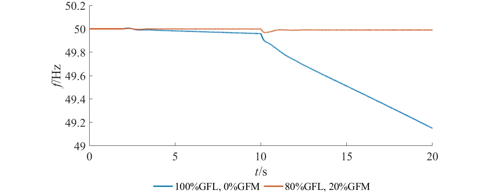

由下图可得，图中实线和虚线分别表示构网型和跟网型设备的出力情况，可见当系统发生掉机故障时，跟网型设备仍保持原功率设定值，无法支撑系统频率，而构网型设备主动增大有功功率输出，有利于维持系统频率稳定，同时提供无功补偿以维持机端电压稳定。由此验证了模型的有效性。  

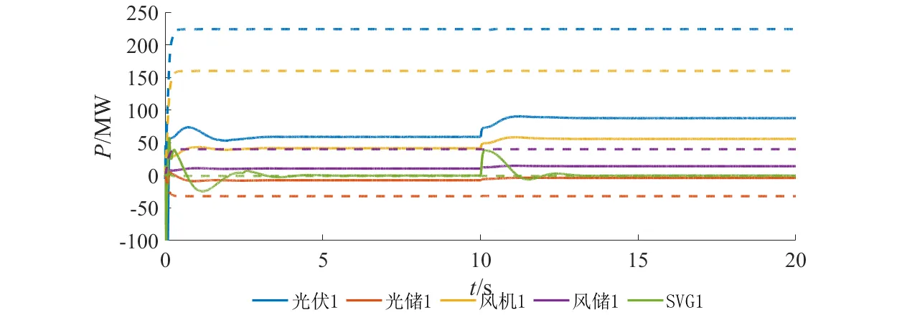  

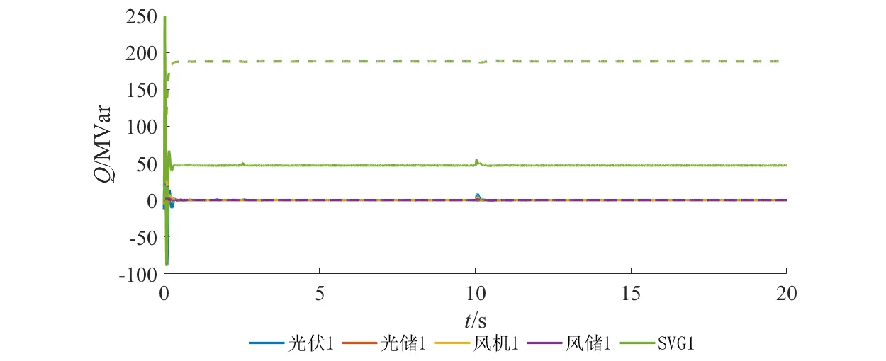

## 模型地址
点击打开模型地址：[**跟网/构网型并网变流器-平均模型**](https://cloudpss.net/model/open-cloudpss/IBR-acad_DPS_lqp-v1a1)  

## 附录

### 参数

import Parameters from './_parameters.md'

<Parameters/>

### 引脚

import Pins from './_pins.md'

<Pins/>