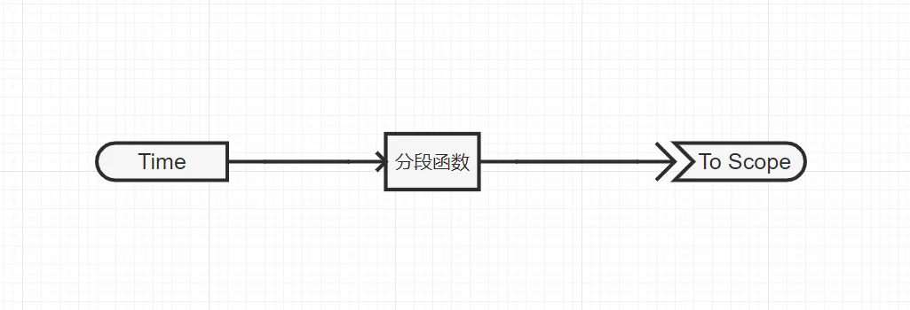
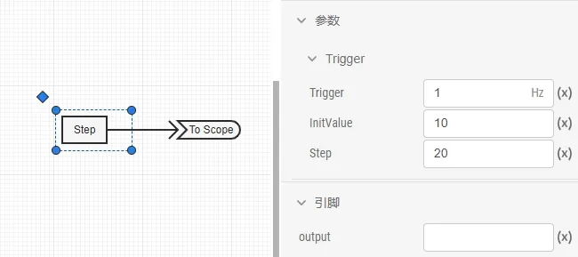
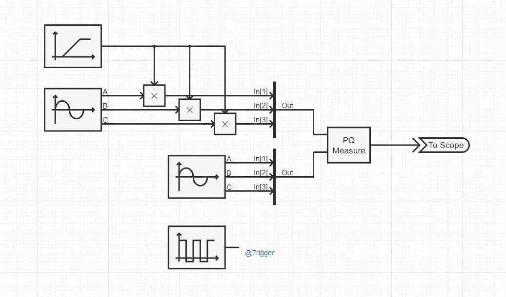
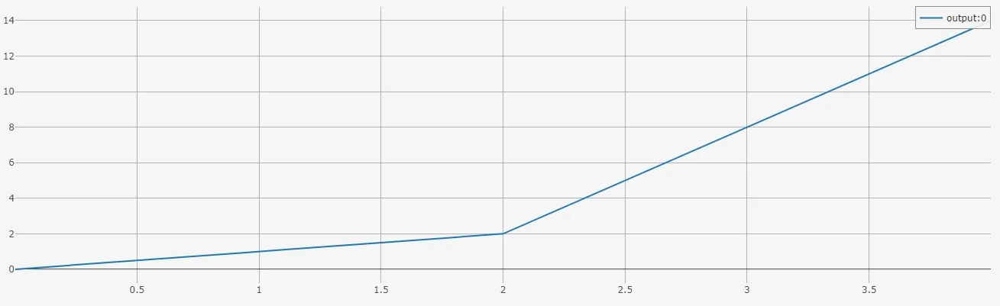
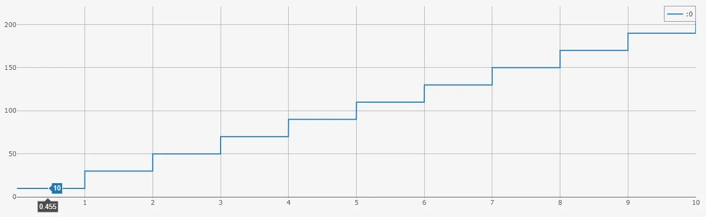

## 案例介绍
本篇文档通过三个典型算例，展示在 EMTLab 平台上使用自定义 Octave 控制元件的方法：
- 案例 1： 每时步触发的简单分段函数控制元件，用于实现可调斜率与分段点的分段函数。
- 案例 2： 固定频率触发且带有全局变量的阶梯爬坡信号发生器，通过 `Trigger` 参数指定触发频率。
- 案例 3： 外部触发的三相瞬时功率计算元件，支持多维输入（电压、电流）和多维输出（有功 P、无功 Q）。

## 使用方法说明
1.  触发方式
- 每时步触发：每个仿真步均调用 Octave 代码（默认方式）。
- 固定频率触发：通过新增参数 `Trigger` 指定触发频率（Hz），仅在该频率上触发执行。
- 外部触发：将 `Trigger` 参数类型设为虚拟引脚，上升沿触发时调用。
2. 实时性限制  
每次触发需调用 Octave 解释器执行脚本，若触发频率高或代码逻辑复杂，会降低仿真速度，影响仿真效率，建议在性能关键场景下考虑拓扑模块封装或降低触发频率。

## 算例介绍
import Tabs from '@theme/Tabs';
import TabItem from '@theme/TabItem';

<Tabs>
<TabItem value="case1" label="案例 1：简单分段函数">
本案例的 Octave 控制元件为可调斜率和分段点的分段函数。



案例中分段函数的输入引脚连接一个**时间输入**元件，在其输出引脚连接一个**输出通道**观测输出结果。

**参数**

| 参数名 | 键名 | 类型 [单位] | 描述 |
|:------ |:---- |:-----------:|:---- |
|斜率1	|`k1`	|实数|	第一段函数斜率|
|斜率2	|`k2`	|实数|	第二段函数斜率|
|分段点横坐标|	`a`|	实数|	分段点横坐标|
|分段点纵坐标|	`b`|	实数|	分段点纵坐标|

**引脚**

| 引脚名 | 键名 | 类型 | 维度 | 描述 |
|:------ |:---- |:----:|:----:|:---- |
| input |	`input`|	输入|	1 × 1|	输入|
| output |	`output`|	输出|	1 × 1|	输出|

**核心代码**
    ``` matlab title="简单分段函数" showLineNumbers
    if input < args.a
        output = args.k1 * input + args.b - args.k1 * args.a;
    else
        output = args.k2 * input + args.b - args.k2 * args.a;
    end
    ```

</TabItem>

<TabItem value="case2" label="案例 2：阶梯爬坡信号发生器">
本案例的 Octave 控制元件为阶梯爬坡信号发生器。



案例中阶梯爬坡信号发生器的输出引脚连接一个**输出通道**观测输出结果。

**参数**

| 参数名 | 键名 | 类型 [单位] | 描述 |
|:------ |:---- |:-----------:|:---- |
|Trigger	|`Trigger`	|实数 [Hz]	|	触发频率|
|InitValue	|`InitValue`	|实数|	初始值|
|Step|	`Step`|	实数|	爬升高度|

**引脚**

| 引脚名 | 键名 | 类型 | 维度 | 描述 |
|:------ |:---- |:----:|:----:|:---- |
| output |	`output`|	输出|	1 × 1|	输出|

**核心代码**
    ``` matlab title="阶梯爬坡信号发生器" showLineNumbers
    global StepMemory = args.InitValue;
    output = StepMemory;
    StepMemory = output + args.Step;
    ```
</TabItem>

<TabItem value="case3" label="案例 3：三相瞬时功率计算元件">
本案例的 Octave 控制元件为三相瞬时功率计算元件。



案例中两个正弦发生器分别模拟电压信号和电流信号，电压信号与一个斜坡发生器相乘后输入 Octave 三相瞬时功率计算元件，模拟电压不断增大的过程。案例中使用方波发生器的输出作为 Octave 元件外部触发的触发信号。

**参数**

| 参数名 | 键名 | 类型 [单位] | 描述 |
|:------ |:---- |:-----------:|:---- |
|Trigger	|`Trigger`	|虚拟引脚（输入）|外部触发信号输入端口（上升沿触发）|

**引脚**

| 引脚名 | 键名 | 类型 | 维度 | 描述 |
|:------ |:---- |:----:|:----:|:---- |
|V|	`V`|	输入|	3 × 1| |	
|I|	`I`|	输入|	3 × 1| |	
|PQ|`PQ`|	输出|	2 × 1| |


**核心代码**
    ``` matlab title="三相瞬时功率计算" showLineNumbers
    Ps = V(1)*I(1) + V(2)*I(2) + V(3)*I(3);
    Qs = (( V(2)*I(3) - I(2)*V(3) ) + ( V(3)*I(1) - I(3)*V(1) ) + ( V(1)*I(2) - I(1)*V(2) ))/(-sqrt(3));
    PQ(1) = Ps;
    PQ(2) = Qs;
    ```
</TabItem>
</Tabs>

## 算例仿真测试

<Tabs>
<TabItem value="case1" label="案例 1：简单分段函数">
仿真结果如下，可以看出分段函数曲线的拐点位于 (2, 2)，两段斜率分别为 1 和 6，曲线的分段点和斜率与设置参数一致。



</TabItem>

<TabItem value="case2" label="案例 2：阶梯爬坡信号发生器">
仿真结果如下，可以看出阶梯爬坡信号发生器的输出为每秒上升 20，从 10 开始的阶梯波形。


</TabItem>

<TabItem value="case3" label="案例 3：三相瞬时功率计算元件">
仿真结果如下，可以看出三相瞬时功率计算元件每 0.1 s 计算一次瞬时有功 Ps 和瞬时无功 Qs，结果与触发频率保持一致。


</TabItem>

</Tabs>

## 算例文件下载链接
**案例 1** 算例文件下载：[model_admin_Octave_Test_Case1.zip](./model_admin_Octave_Test_Case1.zip "案例 1 算例文件")  
**案例 2** 算例文件下载：[model_admin_Octave_Test_Case2.zip](./model_admin_Octave_Test_Case2.zip "案例 2 算例文件")  
**案例 3** 算例文件下载：[model_admin_Octave_Test_Case3.zip](./model_admin_Octave_Test_Case3.zip "案例 3 算例文件")

## 附：修改及调试日志
- 20250715 编写案例文档