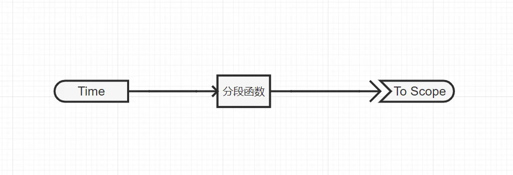
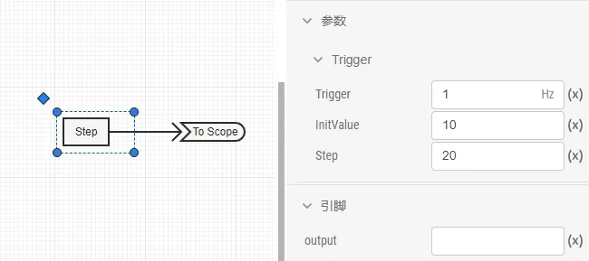
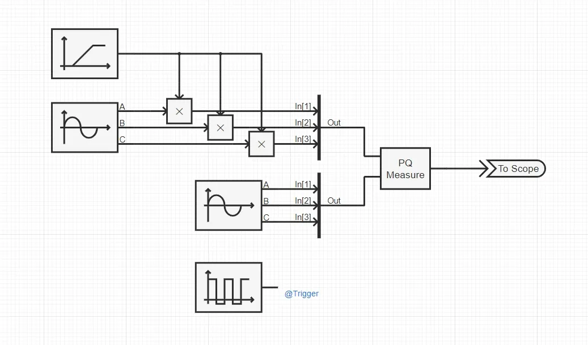
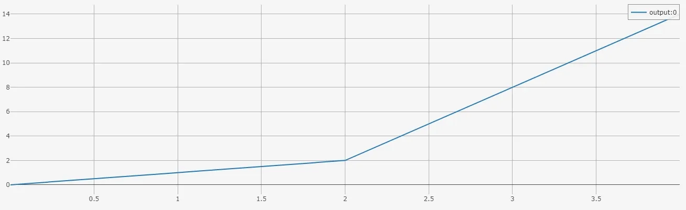
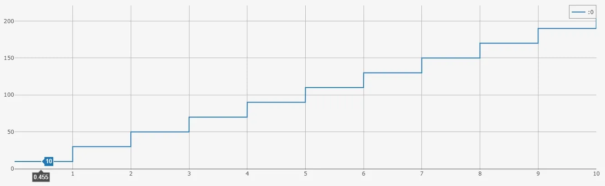
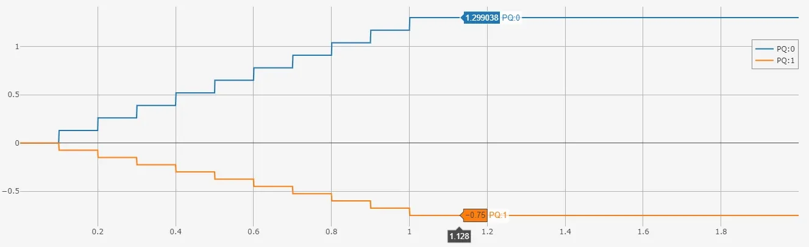

## 案例介绍
本文档通过三个典型算例，介绍在 EMTLab 平台上使用自定义 Python 控制元件的方法：
- 案例 1： 每时步触发的简单分段函数 Python 元件。 
- 案例 2： 固定频率触发且带有全局变量的阶梯爬坡信号发生器。
- 案例 3： 外部触发的三相瞬时功率计算元件（多维输入输出）。  

:::warning
公网试用平台暂不支持自定义 Python 元件。
:::

## 使用方法说明
1. 触发方式
Python 元件支持以下三种触发方式：
- 每时步触发（默认）：每个仿真步都会调用 Python 脚本。
- 固定频率触发：需新增 `Trigger` 参数（实数，单位 Hz），设置后仅按指定频率触发执行。
- 外部触发：将 `Trigger` 参数类型设为虚拟引脚，Python 代码仅在输入信号上升沿时被触发执行。
2. 实时性限制  
Python 元件每次调用都需解释执行，复杂逻辑或高频触发时将增加 CPU 开销，影响仿真实时性，建议尽量简化控制逻辑或适当调低触发频率。

## 算例介绍
import Tabs from '@theme/Tabs';
import TabItem from '@theme/TabItem';

<Tabs>
<TabItem value="case1" label="案例 1：简单分段函数">
本案例的 Python 控制元件为可调斜率和分段点的分段函数：输入信号小于分段点时执行第一段斜率，大于等于分段点时执行第二段斜率。



案例中分段函数的输入引脚连接一个**时间输入**元件，在其输出引脚连接一个**输出通道**观测输出结果。

**参数**

| 参数名 | 键名 | 类型 [单位] | 描述 |
|:------ |:---- |:-----------:|:---- |
|斜率1	|`k1`	|实数|	第一段函数斜率|
|斜率2	|`k2`	|实数|	第二段函数斜率|
|分段点横坐标|	`a`|	实数|	分段点横坐标|
|分段点纵坐标|	`b`|	实数|	分段点纵坐标|

**引脚**

| 引脚名 | 键名 | 类型 | 维度 | 描述 |
|:------ |:---- |:----:|:----:|:---- |
| input |	`input`|	输入|	1 × 1|	输入|
| output |	`output`|	输出|	1 × 1|	输出|

**核心代码**
    ``` python title="简单分段函数" showLineNumbers
    if input < args["a"]:
        output = args["k1"] * input + args["b"] - args["k1"] * args["a"] 
    else:        
        output = args["k2"] * input + args["b"] - args["k2"] * args["a"]
    return[output]
    ```

</TabItem>

<TabItem value="case2" label="案例 2：阶梯爬坡信号发生器">
本案例的 Python 控制元件为阶梯爬坡信号发生器：以固定频率输出递增的阶梯波，使用全局变量存储状态。



案例中阶梯爬坡信号发生器的输出引脚连接一个**输出通道**观测输出结果。

**参数**

| 参数名 | 键名 | 类型 [单位] | 描述 |
|:------ |:---- |:-----------:|:---- |
|Trigger	|`Trigger`	|实数 [Hz]	|	触发频率|
|InitValue	|`InitValue`	|实数|	初始值|
|Step|	`Step`|	实数|	爬升高度|

**引脚**

| 引脚名 | 键名 | 类型 | 维度 | 描述 |
|:------ |:---- |:----:|:----:|:---- |
| output |	`output`|	输出|	1 × 1|	输出|

**核心代码**
    ``` python title="阶梯爬坡信号发生器" showLineNumbers
        global StepMemory
        output = StepMemory
        StepMemory = output + args["Step"]
        return [output]

    StepMemory = args["InitValue"]
    ```
</TabItem>

<TabItem value="case3" label="案例 3：三相瞬时功率计算元件">
本案例的 Python 控制元件为三相瞬时功率计算元件：计算三相瞬时有功功率 Ps 与无功功率 Qs，外部信号触发计算。




案例中两个正弦发生器分别模拟电压信号和电流信号，电压信号与一个斜坡发生器相乘后输入 Python 三相瞬时功率计算元件，模拟电压不断增大的过程。案例中使用方波发生器的输出作为 Python 元件外部触发的触发信号。

**参数**

| 参数名 | 键名 | 类型 [单位] | 描述 |
|:------ |:---- |:-----------:|:---- |
|Trigger	|`Trigger`	|虚拟引脚（输入）|外部触发信号输入端口（上升沿触发）|

**引脚**

| 引脚名 | 键名 | 类型 | 维度 | 描述 |
|:------ |:---- |:----:|:----:|:---- |
|V|	`V`|	输入|	3 × 1| |	
|I|	`I`|	输入|	3 × 1| |	
|PQ|`PQ`|	输出|	2 × 1| |


**核心代码**
    ``` python title="三相瞬时功率计算" showLineNumbers
    import math    
    Ps = V[0]*I [0] + V[1]*I [1] + V[2]*I [2]
    Qs = (( V[1]*I [2] - I[1]*V [2] ) + ( V[2]*I [0] - I[2]*V [0] ) + ( V[0]*I [1] - I[0]*V [1] ))/(-math.sqrt(3))
    return [[Ps,Qs]]
    ```
</TabItem>
</Tabs>

## 算例仿真测试
<Tabs>
<TabItem value="case1" label="案例 1：简单分段函数">
仿真结果如下，可以看出分段函数曲线的拐点位于 (2, 2)，两段斜率分别为 1 和 6，曲线的分段点和斜率与设置参数一致。



</TabItem>

<TabItem value="case2" label="案例 2：阶梯爬坡信号发生器">
仿真结果如下，可以看出阶梯爬坡信号发生器的输出为每秒上升 20，从 10 开始的阶梯波形。


</TabItem>

<TabItem value="case3" label="案例 3：三相瞬时功率计算元件">
仿真结果如下，可以看出三相瞬时功率计算元件每 0.1 s 计算一次瞬时有功 Ps 和瞬时无功 Qs，结果与触发频率保持一致。



</TabItem>

</Tabs>

## 算例文件下载链接
**案例 1** 算例文件下载：[model_admin_Python_Test_Case1.zip](./model_admin_Python_Test_Case1.zip "案例 1 算例文件")  
**案例 2** 算例文件下载：[model_admin_Python_Test_Case2.zip](./model_admin_Python_Test_Case2.zip "案例 2 算例文件")  
**案例 3** 算例文件下载：[model_admin_Python_Test_Case3.zip](./model_admin_Python_Test_Case3.zip "案例 3 算例文件")  
文件密码：cloudpss123

## 附：修改及调试日志
- 20250716 编写案例文档