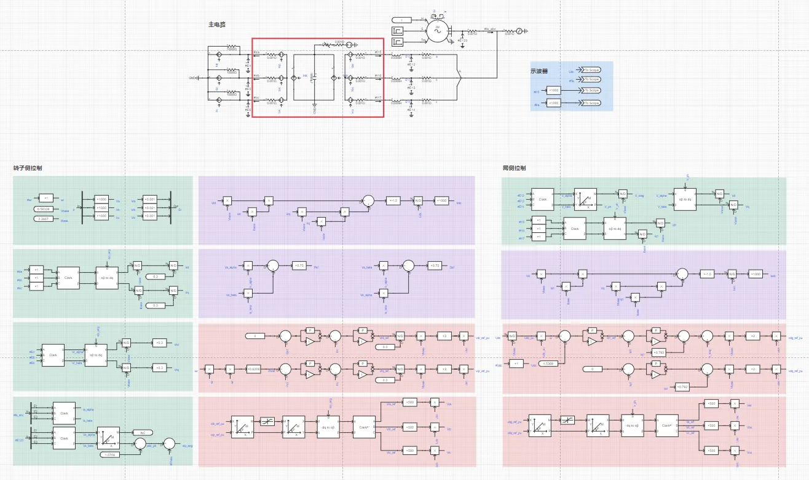
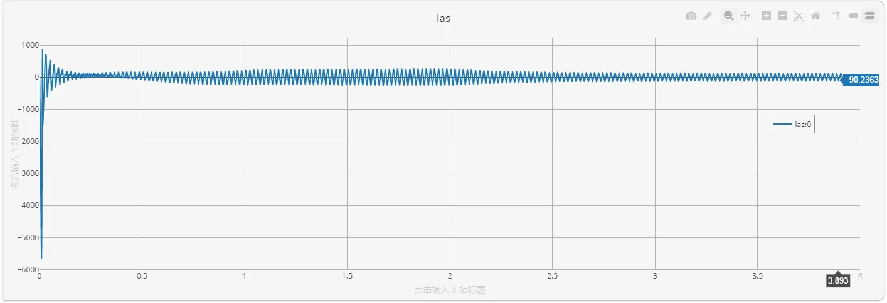
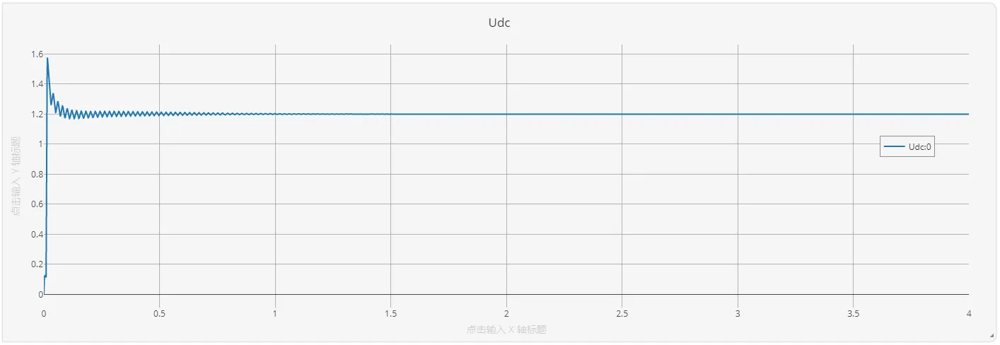
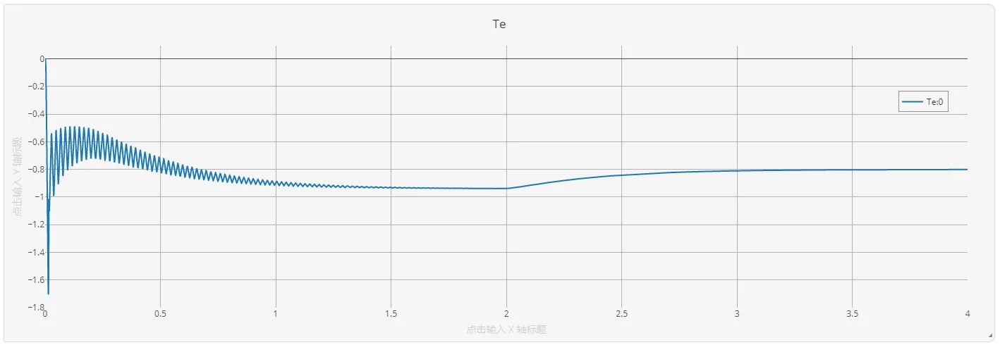
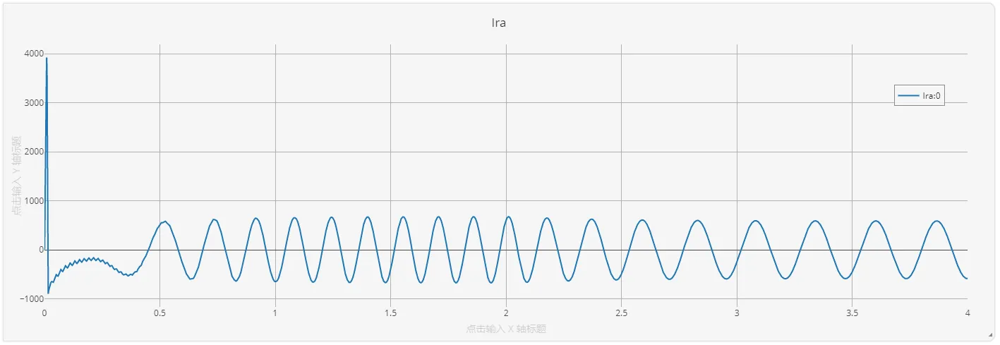

## 描述
双馈电机采用交流电流励磁，与采用直流电流励磁的同步电机相比，励磁电流的可调量除了幅值外，还多了频率和相位，这就使交流励磁双馈电机在性能上更优越。当发电机转速变化时，励磁电流的频率会相应改变，使定子发出电压的频率不变；改变励磁电流的相位，则改变了电网电压和定子电压的相对位置，即改变了发电机的功率角，从而能调节发电机的有功功率和无功功率。

本算例为双馈电机控制系统的仿真，其中，励磁调节系统采用为采用平均化建模的背靠背式电压源变流器，双馈电机励磁侧仅支持平均化模型接入。

## 模型介绍

 双馈电机控制测试算例主功率拓扑由三相交流电压源、三相异步电机以及励磁回路构成，其中励磁回路采用背靠背电压源变流器的平均化模型，仿真拓扑如下图所示。

## 仿真
设定`运行`标签页参数方案列表中的`机械转矩切换时刻 [s]`为2，配置`电磁暂态仿真方案`，点击`启动任务`开始仿真计算。

a相定子电流的仿真结果如下图所示：

直流电压的仿真结果如下图所示：

电磁转矩的仿真结果如下图所示：

a相转子电流的仿真结果如下图所示：

根据仿真结果及仿真设置可知，直流电压的参考值为1.2kV，直流电压维持在参考值保持不变。