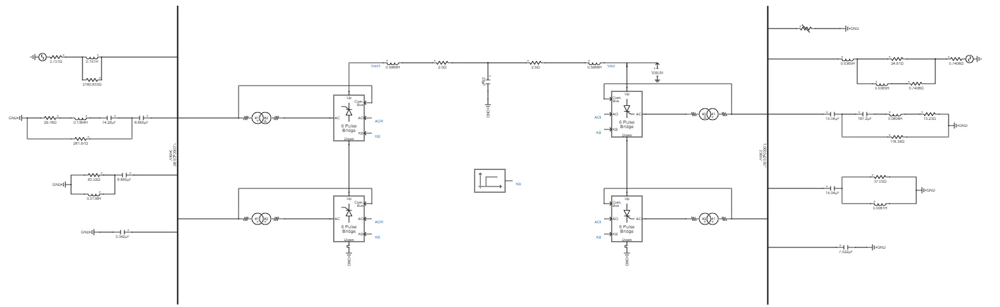
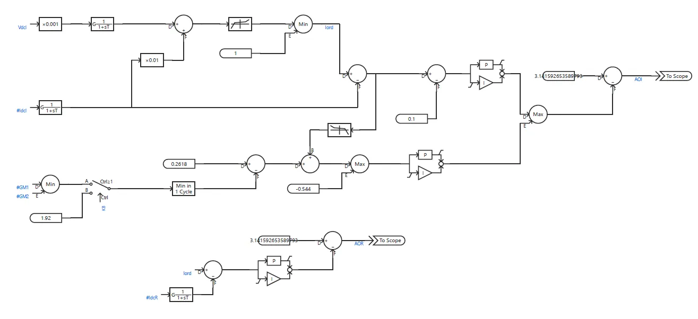
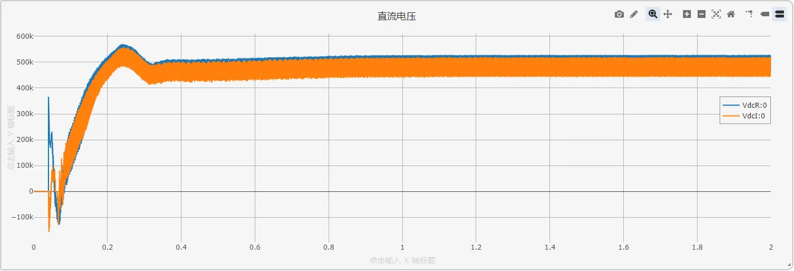
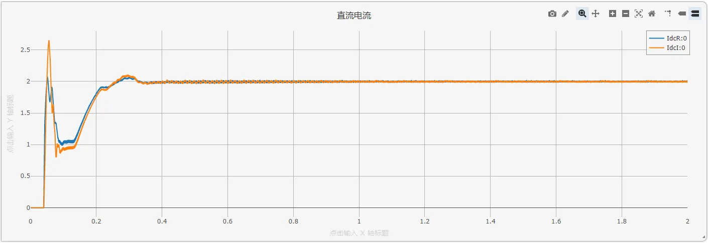
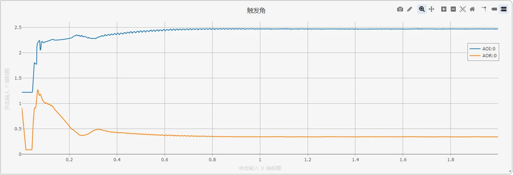
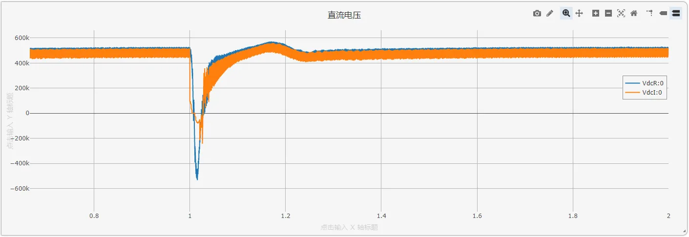
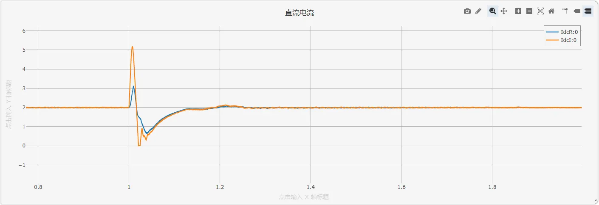
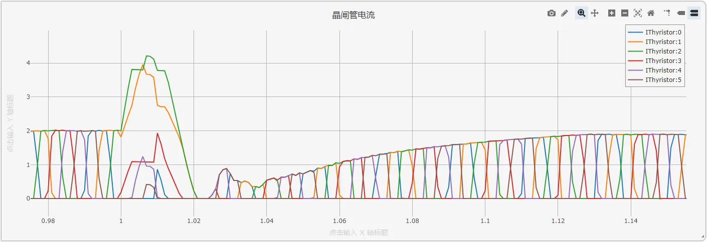

## 一、案例描述

基于电网换相换流器的高压直流 (Line commutated converter high voltage direct current, LCC-HVDC) 输电系统具有输送功率大、技术成熟等优点，近年来在电力系统中发挥越来越大的作用。CloudPSS 提供了国际大电网组织提供的 LCC-HVDC 标准测试系统。在标准测试系统上，CloudPSS 进一步提供了单极 12 脉动、单极双 12 脉动、双极 12 脉动、双极双 12 脉动四种 LCC-HVDC 仿真模型，用户可根据需要进行选取。现以单极单 12 脉动为例进行仿真模型的介绍。

## 二、使用方法说明

### 2.1 计算参数

**仿真步长**：为了准确捕捉换流阀开关瞬间的电磁暂态过程，建议步长需满足 Δt ≤ 1/(50×$f_{switch}$)，其中，$f_{switch}$为开关频率（典型值$n\times f_{ac},12×50=600Hz$）。电磁暂态仿真建议采用 1μs\~50μs 步长，避免因步长过大导致换相过程计算失真；当步长过小时可能引发数值不稳定。
  
### 2.2 参数方案

| 参数项    | 数值   | 单位 | 备注              |
| ----------- | --------- | ------- | -------------------- |
| 故障开始时间 | 2    | s  | 输入 1s 到 100s 之间 |
| 故障结束时间 | 2.02 | s  | 输入 1s 到 100s 之间 |

## 三、算例介绍

### 3.1 算例简介

#### 3.1.1 算例背景

本案例为基于 CIGRE HVDC 标准测试系统构建的单极 12 脉动的 LCC-HVDC 高压直流输电系统，由两个换流站和等值直流线路组成，每个换流站通过两组 6 脉动换流器串联实现 12 脉波换流，可将交流侧谐波次数提升至 12 次、24 次，降低谐波滤波器设计复杂度。本算例可用于模拟交直流故障、换相失败过程分析、闭环控制动态分析、控制保护系统设计等场合。

#### 3.1.2 应用场景

*   换流站谐波抑制策略验证（如 12 脉动与 6 脉动谐波含量对比）；
*   直流系统控制策略优化（定电流、定关断角控制参数整定）；
*   暂态故障（直流短路、换相失败）下的系统稳定性评估。
### 3.2 模型构成

单极 12 脉动 LCC-HVDC 模型如图所示，其中每个 6 脉波桥换流器与对应的换流变压器进行连接，进一步与交流侧母线连接。交流母线上，并联有交流滤波器组与电容器组，电容器组主要用于交流侧的无功补偿；滤波器组用于滤除交流测的谐波，同时也具有一定的无功补偿的作用。整流侧与逆变侧通过直流线路相连接。

在直流系统的控制系统模型中，整流侧采用定电流控制，逆变侧一般情况下采用定熄弧角控制，并配有低压限流保护环节。

在直流系统的控制系统模型中，整流侧采用定电流控制，逆变侧一般情况下采用定熄弧角控制，并配有低压限流保护环节，如下图所示。

### 3.3 系统原理

单极 12 脉动 LCC-HVDC 系统基于电网换相换流器 (LCC) 技术，其核心拓扑由以下部分构成：

**换流单元**：包含两个 6 脉动换流桥，通过换流变压器与交流系统连接，两桥之间相位差 30$^\circ$，形成 12 脉动换流结构。
**换流变压器**：采用 Y/Y 和 Y/Δ 两种接线方式，为两个 6 脉动桥提供相位差 30$^\circ$ 的交流电压，是实现 12 脉动换流的关键元件。  
**交流侧设备**：并联交流滤波器组与电容器组，其中：
*   电容器组：主要用于补偿换流器消耗的无功功率（换流器运行时约消耗 30%-50% 额定有功功率的无功）。
*   滤波器组：滤除 12k±1 次（如 11 次、13 次）谐波，同时辅助无功补偿。  

**直流线路**：连接整流侧与逆变侧，传输高压直流功率。

#### 3.3.1 脉动换流原理

12 脉动换流通过两个 6 脉动桥串联实现，其工作原理如下：  
**电压叠加**：两个 6 脉动桥输出的直流电压叠加，形成 12 脉动波形，理论直流电压表达式为：
$V_{dc} = \frac{2 \times 3 \times \sqrt{2} V_{t} \cos\alpha}{\pi} \times 2$  
其中，$V_t$为换流变压器阀侧线电压有效值，$\alpha$为触发角。

**谐波特性**：12 脉动换流可将直流侧谐波主要限制在 12 次及以上，相比 6 脉动换流，谐波含量显著降低。

#### 3.3.2 无功与谐波

**无功需求**：LCC 换流器运行时需从交流系统吸收大量无功，需通过电容器组和滤波器组更精确地补偿。

**谐波滤波**：滤波器组用于滤除交流侧的高次谐波，提高系统的电能质量。
### 3.4 控制策略

#### 3.4.1 整流侧控制

**定直流电流控制**：通过 PI 调节器维持直流电流$I_{dcR}$稳定。当实测$I_{dcR}$低于参考值时，减小触发角$\alpha$以提升直流电压，从而增大电流；反之则增大$\alpha$。
#### 3.4.2 逆变侧控制

**定熄弧角控制**：通过调节触发角$\alpha$，维持晶闸管关断后的熄弧角$\gamma$恒定，防止换相失败。

**熄弧角**：$\gamma = \beta - \omega L_i I_{dc} / V_{t}$

其中，$\beta$为越前触发角，$\omega$为角频率，$L_i$为换相电感，$V_t$为阀侧线电压。

#### 3.4.3 低压限流保护（LVRT）

低压限流保护（LVRT）的启动条件通常与直流电压跌落相关：当直流电压$V_{dc}$低于设定下限值时，启动限流。当系统发生故障（如逆变侧交流母线三相短路）导致直流电压跌落时，该环节会启动以限制直流电流，避免设备过流损坏。

## 四、仿真

设定合适的仿真步长（10μs），对 LCC-HVDC 系统进行电磁暂态仿真。

### 4.1 稳态运行测试

在运行标签页的电磁暂态仿真方案中设置算例的起止时间及积分步长等基本信息。点击启动任务，即可得到仿真结果。算例中已输出整流侧与逆变侧的直流电压、直流电流和触发角波形，用户可根据实际需求自行设置输出波形。通过仿真结果我们可以看到直流系统快速进入稳态运行状态。

#### 稳态运行结果分析

**直流电压**：稳态时整流侧电压 $V_{dcR}$ 和逆变侧电压 $V_{dcI}$ 较为稳定，电压纹波小于 1%，波形平滑。  
**直流电流**：额定电流 $I_{dc}$ 约 2kA，波动小于 1%，体现定电流控制的有效性。  
**触发角**：整流侧触发角 $\alpha_R$ 约为 19$^\circ$（对应弧度值 0.34rad），逆变侧触发角 $\alpha_I = 142^\circ$（对应弧度值 2.62rad），越前触发角 β 约为 38$^\circ$，确保熄弧角 γ 稳定。
### 4.2 换相失败故障测试

换相失败故障是 LCC-HVDC 中最为常见的故障类型。在逆变侧交流母线上设置三相短路故障，并在运行标签页的参数方案列表中设置故障起止时间，该交流故障可以引起直流系统发生换相失败故障。

通过量测逆变侧六脉动换流桥元件的晶闸管电流，还可绘制详细的桥内部6个晶闸管的电流。
 

#### 换相失败暂态分析

**直流电压**：故障时 $V_{dcI}$ 骤降至 - 500kV（极性反转），故障切除后逐步恢复至额定值，恢复时间约 0.5s。

**直流电流**：故障期间 $I_{dc}$ 飙升至 5kA（约 2.5 倍额定值），低压限流保护启动后快速下降，电压恢复后缓慢回升。

**晶闸管电流**：故障时部分晶闸管电流持续导通（如 IThyristor:1和2 的电流超过额定值且关断延迟），表明换相失败发生；故障切除后，电流波形逐渐恢复正常，各晶闸管轮流导通。

#### 暂态分析结论

*   低压限流保护有效抑制了故障期间的过电流，避免设备损坏。
*   定熄弧角控制在电压恢复过程中调整触发角，确保 γ 回升至安全范围，防止二次换相失败。

## 五、更新记录

| 版本 | 更新时间       | 修改内容           |
| ------- | --------------- | ------------------- |
| v1 | 2025-07-02 | 初始版本，模型测试与文档撰写 |

<!-- import DocCardList from '@theme/DocCardList';

<DocCardList /> -->