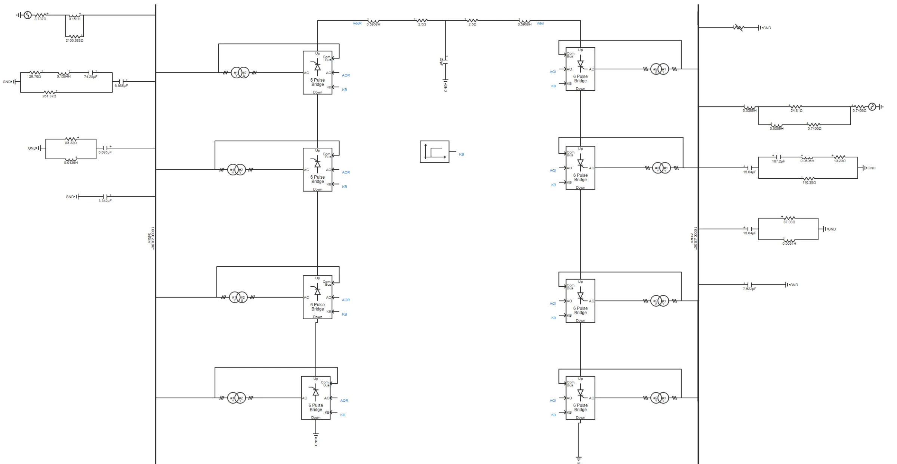
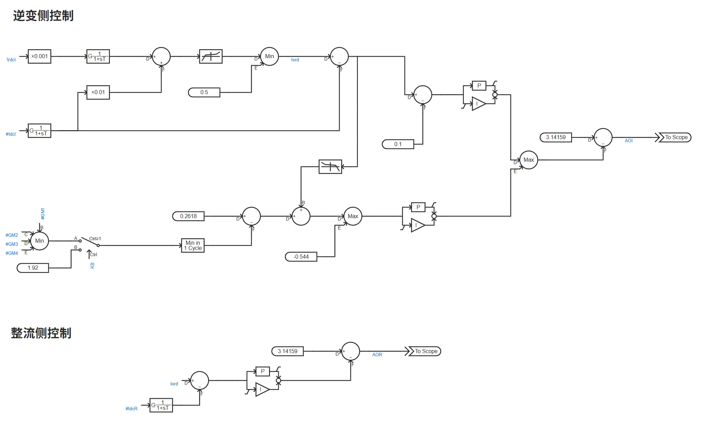
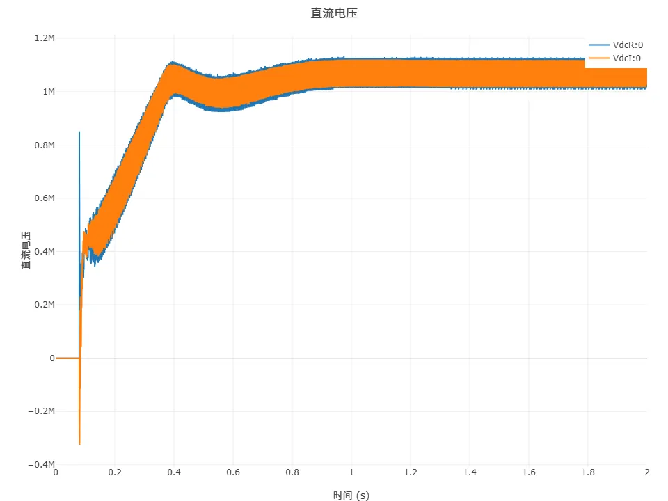
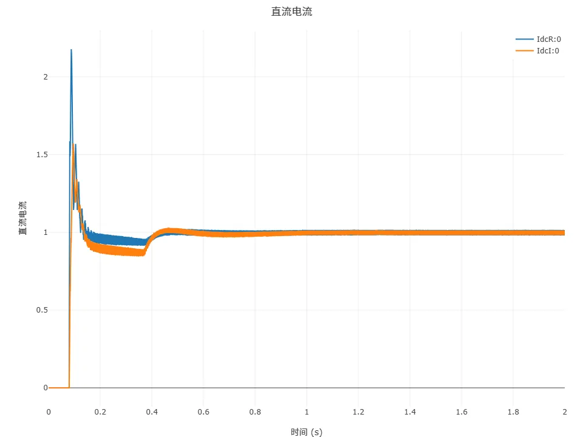
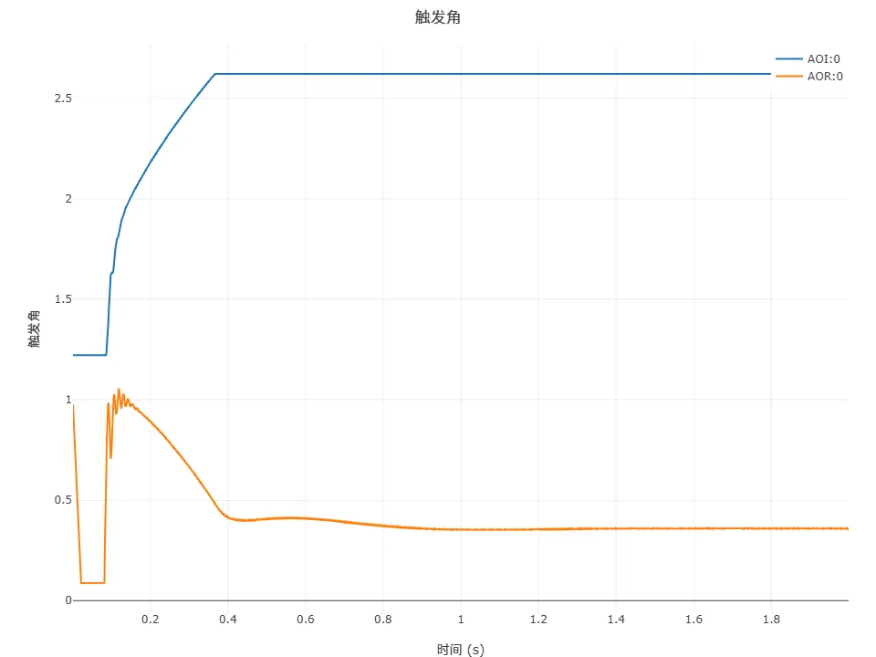
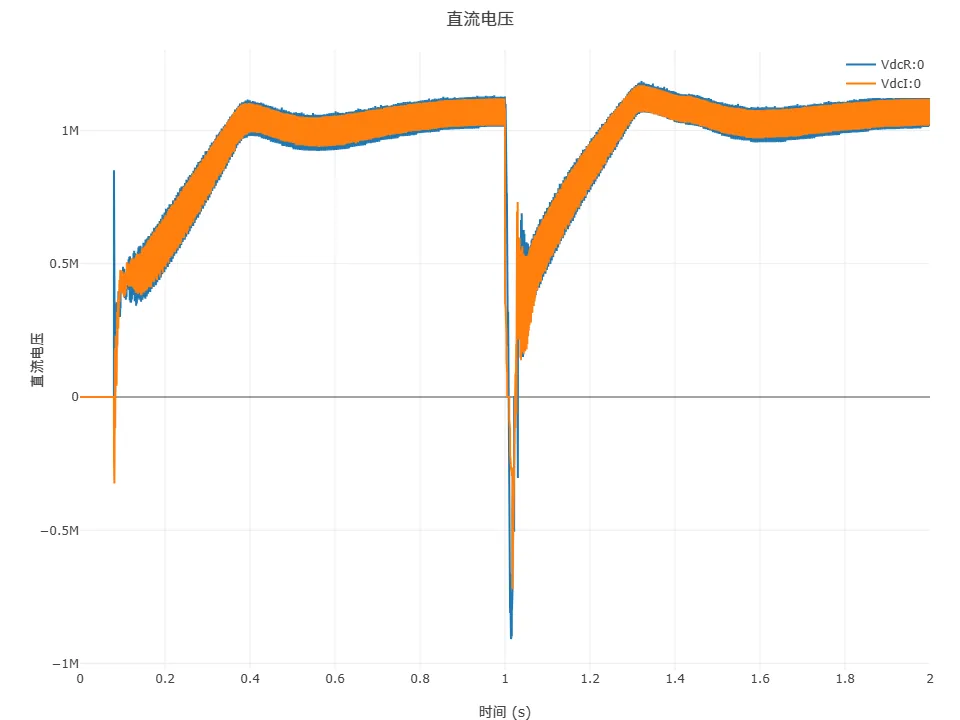
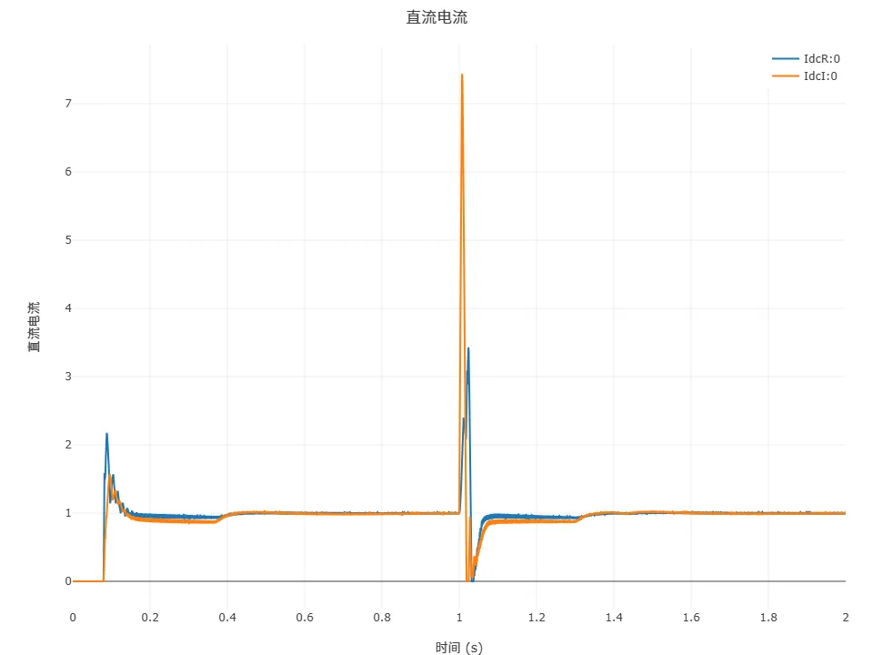
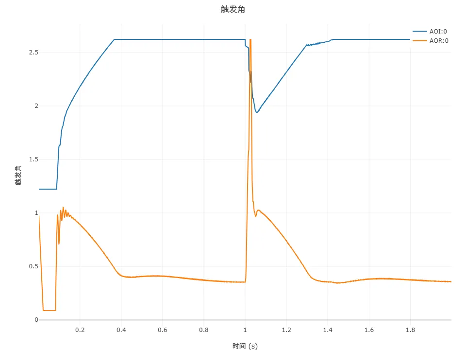

## 一、案例描述

基于电网换相换流器的高压直流 (Line commutated converter high voltage direct current, LCC-HVDC) 输电系统具有输送功率大、技术成熟等优点，近年来在电力系统中发挥越来越大的作用。CloudPSS 提供了国际大电网组织提供的 LCC-HVDC 标准测试系统。在标准测试系统上，CloudPSS 进一步提供了单极 12 脉动、单极双 12 脉动、双极 12 脉动、双极双 12 脉动四种 LCC-HVDC 仿真模型，用户可根据需要进行选取，本案例为单极双 12 脉动。

相比于单极 12 脉动系统，单极双 12 脉动系统具有更高的输送容量和更低的谐波含量。通过采用双 12 脉动换流结构，能够在不显著增加系统复杂度的情况下，有效提升直流输电的效率和稳定性，因此在大容量、远距离输电场景中具有明显优势。

## 二、使用方法说明

### 2.1 计算参数

*   **仿真步长**：为了准确捕捉换流阀开关瞬间的电磁暂态过程，建议步长需满足 Δt ≤ 1/(50×$f_{switch}$)，其中$f_{switch}$为开关频率（典型值$n\times f_{ac},12×50=600Hz$）。电磁暂态仿真建议采用 1μs\~50μs 步长，避免因步长过大导致换相过程计算失真；当步长过小时可能引发数值不稳定。

### 2.2 参数方案

| 参数项    | 数值   | 单位 | 备注              |
| ----------- | --------- | ------- | -------------------- |
| 故障开始时间 | 2    | s  | 输入 1s 到 100s 之间 |
| 故障结束时间 | 2.02 | s  | 输入 1s 到 100s 之间 |

## 三、算例介绍

### 3.1 算例简介

#### 3.1.1 算例背景

本案例为基于 CIGRE HVDC 标准测试系统构建的单极双 12 脉动的 LCC-HVDC 高压直流输电系统，由两个换流站和等值直流线路组成。每个换流站通过两组 12 脉动换流器串联实现双 12 脉波换流，进一步提升了交流侧谐波次数，可将其提升至 24 次、48 次等，相比单极 12 脉动系统，大大降低了谐波滤波器设计复杂度，同时提高了系统的输送容量。本算例可用于模拟交直流故障、换相失败过程分析、闭环控制动态分析、控制保护系统设计等场合。
#### 3.1.2 应用场景

*   换流站谐波抑制策略验证（如单极双 12 脉动与单极 12 脉动、6 脉动谐波含量对比）：单极双 12 脉动系统在谐波抑制方面表现更为出色，能够更有效地降低系统中的谐波含量，为谐波抑制策略的验证提供了更优的平台。
*   直流系统控制策略优化（定电流、定关断角控制参数整定）：由于系统结构和运行特性的变化，单极双 12 脉动系统需要对控制策略进行更精细的优化，以确保系统的稳定运行。
*   暂态故障（直流短路、换相失败）下的系统稳定性评估：更高的脉动次数使得系统在暂态故障下具有更好的稳定性和恢复能力，通过本算例可以更准确地评估系统在各种故障情况下的性能。
### 3.2 模型构成

单极双 12 脉动 LCC-HVDC 模型中，每个 12 脉波桥换流器与对应的换流变压器进行连接，进一步与交流侧母线连接。交流母线上，并联有交流滤波器组与电容器组，电容器组主要用于交流侧的无功补偿；滤波器组用于滤除交流侧的谐波，同时也具有一定的无功补偿的作用。整流侧与逆变侧通过直流线路相连接。

在直流系统的控制系统模型中，整流侧采用定电流控制，逆变侧一般情况下采用定熄弧角控制，并配有低压限流保护环节，如下图所示。

### 3.3 系统原理

单极双 12 脉动 LCC-HVDC 系统基于电网换相换流器（LCC）技术，其核心拓扑由以下部分构成：

*   **换流单元**：包含四个 6 脉动换流桥，两两组合形成两组 12 脉动换流结构，通过换流变压器与交流系统连接，两组 12 脉动换流结构之间也存在一定的相位差，进一步优化了换流过程。这种结构相比单极 12 脉动系统，能够实现更高的功率传输和更低的谐波含量。
*   **换流变压器**：采用 Y/Y 和 Y/Δ 两种接线方式，为四个 6 脉动桥提供合适相位差的交流电压，是实现双 12 脉动换流的关键元件。通过合理配置换流变压器的参数和接线方式，确保两组 12 脉动换流结构能够协同工作，提高系统的整体性能。
*   **交流侧设备**：并联交流滤波器组与电容器组，其中：

    *   电容器组：主要用于补偿换流器消耗的无功功率,由于单极双 12 脉动系统的功率更大，无功需求也相应增加，因此需要更合理地配置电容器组的容量。
    *   滤波器组：滤除 24k±1 次等更高次谐波，同时辅助无功补偿。相比于单极 12 脉动系统，滤波器组的设计需要考虑更高次的谐波成分，以确保系统的谐波含量符合标准要求。
*   **直流线路**：连接整流侧与逆变侧，传输高压直流功率。单极双 12 脉动系统的直流线路需要具备更高的容量和更好的绝缘性能，以满足系统的功率传输需求。
#### 3.3.1 脉动换流原理

双 12 脉动换流通过两组 12 脉动桥串联实现，其工作原理如下：

*   **电压叠加**：两组 12 脉动桥输出的直流电压叠加，形成更平滑的直流电压波形，理论直流电压表达式为：
    $V_{dc} = \frac{2 \times 3 \times \sqrt{2} V_{t} \cos\alpha}{\pi} \times 4$

    其中$V_t$为换流变压器阀侧线电压有效值，$\alpha$为触发角。相比于单极 12 脉动系统，输出的直流电压更加稳定，纹波系数更小。
*   **谐波特性**：双 12 脉动换流可将直流侧谐波主要限制在 24 次及以上，相比单极 12 脉动换流，谐波含量显著降低，进一步减少了对交流系统和周边设备的影响。
#### 3.3.2 无功与谐波

*   **无功需求**：LCC 换流器运行时需从交流系统吸收大量无功，单极双 12 脉动系统由于功率更大，需通过电容器组和滤波器组更精确地补偿。
*   **谐波滤波**：滤波器组用于滤除交流侧的高次谐波，提高系统的电能质量。
### 3.4 控制策略

#### 3.4.1 整流侧控制

*   **定直流电流控制**：通过 PI 调节器维持直流电流$I_{dcR}$稳定。当实测$I_{dcR}$低于参考值时，减小触发角$\alpha$以提升直流电压，从而增大电流；反之则增大$\alpha$。
#### 3.4.2 逆变侧控制

*   **定熄弧角控制**：通过调节触发角$\alpha$，维持晶闸管关断后的熄弧角$\gamma$恒定，防止换相失败。
*   **熄弧角**：$\gamma = \beta - \omega L_i I_{dc} / V_{t}$

    其中，$\beta$为越前触发角，$\omega$为角频率，$L_i$为换相电感，$V_t$为阀侧线电压。

#### 3.4.3 低压限流保护（LVRT）

低压限流保护（LVRT）的启动条件通常与直流电压跌落相关：当直流电压$V_{dc}$低于设定下限值时，启动限流。当系统发生故障（如逆变侧交流母线三相短路）导致直流电压跌落时，该环节会启动以限制直流电流，避免设备过流损坏。

## 四、仿真

设定合适的仿真步长（如 10μs），对 LCC-HVDC 系统进行电磁暂态仿真。
### 4.1 稳态运行测试

在`运行`标签页的`电磁暂态仿真方案`中设置算例的起止时间及积分步长等基本信息。点击`启动任务`，即可得到仿真结果。算例中已输出整流侧与逆变侧的直流电压、直流电流和触发角波形，用户可根据实际需求自行设置输出波形。通过仿真结果我们可以看到直流系统快速进入稳态运行状态。

**稳态运行结果分析**

*   **直流电压**：稳态时整流侧电压$V_{dcR}$和逆变侧电压$V_{dcI}$较为稳定，约为 1MV，为单极 12 脉动系统的2倍。

*   **直流电流**：约 0.4s后达到稳态，额定电流$I_{dc}$约 1kA。

### 4.2 换相失败故障测试

换相失败故障是 LCC-HVDC 中最为常见的故障类型。在逆变侧交流母线上设置三相短路故障，并在`运行`标签页的参数方案列表中设置故障起止时间，该交流故障可以引起直流系统发生换相失败故障。仿真结果如下图所示。

**换相失败暂态分析**

*   **直流电压**：故障时$V_{dcI}$骤降至 - 750kV（极性反转），故障切除后逐步恢复至额定值，恢复时间约 0.4s。
*   **直流电流**：故障期间$I_{dc}$飙升至 7.4kA（约7.4 倍额定值），低压限流保护启动后快速下降，电压恢复后缓慢回升。

### 4.3 总结

单极双 12 脉动 LCC-HVDC 系统通过双 12 脉动换流技术实现了高效、低谐波的直流输电，其控制策略以定电流和定熄弧角为核心，配合低压限流等保护环节，确保系统在稳态和故障条件下的可靠运行。仿真结果表明，系统在正常运行时具有良好的稳定性，在换相失败故障下能通过控制策略快速恢复，为工程应用提供了重要参考。

## 五、更新记录

| 版本 | 更新时间       | 修改内容           |
| ------- | --------------- | ------------------- |
| v1 | 2025-07-02 | 初始版本，模型测试与文档撰写 |

<!-- import DocCardList from '@theme/DocCardList';

<DocCardList /> -->