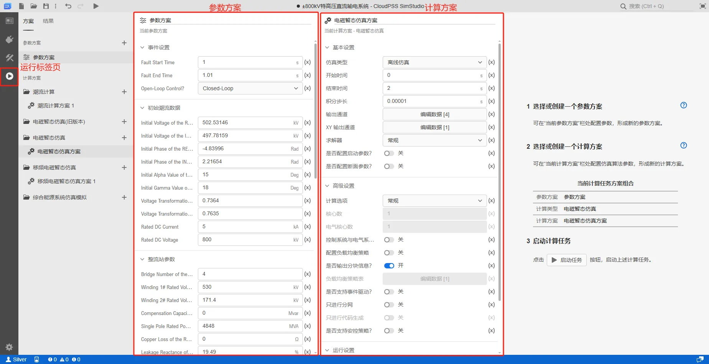
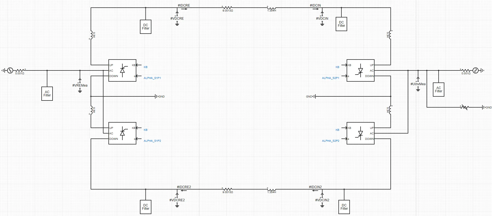
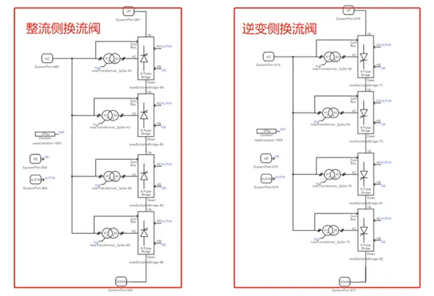
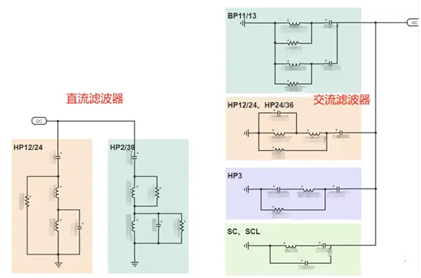
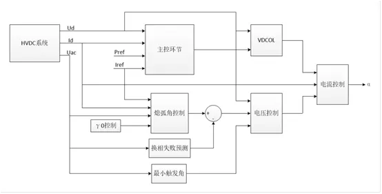
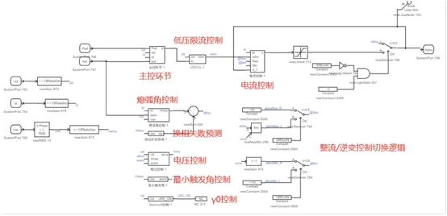
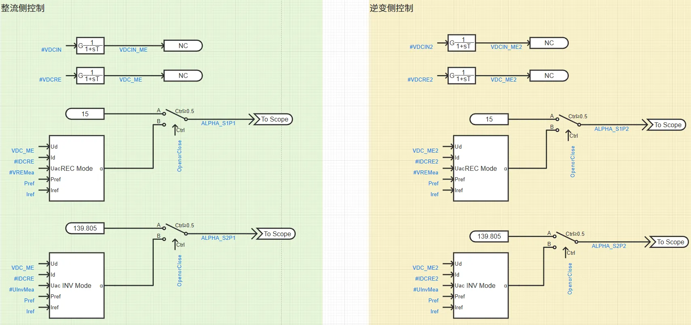
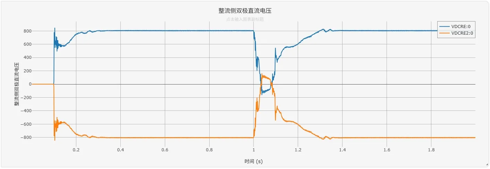
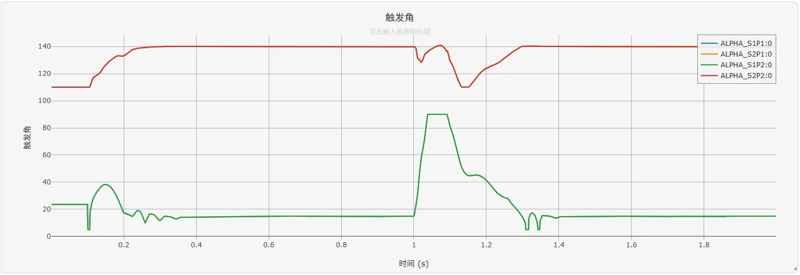
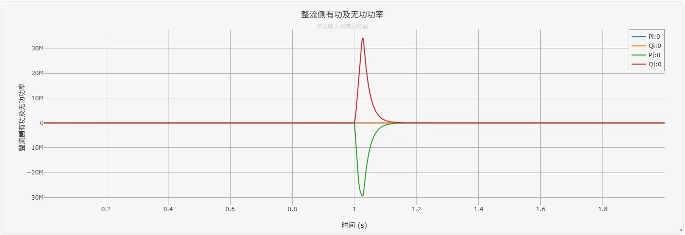

## 案例介绍

特高压直流输电（UHVDC）以其可实现交流电网的异步连接、控制灵活、输送功率高等特点得到快速发展和广泛应用。CloudPSS 平台提供了双极双 12 脉动 +/-800-1000kV 特高压直流系统模型。该系统采用双极并联、每极配置 4 组 6 脉动换流器的结构，实现高电压、大容量电力传输。
- 优势
    - 高可靠性：双极设计和冗余控制允许单极故障时持续供电。
    - 低谐波污染：12 脉动换流器输出谐波含量低，无需大容量滤波器，降低了设备成本。
    - 成熟性：晶闸管换流技术经过数十年验证，适用于远距离、大容量输电场景。
- 挑战
    - 换相失败风险：依赖交流系统电压支撑，易受故障影响导致换相失败，需通过 VDCOL 等控制策略抑制。
    - 灵活性局限：相比 MMC-HVDC，传统 LCC-HVDC 无法独立控制无功和电压，需依赖交流系统支撑。

## 使用方法说明

在  **运行标签页** - **参数方案** 配置仿真系统的参数，包括配置系统的故障时间、初始潮流、站级电气参数等内容。在 **计算方案** - **电磁暂态仿真方案** 配置仿真时间、步长和输出通道的示波器分组等内容。

## 算例介绍

+/-800-1000kV 特高压直流系统的仿真模型主要分为电气及控制两部分。

### 电气部分

典型的UHVDC系统拓扑包含交流侧电网、交流侧母线、交流侧滤波器、换流变压器、六脉动换流器、直流滤波器和直流线路等，其中每个六脉动换流器与对应的换流变压器进行连接，进一步与交流侧母线连接。整流侧与逆变侧通过直流线路相连接，直流线路上还有平波电抗器、直流滤波器等模块。

+/-800-1000kV 特高压直流系统算例采用了“模块封装”功能对系统进行了区域性/功能性的拓扑封装，增强了模型的逻辑关系和可移植性。

#### 双十二脉动换流阀
系统包含正极和负极两个独立极，每极由两个十二脉动换流阀串联组成。每一极双十二脉动换流阀包含四个六脉动晶闸管桥和四个三相双绕组变压器。本算例根据换流阀的位置，将换流阀封装为两个模块：整流侧换流阀和逆变侧换流阀。

#### 交流滤波器与直流滤波器
系统模型中配置了默认的交流和直流滤波器组。其中，直流滤波器采用 HP12/24 以及 HP2/39 型，交流滤波器采用 BP11/13、HP12/24、HP 24/36、HP3、SC、SCL 型。交流滤波器组自带无功补偿功能。也可根据需要删减、重新搭建自定义的滤波器模块。

### 控制部分

UHVDC系统的控制部分主要分为4个通用UHVDC控制器模块，分别对应整流侧/逆变侧的正/负极控制。通用UHVDC控制器可通过设置相应参数使其满足不同阀侧、不同运行方式下的控制。

本算例利用 Cloudpss “模块封装”功能对调节器进行功能划分及封装，其内部包含了主控环节、换相失败预测、低压限流控制（VDCOL）、最小触发角控制、电压控制、电流控制、熄弧角控制和γ0控制等子模块。各子模块互相配合以完成对UHVDC的有效控制。此外，控制器的参数录入与PSASP（5型直流）、BPA（DA、DZ卡）等软件参数格式一致，可以模拟国内多条特高压直流线路的控制特性。

通过以上方式封装的通用模块搭建的整流侧与逆变侧的控制模型如下图所示。

## 仿真

设置故障开始时间为1s，故障结束时间为1.01s。仿真结果显示系统快速进入稳态，1s时触发故障，约0.3s后系统重新恢复稳态，具体结果如下图所示。

