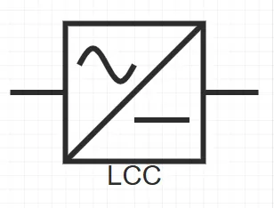
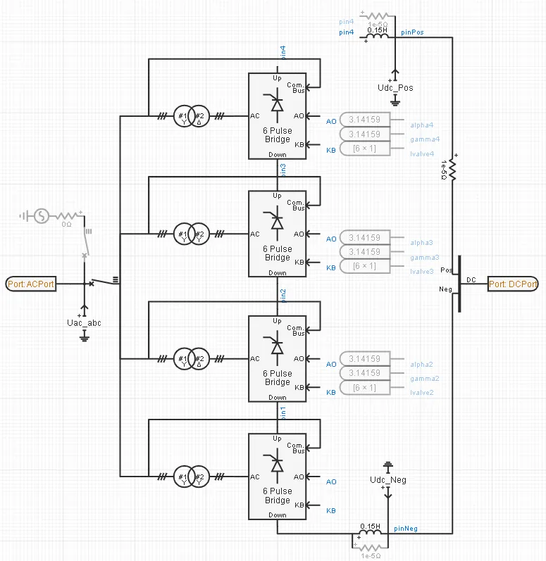
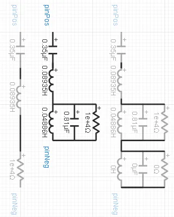
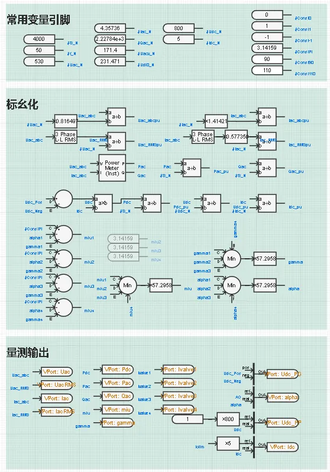
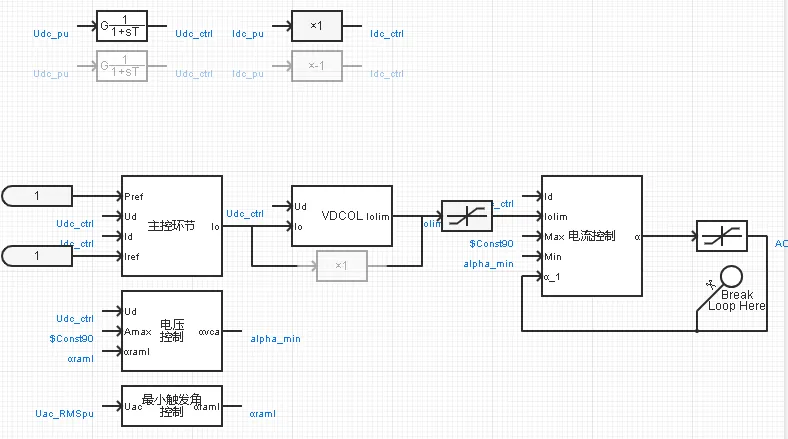
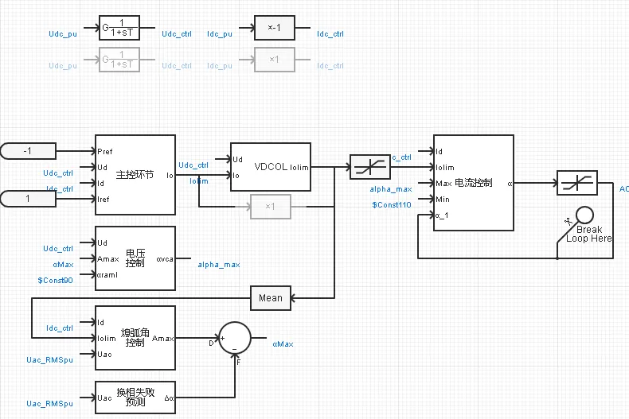
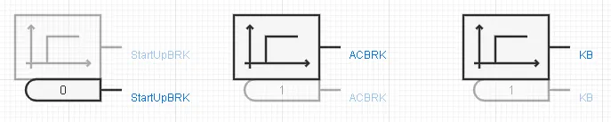

## 元件介绍

本元件用于模拟常规直流输电技术中的电网换相换流器。包含晶闸管换流阀、换流变压器及其常规控制策略，可通过与其他直流输电元件的互联及参数配合，实现对直流输电工程不同系统拓扑、不同控制模式和不同运行方式的仿真。

## 使用方法说明

### 适用场景
元件支持不同直流输电系统拓扑方案的仿真测试，适用于以下分析场景：
   + 常规端对端直流输电系统仿真
   + 特高压分层常规直流输电系统仿真
   + 多端直流输电系统仿真
   + 混合直流输电系统仿真  

### 适用范围
   + 建议步长范围：10-50μs

### 功能概述
   + 支持6脉动、12脉动、双12脉动拓扑方案，并可通过直流侧串并联构成更多复杂换流站拓扑
   + 换流阀支持整流、逆变，以及极性翻转运行控制模式
   + 换流变压器支持控电压、控角度两种有载调压分接头控制模式
   + 支持直流电压指令、直流功率/电流指令、逆变站熄弧角参考值的外部给定
   + 支持分步骤顺序控制启动
   + 支持参与交流大电网潮流计算及潮流结果写回至仿真初始化变量
  
### 模型地址

点击打开模型地址：[**LCC-标准封装模型-v1**](cloudpss:/model/open-cloudpss/LCC-fdm-stdm-v1b1)

## 元件说明

LCC标准封装模型主要包括一次回路、量测与信号处理、整流器控制、逆变器控制，以及顺序启动控制等部分。

### 一次回路

一次回路由LCC换流阀、换流变压器、平波电抗器、直流滤波器，以及必要的断路器、初始化启动电源等组成。

其中，LCC换流阀采用集成的6脉动换流桥元件，支持从单6脉动换流阀到双12脉动特高压换流阀的模拟，可通过配置6脉动桥的数量参数灵活设置换流阀结构。

换流变压器采用常规的三相两绕组变压器元件进行模拟，目前暂未支持有载调压分接头的设置，有载调压相关配置及分接头挡位控制将在后续版本逐步完善。

直流滤波器考虑典型的单调谐、双调谐，以及三调谐滤波器拓扑，可在模型选项中搭配选用并配置具体电气参数。

初始化启动电源为一个由断路器控制投切的三相理想电压源元件，布置于换流器的交流网侧端口处，仅在模型启动方式选为“启动到初始潮流”时启用，用于在仿真开始后协助换流器快速启动到给定的初始潮流。

### 量测与信号处理

量测与信号处理部分定义当前换流器各运行变量的量测信号及进行量测信号的相关处理，包括量测信号标幺化、信号输出等环节。

其中，量测信号的标幺化基于当前换流器的额定容量、交直流额定电压所形成的基准值体系，对模型中所有量测信号和控制变量进行标幺化处理，包括计算交流电压、电流的瞬时标幺值和有效标幺值，直流电压、电流的瞬时标幺值，以及交流侧有功功率、无功功率、直流侧功率的标幺值等。

量测信号输出环节用于将需要观测的量测信号作为输出变量送至相应的虚拟引脚，方便模型封装后从外部进行观测。

### 整流器控制

整流器控制模拟换流器的整流控制策略，仅在换流器被配置为整流方式运行时使能。按照典型的高压直流输电控制功能配置，整流器的控制策略主要由定电流控制、定电压控制、最小触发角控制，以及低压限流控制、系统主控等环节组成。

其中，电流控制环节是电流源型换流器的主控制器，在整流和逆变控制中均有配置。电流控制环节测量实际直流电流值，与给定的电流指令值相比较后，得到电流差值，经比例积分控制，最终输出换流器的触发角度指令值。电流控制环节的积分和最终输出都设有上下限幅，用于与其他控制环节相互配合实现更为完善的伏安控制曲线。

电压控制环节量测实际直流电压值，与给定的电压指令值比较后经比例积分控制输出一个触发角度指令，作为电流控制环节触发角度指令的下限。

最小触发角控制环节规定整流器允许输出的触发角度指令最小值。根据晶闸管的特性，触发晶闸管时要求其承受的正向电压不得低于其最小触发电压，这一电压所对应的触发角一般约为5°。同时，为了减少交流电网故障恢复瞬间的超调，整流器也对网侧实际交流电压的有效值进行量测，当监测到送端交流电网发生电压跌落时，会将允许的最小触发角提升至30°左右，并在交流电压跌落故障消除后缓慢恢复至原有的5°。最小触发角控制环节输出的触发角度指令将送至电压控制环节，作为电压控制环节触发角度指令的下限。

低压限流控制环节量测实际直流电压值，当直流电压跌落至一定程度时，对换流器允许输出的直流电流指令上限进行限制，以减小直流系统故障时的电流应力，降低故障期间换流器对交流电网的无功需求。直流电压恢复后，低压限流环节将按照设定速率平稳提升电流指令，提高功率恢复过程的稳定性。

最后，主控环节接收外部输入的直流系统功率/电流参考值，根据当前选配的系统控制模式，按照定电流或定功率方式计算当前换流器的电流指令。

### 逆变器控制

逆变器控制模拟换流器的逆变控制策略，仅在换流器被配置为逆变方式运行时使能。按照典型的高压直流输电控制功能配置，逆变器的控制策略主要由定电流控制、定电压控制、定熄弧角控制、换相失败预测控制，以及低压限流控制、系统主控等环节组成。

其中，电流控制环节、电压控制环节、低压限流环节和主控环节的主要功能与整流器控制部分大体相同，差异之处在于两处：1）是在逆变器控制中，电压控制环节所输出触发角度指令被作为电流控制环节输出角度指令的上限；2）是为了实现整流侧与逆变侧的有序配合，同一直流系统中逆变器的电流参考值将在整流器电流参考值的基础上减去一个裕度，以使得正常运行时逆变侧总是处于控制直流电压的地位。

换流器逆变运行时处于大角度触发状态，由于晶闸管的半控特性，其依赖电网电压换相，当熄弧角过小时存在换相失败的本征风险。因此逆变器控制中的另一个重要目标是控制熄弧角稳定运行于合理范围。熄弧角控制环节量测当前实际直流电流和网侧实际交流电压有效值，结合给定的熄弧角度参考值计算逆变器预期的越前触发角，并由此输出一个触发角度指令，该指令作为逆变器控制电压控制环节的触发角度上限。

换相失败预测控制则在熄弧角控制的基础上，对逆变站网侧交流电压进行量测，当监测到受端电网发生电压跌落时，主动将熄弧角控制输出的触发角度指令再减去一个裕度，以进一步减小交流电网电压过低引发换相失败的概率。

### 顺序启动控制

LCC的顺控启动过程较为简单，主要包括换流变压器上电和换流器解锁两个过程。

除此之外，若模型的启动方式选为“启动到初始潮流”，将在初始化启动阶段投入一个用于协助换流器快速启动到给定潮流的三相理想电压源，并在初始化阶段结束后将其切除。

## 附录

### 参数

import Parameters from './_parameters.md'

<Parameters/>

### 引脚

import Pins from './_pins.md'

<Pins/>

<!-- 
## 附：修改及调试日志

+ 20260129
  + 初次发布

-->