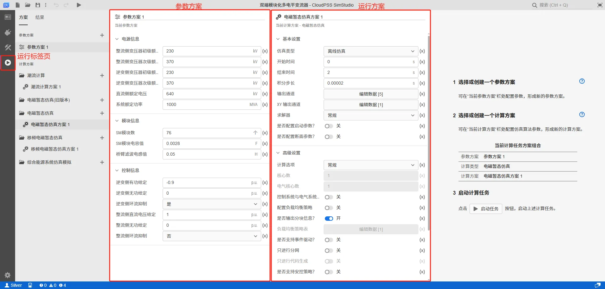
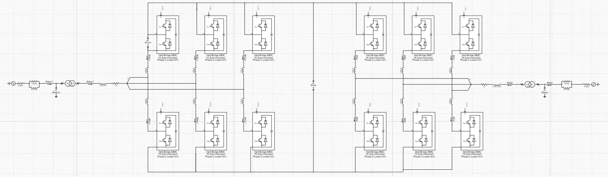
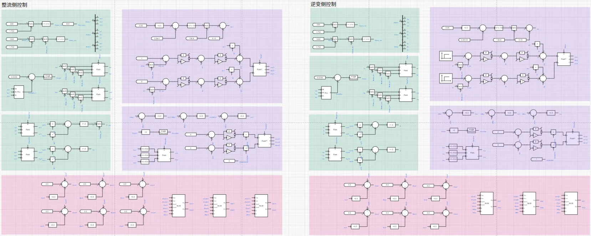

## 案例介绍

双端模块化多电平变流器（MMC-HVDC）是一种常用于高压直流输电系统（HVDC）的电力电子设备。它由两个模块化多电平变流器（MMC）通过直流母线互联构成，可实现双向电力传输。以下是其详细介绍：
- **结构原理**：模块化多电平变流器通过子模块（SM）串联或并联实现多电平输出。每个子模块由半导体开关（如IGBT）和储能元件（通常为电容器）构成。通过控制子模块的插入或旁路状态，合成阶梯状交流电压波形，可降低谐波失真。在双端结构中，整流侧和逆变侧的电路拓扑及控制基本一致，每侧的变流器每相上下桥臂各由多个子模块和限流电抗构成。
- **优势特点**：相比传统的两电平或三电平电压源型变流器，双端模块化多电平变流器具有诸多优势。其各子模块不需要同时导通，可降低桥臂电压和电流变化率，减小开关器件承受的应力，且输出电压谐波含量少，无需交流滤波器；上下桥臂通过串联电抗器，能限制正常运行时的桥臂环流和故障情况下的冲击电流；模块化设计便于电压和容量匹配，也易于实现系统冗余保护。
- **控制策略**：子模块的电容电压需通过均压算法保持均衡，通常采用最近电平逼近调制（NLM）或载波移相调制（CPS - PWM）等调制策略。双端MMC - HVDC系统中，每侧的控制系统通常包括标幺值换算、电流电压测量、电流电压坐标变换、瞬时功率计算、功率控制、环流抑制以及调制和排序算法等模块。
- **应用领域**：双端模块化多电平变流器适用于电网互联、孤岛供电及电能质量综合治理等场景，尤其能快速响应电压骤降、谐波干扰等问题，可实现不同交流电网之间的柔性连接和功率双向传输。

## 使用方法说明

双端模块化多电平变流器模型的适用范围：

- 用户可根据需要修改电平数（10-101）及系统电压、功率参数。
- 电平数在101以下，采用最近电平调制时，建议采用 10μs 或 20μs 仿真步长

在 **运行标签页** - **参数方案** 配置仿真系统的参数，包括配置系统的电源、模块与控制信息等内容。在 **计算方案** - **电磁暂态仿真方案** 配置仿真时间、步长和输出通道的示波器分组等内容。

## 算例介绍

本算例由国际大电网组织 MMC 工作组提供的双端 MMC 直流输电测试系统简化而来，默认为77电平 640kV 双端 MMC-HVDC 系统。为保证仿真速度，本模型中的半桥子模块(SM)采用戴维南等值的快速仿真模型，与详细电磁暂态仿真模型具有相同的精度，但计算效率大幅度提高。该系统的仿真模型主要分为电气及控制两部分。

### 电气部分

MMC-HVDC 系统分为整流侧（送端）与逆变侧（受端）两部分，两侧的电路拓扑及控制基本一致，仅存在微小差异，如下图所示。

### 控制部分

MMC-HVDC 系统每侧的控制系统包括标幺值换算、电流电压测量、电流电压坐标变换、瞬时功率计算、功率控制(整流侧为直流电压-无功功率控制，逆变侧为有功-无功功率控制)、环流抑制以及调制和排序算法多个模块，如下图所示。

## 仿真

根据电平数和最大开关频率选择合适的仿真步长，对 MMC-HVDC 系统进行电磁暂态仿真。若希望得到更精确的开关过程波形，可采用更小的仿真步长进行仿真。

### 仿真1：逆变侧功率控制暂态响应

仿真默认逆变侧有功给定为 -0.9 p.u.，无功给定为 0 p.u.，整流侧电压给定 1 p.u.，无功给定 0 p.u.。系统预置 0.8s 后有功给定变为 -0.5，1.4s 后无功给定变为0.3。仿真结果显示，逆变侧的有/无功功率、整流侧无功以及直流电压在参考变化时可快速调整至设定值。

### 仿真2：环流抑制对比

选择 **整流侧环流抑制** 的选项为 `否`，即禁用整流侧的环流抑制。仿真结果显示，逆变侧环流峰峰值远小于整流侧，环流抑制效果明显。

### 仿真3：不同电平数/模块数仿真

设置 **SM 模块数** 的值为 76 和 100，对应的输出电平数为 77 和 101。分别启动仿真，得到如下图所示的仿真结果，可以发现模块电容电压的值分别为 8.42kV(640/76)、6.4kV(640/100)，且电容电压均衡效果明显。

