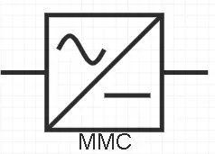
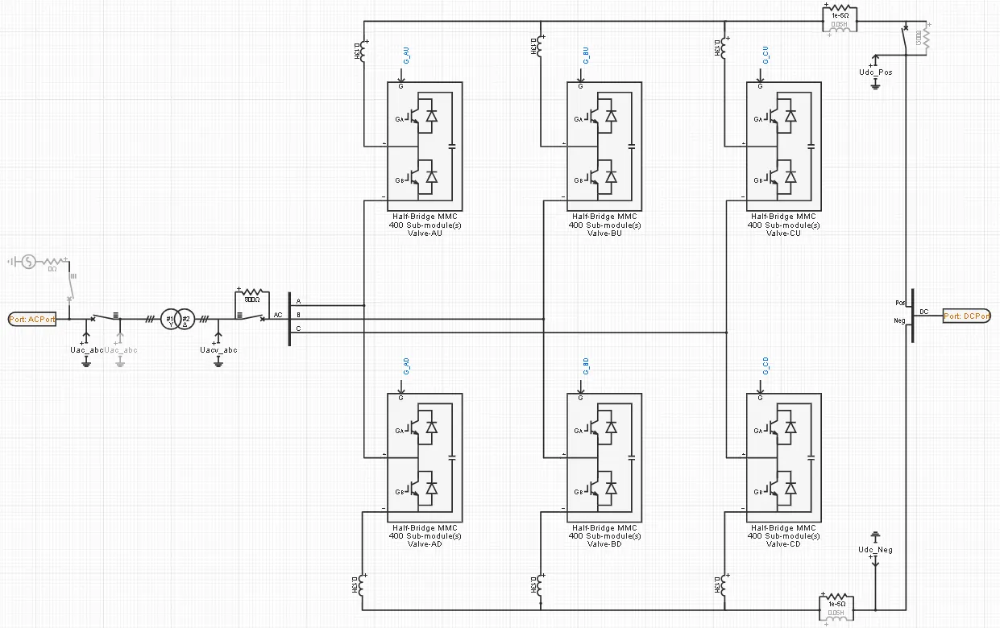
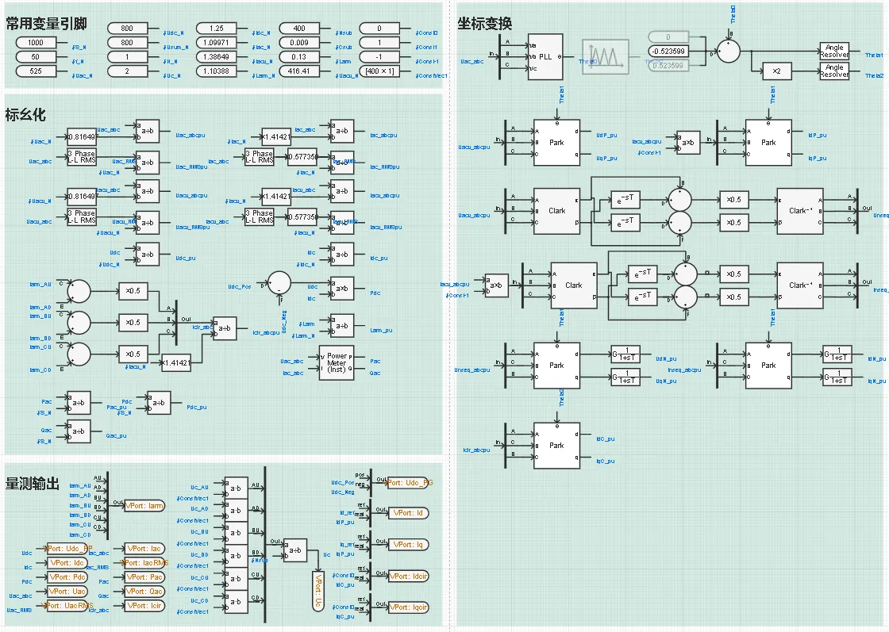
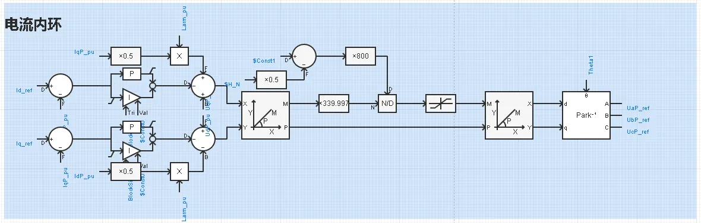
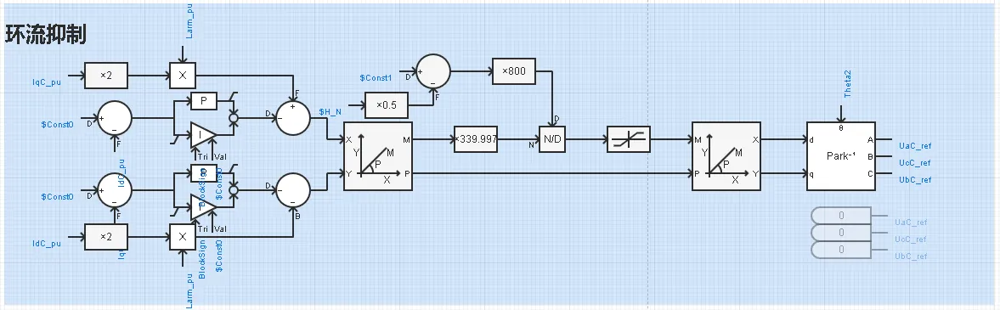
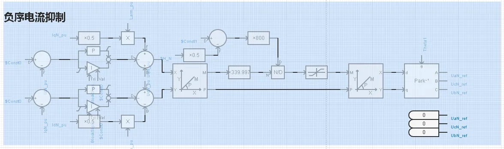
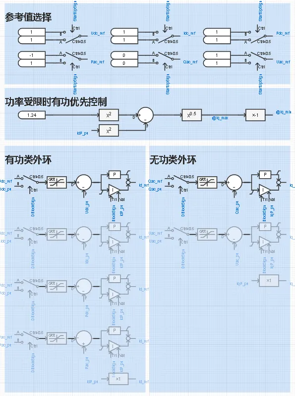
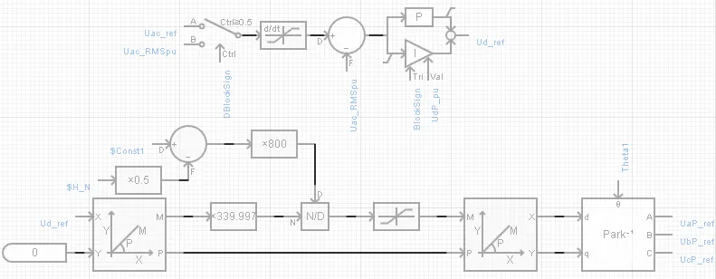
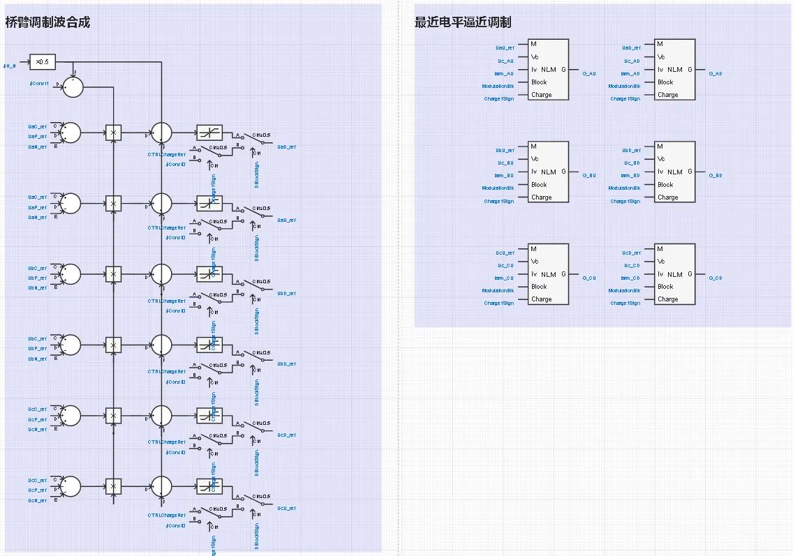
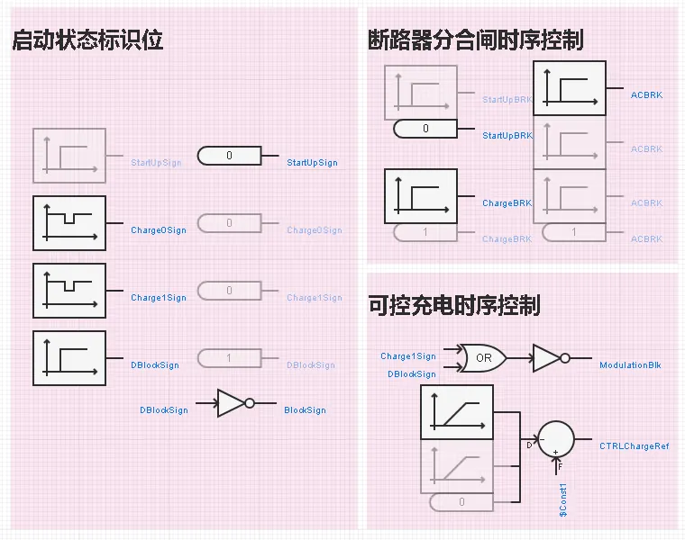

## 元件介绍

本元件用于模拟柔性直流输电技术中的模块化多电平换流器。包含模块化多电平换流阀、联接变压器及其典型控制策略，可通过与其他直流输电元件的互联及参数配合，实现对直流输电工程不同系统拓扑、不同控制模式和不同运行方式的仿真。

## 使用方法说明

### 适用场景
元件支持不同直流输电系统拓扑方案的仿真测试，适用于以下分析场景：
   + 端对端柔性直流输电系统仿真
   + 特高压分层柔性直流输电系统仿真
   + 多端柔性直流输电系统仿真
   + 混合直流输电系统仿真  

### 适用范围
   + 建议步长范围：10-50μs

### 功能概述
   + 支持跟网型控制模式和构网型控制模式
   + 跟网型控制下，有功类控制支持定直流功率、定直流电压、定直流电流、定交流有功等多种模式
   + 跟网型控制下，无功类控制支持定交流无功、定交流电压等多种模式
   + 支持换流器环流抑制、负序电流抑制功能
   + 支持有功类指令、无功类指令、构网电压参考值的外部给定
   + 支持交流侧充电、直流侧充电等多种充电启动模式
   + 支持分步骤顺序控制启动
   + 支持参与交流大电网潮流计算及潮流结果写回至仿真初始化变量
  
### 模型地址

点击打开模型地址：[**MMC-标准封装模型-v1**](cloudpss:/model/open-cloudpss/MMC-fdm-stdm-v1b1)

## 元件说明

MMC标准封装模型主要包括一次回路、量测与信号处理、内环控制、外环控制、构网控制、电压调制控制，以及顺序启动控制等部分。

### 一次回路

一次回路由MMC换流阀、联接变压器、交/直流充电回路，以及必要的断路器、初始化启动电源等组成。

其中，MMC换流阀由多个桥臂元件组成，每个桥臂元件均是采用MMC快速电磁暂态仿真建模方法进行编写。桥臂元件允许设置桥臂内部子模块的数量、子模块电容值、开关器件通断态电阻值等参数，并提供子模块电容电压和电容电流的测量端口。子模块的触发信号及电容电压电流的测量信号均通过多维数据端口进行传递，端口的信号维数为桥臂的子模块数量。

联接变压器采用常规的三相两绕组变压器元件进行模拟，不考虑有载调压分接头。

交/直流充电回路布置于交流阀侧和直流极线侧，由充电电阻及并联的旁路开关构成，用于模拟换流阀启动过程种的不控充电阶段。

初始化启动电源为一个由断路器控制投切的三相理想电压源元件，布置于换流器的交流网侧端口处，仅在模型启动方式选为“启动到初始潮流”时启用，用于在仿真开始后协助换流器快速启动到给定的初始潮流。

### 量测与信号处理

量测与信号处理部分定义当前换流器各运行变量的量测信号及进行量测信号的相关处理，包括量测信号标幺化、坐标变换等环节。

其中，量测信号的标幺化基于当前换流器的额定容量、交直流额定电压所形成的基准值体系，对模型中所有量测信号和控制变量进行标幺化处理，包括计算交流电压、电流的瞬时标幺值和有效标幺值，直流电压、电流的瞬时标幺值，桥臂电流的标幺值，以及交流侧有功功率、无功功率、直流侧功率的标幺值等。

量测信号的坐标变换根据换流器控制需求，统一进行电气量的坐标变换，分解网侧、阀侧电压、电流的正、负序分量，计算桥臂电流中的环流分量，并通过Park变换将这些变量变换至相应频率和相序的旋转直角坐标系，用于后续控制。

量测信号输出环节用于将需要观测的量测信号作为输出变量送至相应的虚拟引脚，方便模型封装后从外部进行观测。

### 内环控制

内环控制部分包括换流器在跟网控制模式下的电流内环控制、负序电流抑制控制，以及环流抑制控制等环节。

电流内环控制通过调节各相单元的正序基波调制电压，控制换流器与交流电网之间的电压幅值和相角差，从而形成受控的交流运行电流，为外环控制提供有功电流分量 、无功电流分量 两个相互解耦的控制变量。

环流抑制控制在电流内环控制的基础上，通过附加一定水平的共模二倍频调制波，对桥臂间流动的负序二倍频环流进行抑制，以降低换流器运行时的电流应力。

负序电流抑制控制则在电流内环控制的基础上，通过附加一定水平的负序基频调制波，抑制流经换流器的交流负序电流。

### 外环控制

电流内环控制器向外环提供了id、iq两个独立的被控变量，可以分别用于有功功率/直流电压和无功功率/交流电压的控制。本模型中的换流器支持多种有功类控制和无功类控制功能，可通过控制模式选项灵活选配组合。

### 构网型控制

以上内、外环控制均为跟网型控制模式下的控制功能。除跟网型控制外，本元件也支持构网型控制。

目前的构网型控制功能仅面向海上风电送出场景，搭建了最简单的定交流电压幅值和频率（VF）控制策略，可用于MMC作为平衡节点独立构建小型电网的情景。对于多MMC联合并网等场景下的复杂构网控制，用户需自行建模或等待后续更新。

### 电压调制控制

前述各类控制所形成的调制波，最终需经电压调制环节形成每个桥臂上各子模块开关器件的开关信号。MMC作为多电平换流器，常用的调制策略包括最近电平逼近调制（NLM）和载波移相调制（CPSM）等。

本模型采用NLM调制，通过对调制波直接进行归一化和离散化操作形成对应的阶梯拟合波形，从而得到各桥臂需要投入的子模块数量；结合子模块电容电压排序和电流方向判断的情况，动态选择每个桥臂投入和切出的子模块编号，最终形成各子模块开关器件的触发脉冲信号。由于直流输电电压等级较高，单个桥臂一般由数百个子模块级联组成，NLM调制下每个子模块在一个工频周期内基本仅发生一次投切，而交流侧输出电压已可以获得较高的谐波电能质量。

对于柔直配电网等场景下的MMC，其桥臂模块数量较少，为提高谐波电能质量可能采取载波移相等其他调制策略，相应的调制方法需用户自行建模或等待后续更新。

### 顺序启动控制

顺序启动控制部分用于管理换流器运行状态的切换，实现换流器从充电、解锁，到升至规定运行功率的整个启动过程的模拟。

其中，换流器的运行状态包括停运、不控充电、可控充电，以及正常运行共4种状态，分别采用不同的启动状态标识位来代表。换流器中各断路器的分合闸、各控制环节的使能、换流阀触发脉冲信号的解闭锁均受启动状态标识位的管理。

除此之外，若模型的启动方式选为“启动到初始潮流”，将在初始化启动阶段投入一个用于协助换流器快速启动到给定潮流的三相理想电压源，并在初始化阶段结束后将其切除。

## 附录

### 参数

import Parameters from './_parameters.md'

<Parameters/>

### 引脚

import Pins from './_pins.md'

<Pins/>

<!-- 
## 附：修改及调试日志

+ 20260129
  + 初次发布

-->