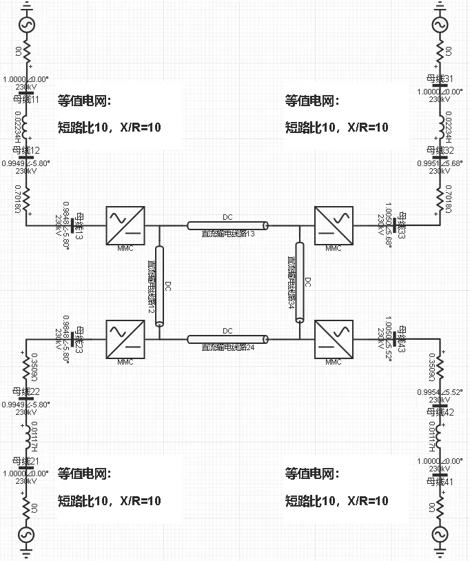
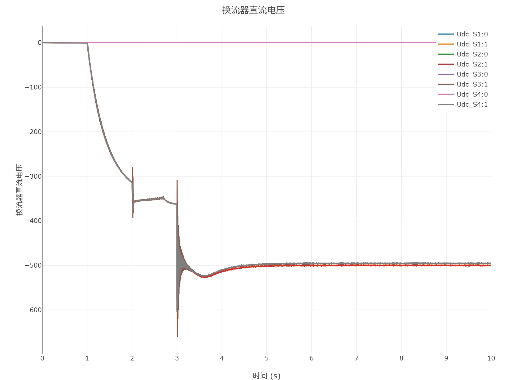
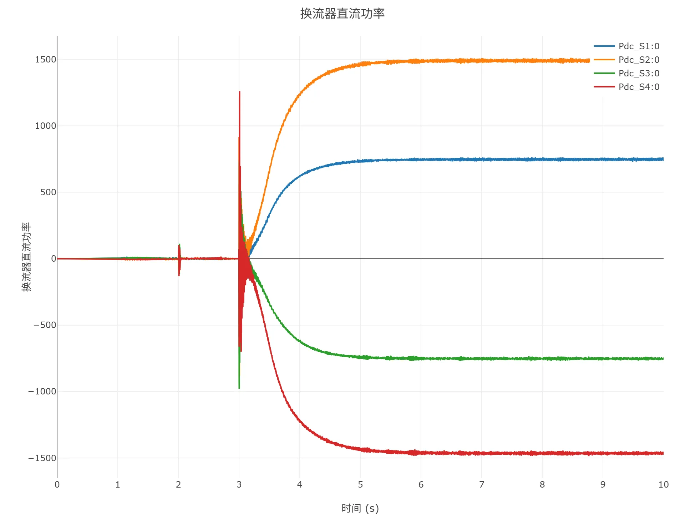
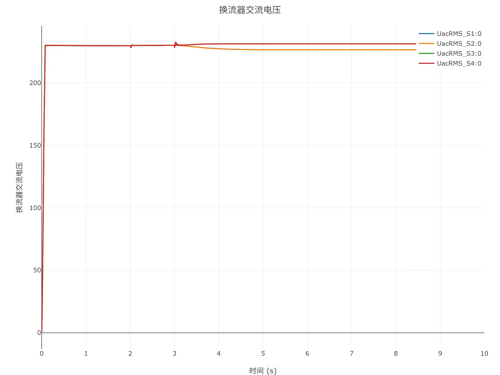
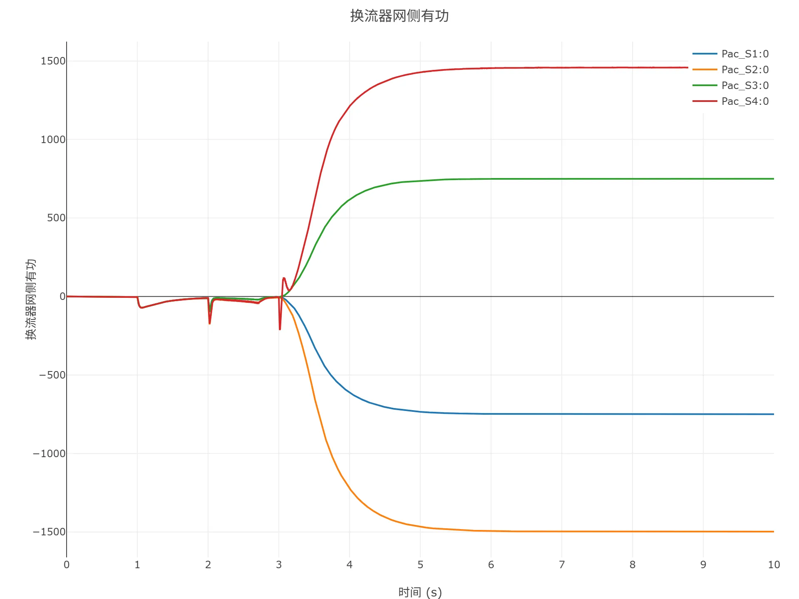
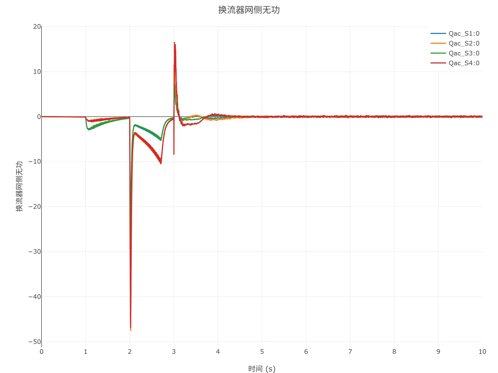
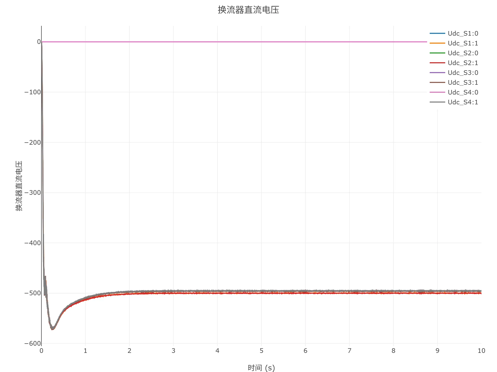
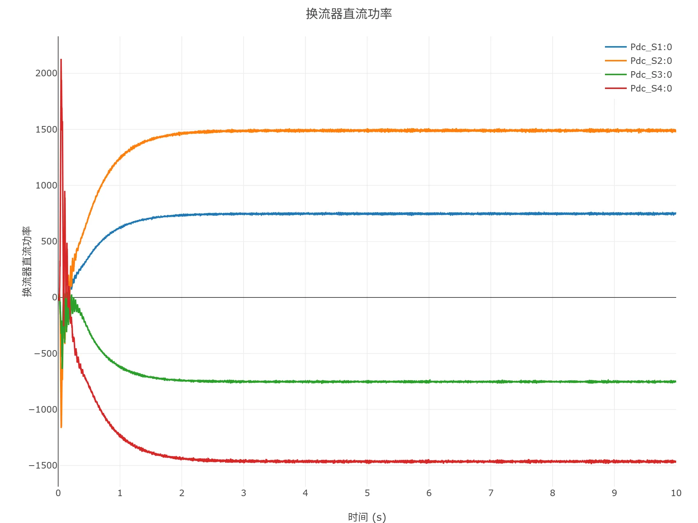
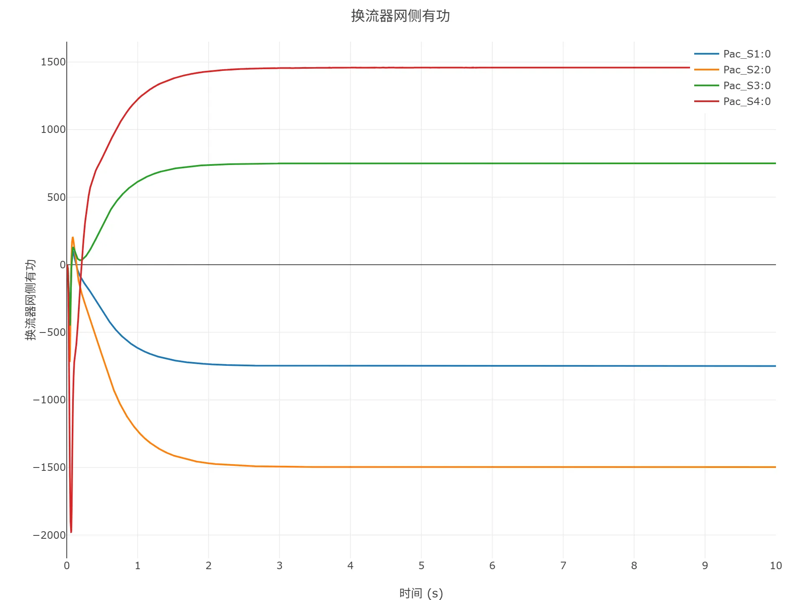
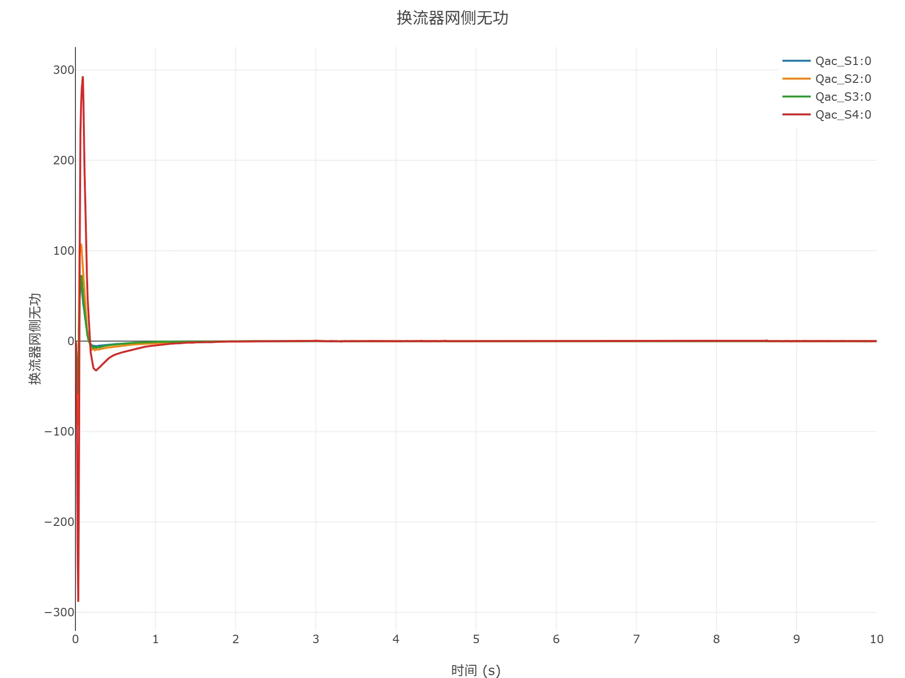

## 模型介绍

### 案例说明

多端柔性直流输电系统案例模拟了一个四端单极柔性直流输电系统，包含两端整流站、两端逆变站共四个MMC以及之间的四条直流输电线路，各端电网由短路比均为10的等值电路模拟。

案例中直流系统的关键参数如下表所示。

| 参数 | 单位 | 值 |
|:----------- |:---- |:---------:|
| 直流接线方式 | -- | 单负极大地回线 |
| 直流额定电压 | kV | 500 |
| 1端额定直流功率 | MW | 750 |
| 1端网侧额定电压 | kV | 230 |
| 2端额定直流功率 | MW | 1500 |
| 2端网侧额定电压 | kV | 230 |
| 3端额定直流功率 | MW | 750 |
| 3端网侧额定电压 | kV | 230 |
| 4端额定直流功率 | MW | 1500 |
| 4端网侧额定电压 | kV | 230 |

### 模型地址

点击打开模型地址：[**多端柔性直流输电系统-v1**](cloudpss:/model/open-cloudpss/HVDC_MMC_MT-fdm-std-v1b2)

## 模型仿真测试

案例可以平稳有序地启动到规定功率运行，也可按照给定的初始潮流快速启动运行。

以下给出具体的仿真测试结果。

### 顺控启动仿真

采用顺控启动方式，模型的仿真结果如下图所示。

### 启动到初始潮流仿真

采用启动到初始潮流方式，模型的仿真结果如下图所示。

## 附录

### 模型参数

import Parameters from './_parameters.md'

<Parameters/>

<!-- 
## 附：修改及调试日志

+ 20260129
  + 初次发布

-->