## 模型介绍

### 案例说明

特高压混合分层直流输电系统案例模拟了一个送、受端均为分层接入的单极特高压混合分层输电系统，包含送、受两端换流站和一条直流输电线路。其中，送端换流站由高、低两套LCC构成，分层接入不同电网；受端换流站的高压端为LCC、低压端为两个MMC并联，高、低压分层接入不同的受端电网。

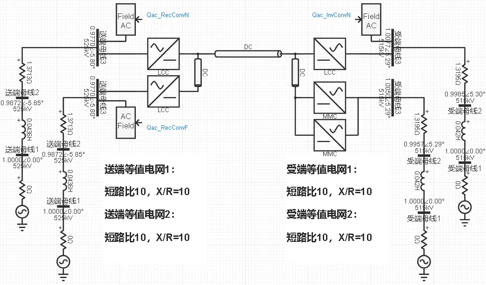

案例中直流系统的关键参数如下表所示。

| 参数 | 单位 | 值 |
|:----------- |:---- |:---------:|
| 直流额定功率 | MW | 4000 |
| 直流额定电压 | kV | 800 |
| 直流接线方式 | -- | 单负极大地回线 |
| 送端1网侧额定电压 | kV | 525 |
| 送端2网侧额定电压 | kV | 525 |
| 受端1网侧额定电压 | kV | 515 |
| 受端2网侧额定电压 | kV | 515 |

### 模型地址

点击打开模型地址：[**特高压混合分层直流输电系统-v1**](cloudpss:/model/open-cloudpss/HVDC_Hybrid_HI-fdm-std-v1b1)

## 模型仿真测试

案例可以平稳有序地启动到规定初始潮流运行。

以下给出具体的仿真测试结果。

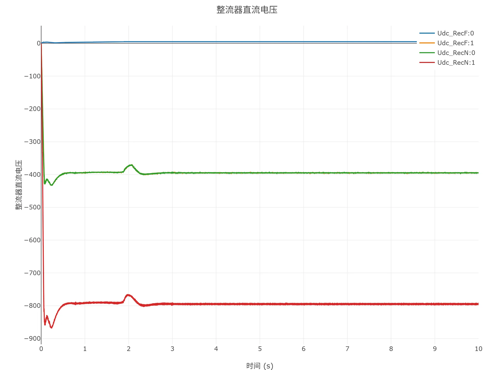
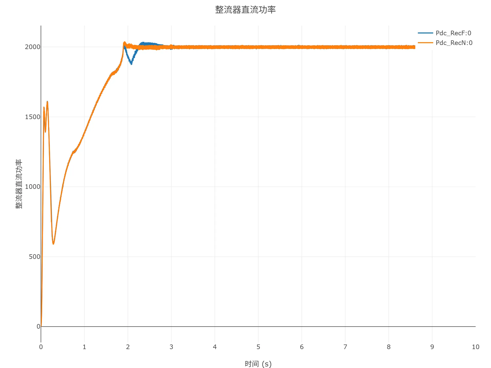
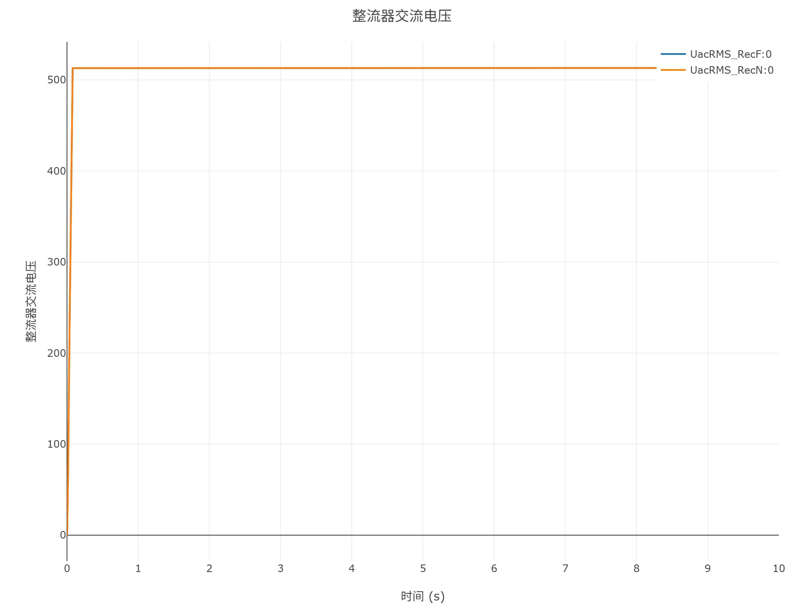
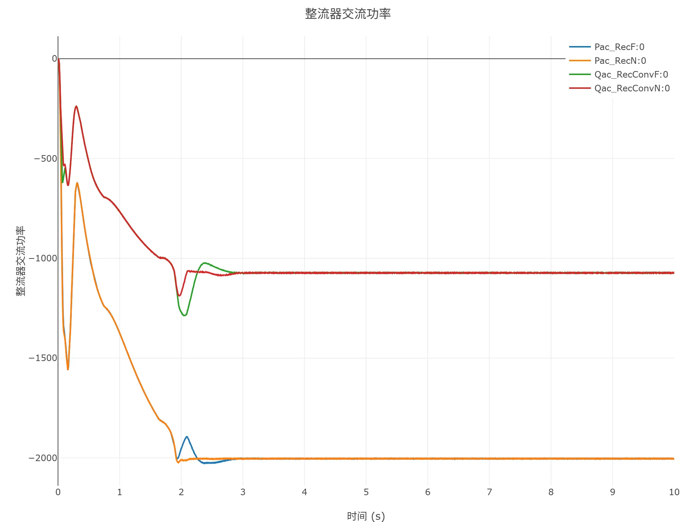
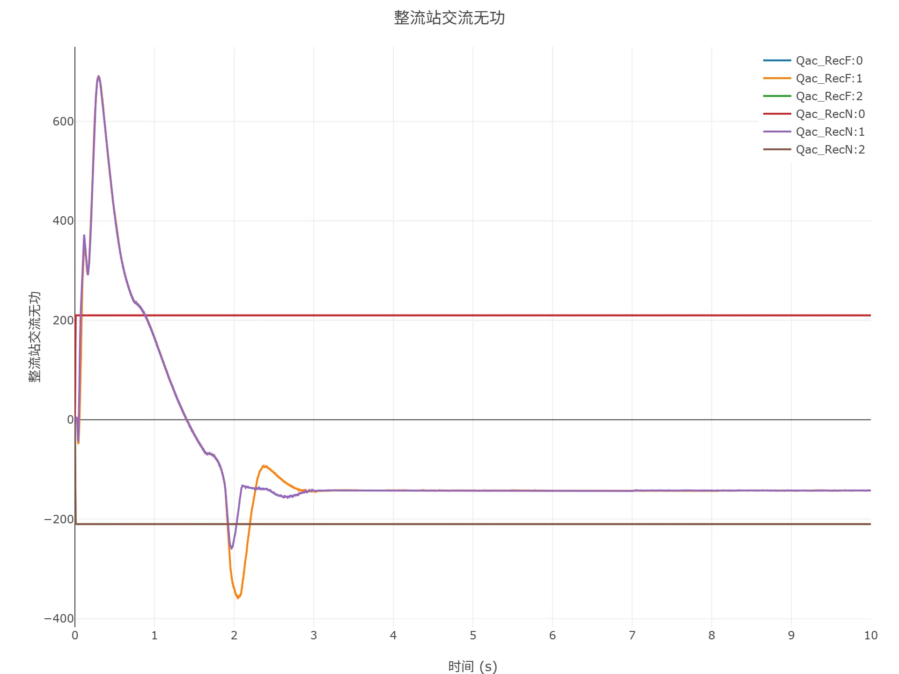
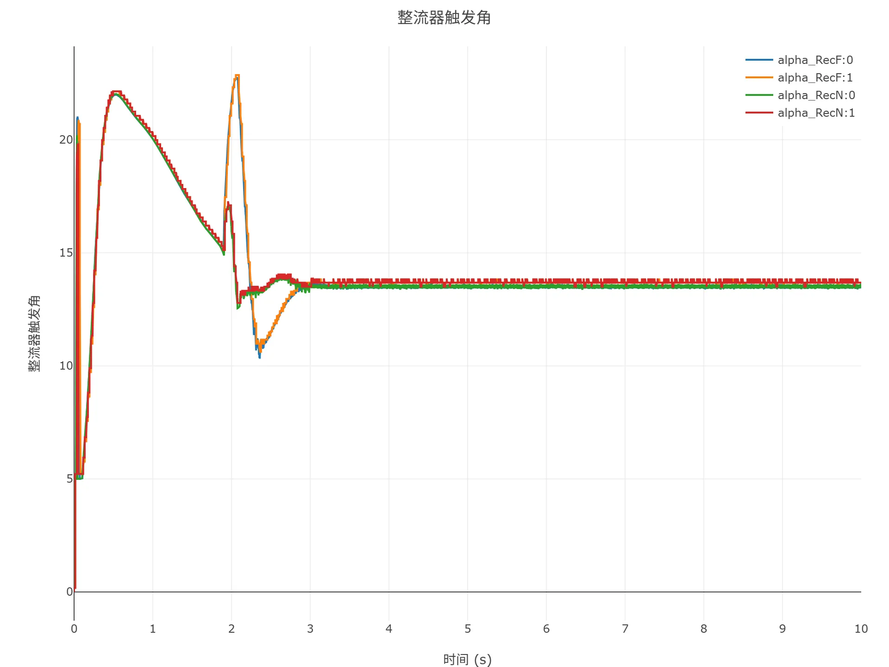
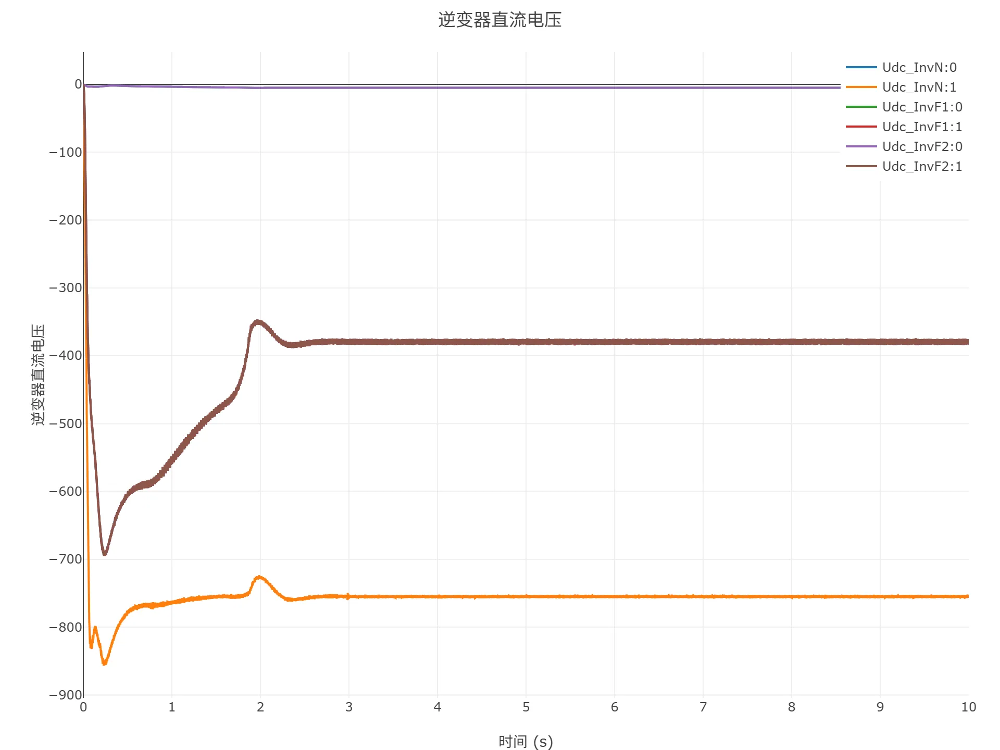
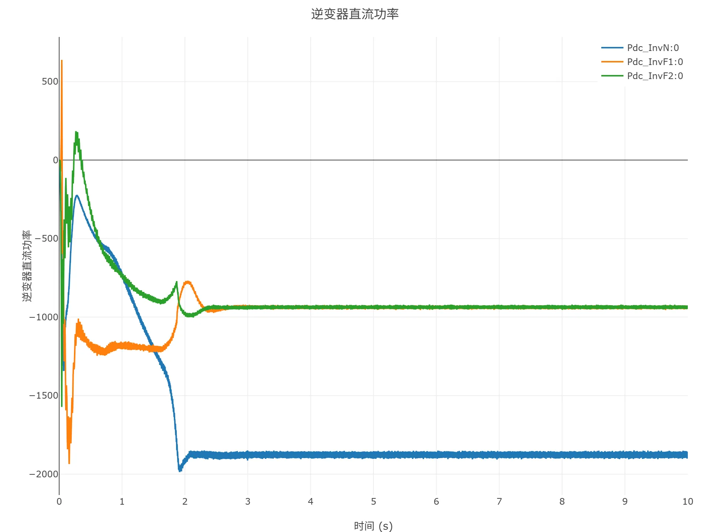

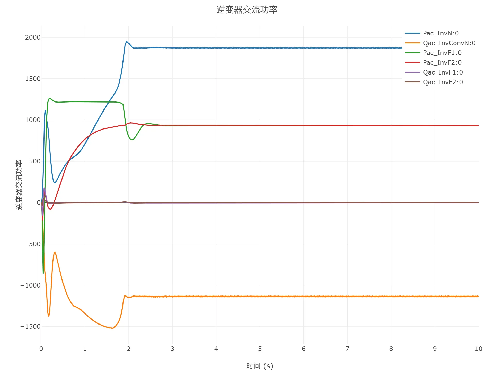
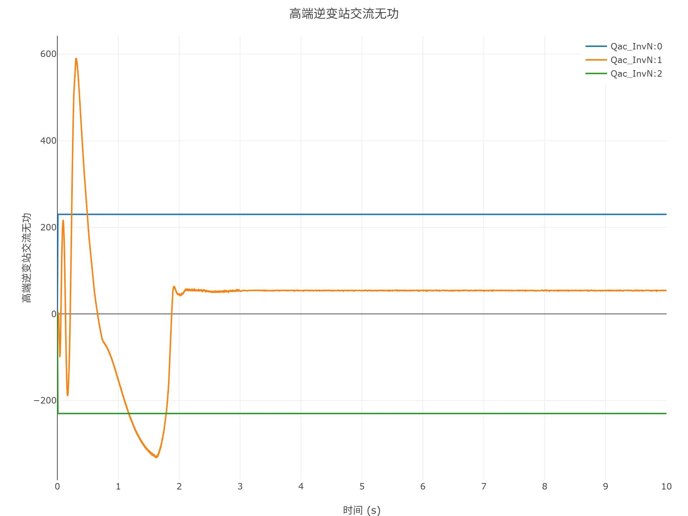

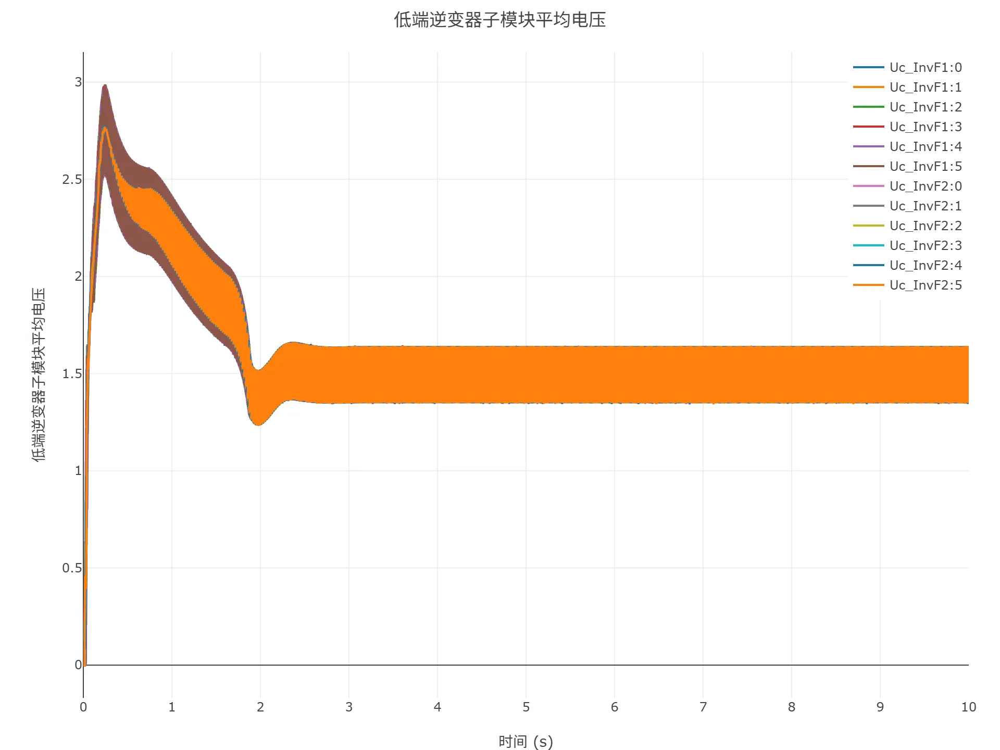

<!-- 
## 附：修改及调试日志

+ 20260129
  + 初次发布

-->