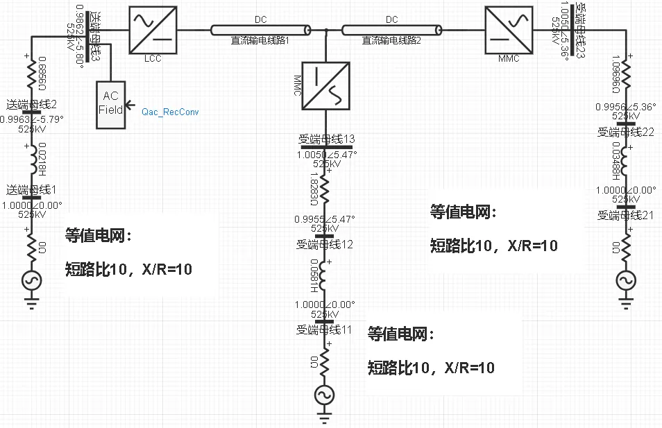
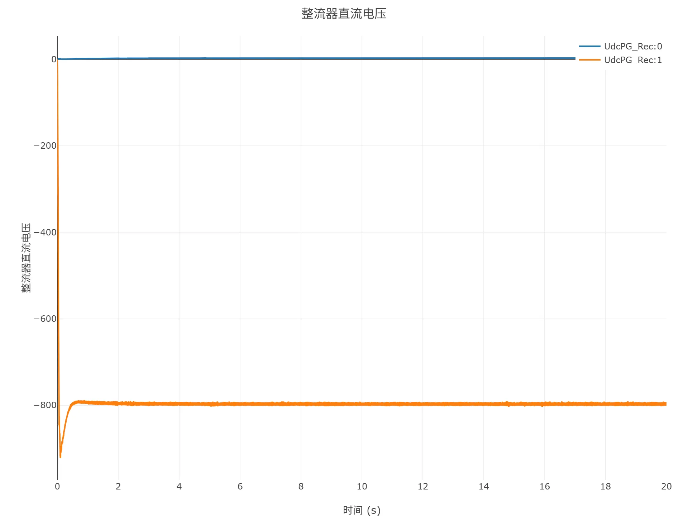
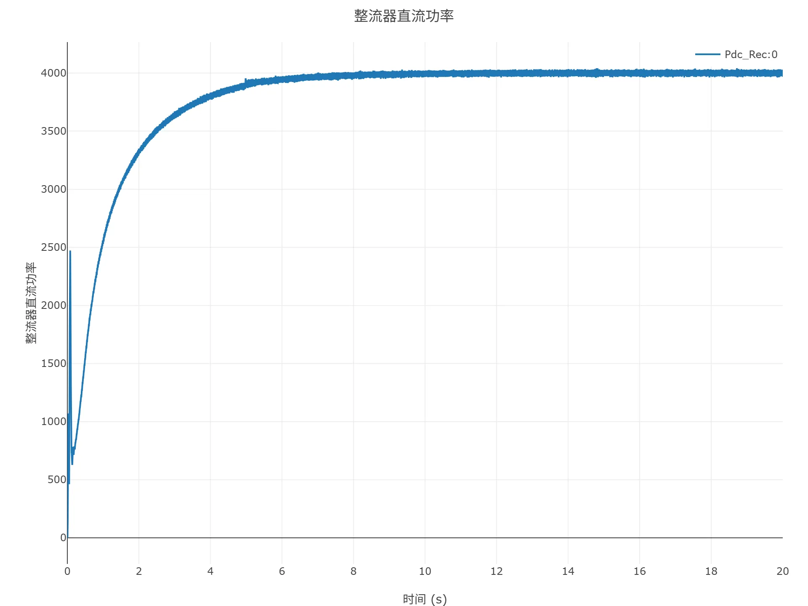
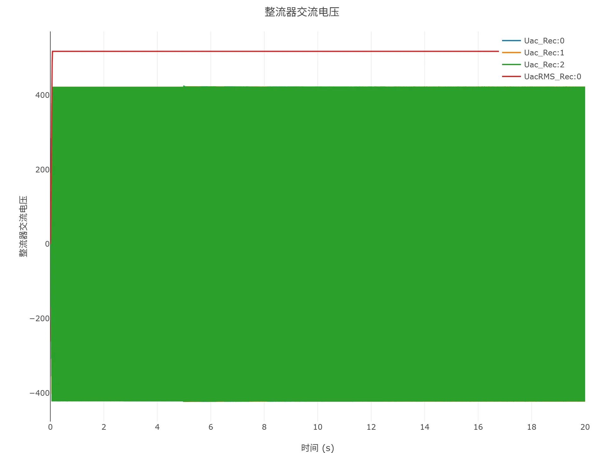
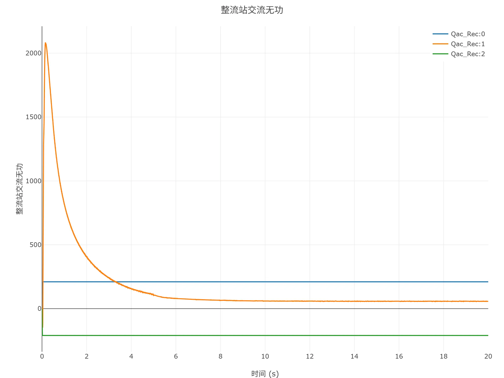
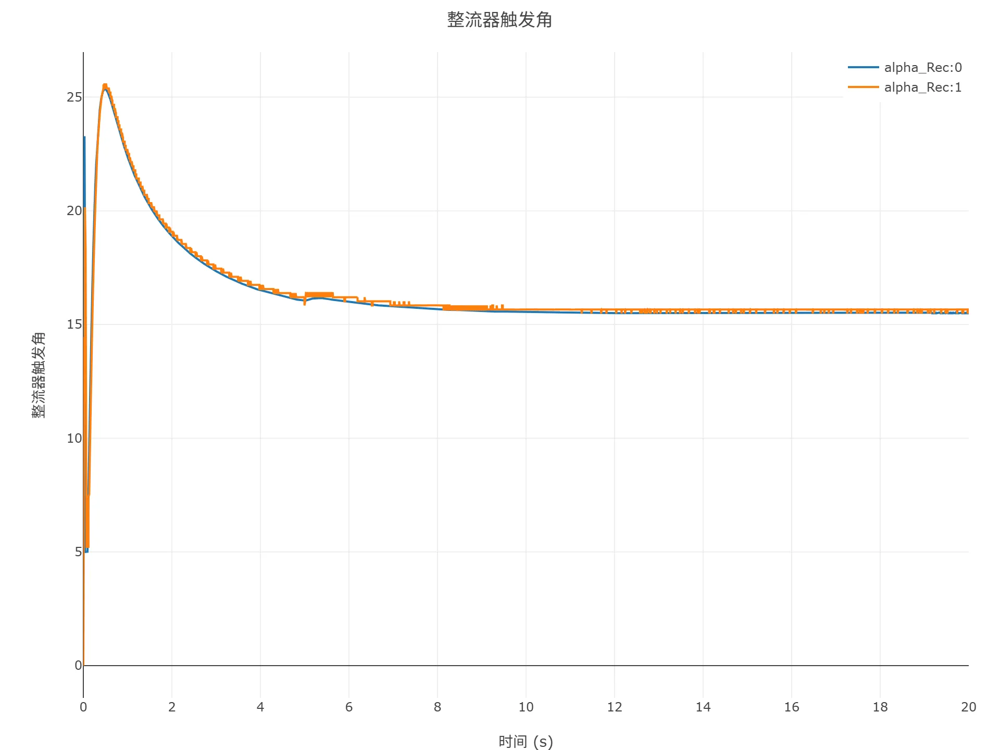
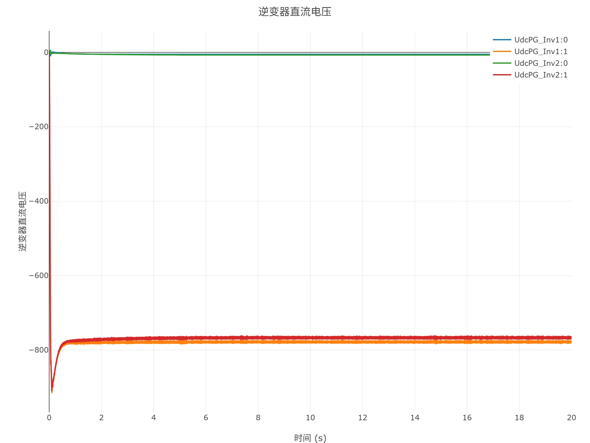
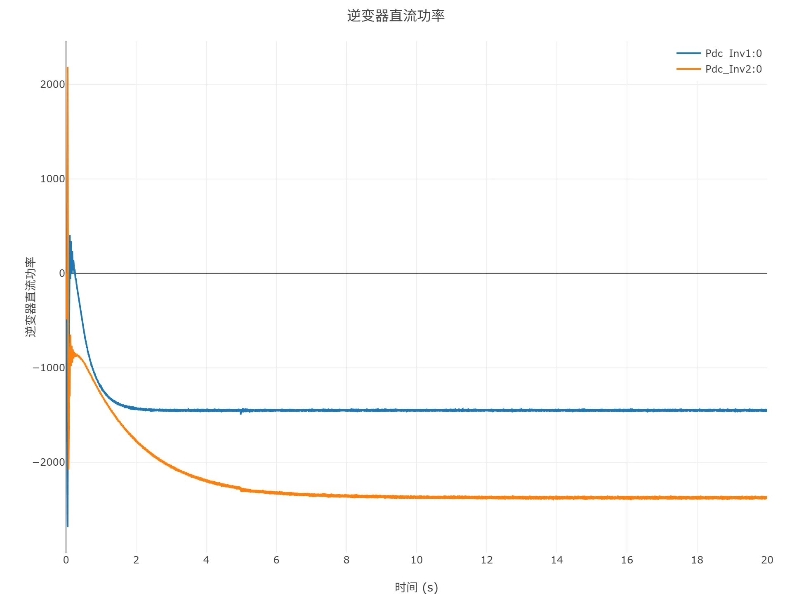
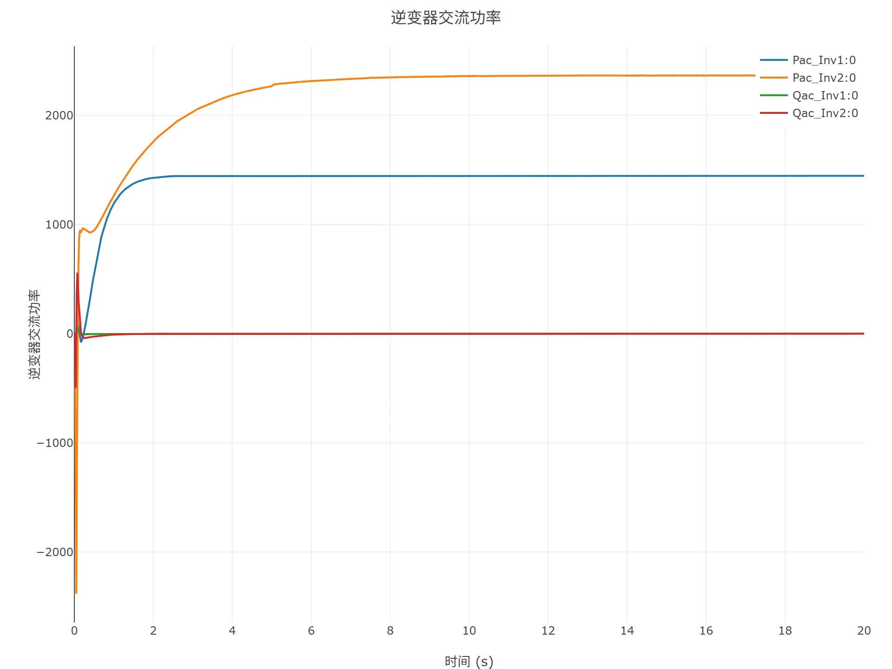
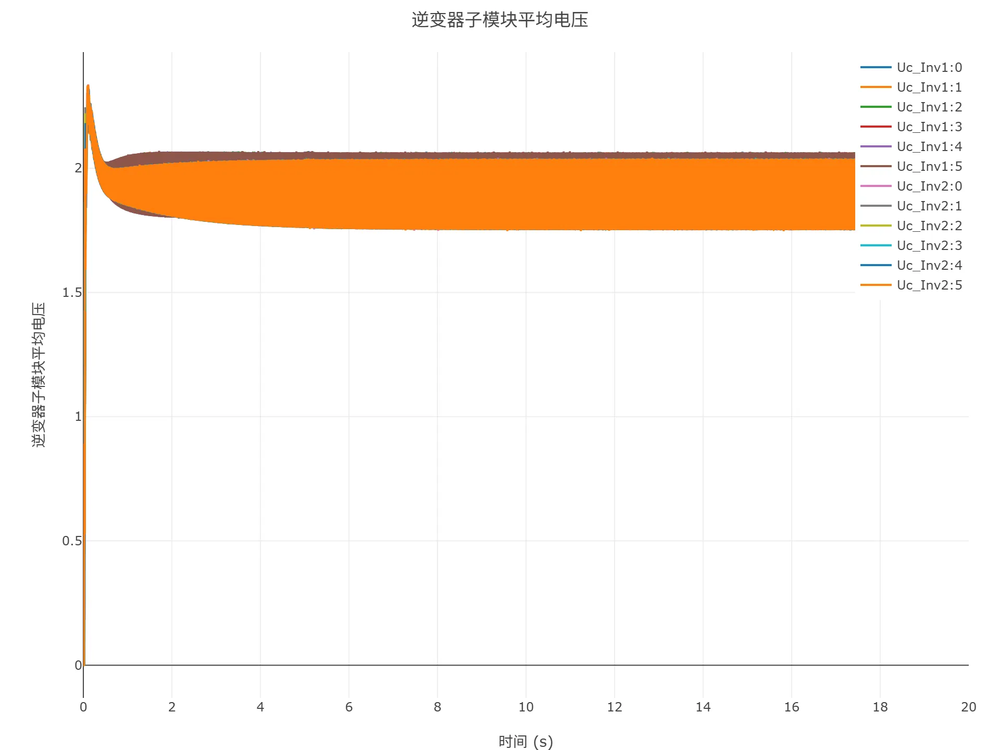

## 模型介绍

### 案例说明

混合多端直流输电系统案例模拟了一个三端混合单极直流输电系统，由一端常直换流站、两端柔直逆变站以及之间的两条直流输电线路构成。其中，常直换流站包含LCC及交流场，柔直换流站包含MMC。各端交流电网由短路比均为10的等值电路模拟。

案例中直流系统的关键参数如下表所示。

| 参数 | 单位 | 值 |
|:----------- |:---- |:---------:|
| 直流接线方式 | -- | 单负极大地回线 |
| 直流额定电压 | kV | 800 |
| 送端额定直流功率 | MW | 4000 |
| 送端网侧额定电压 | kV | 525 |
| 受端1额定直流功率 | MW | 1500 |
| 受端1网侧额定电压 | kV | 525 |
| 受端2额定直流功率 | MW | 2500 |
| 受端2网侧额定电压 | kV | 525 |

### 模型地址

点击打开模型地址：[**混合多端直流输电系统-v1**](cloudpss:/model/open-cloudpss/HVDC_Hybrid_MT-fdm-std-v1b1)

## 模型仿真测试

案例可以平稳有序地启动到规定初始潮流运行。

以下给出具体的仿真测试结果。

<!-- 
## 附：修改及调试日志

+ 20260129
  + 初次发布

-->