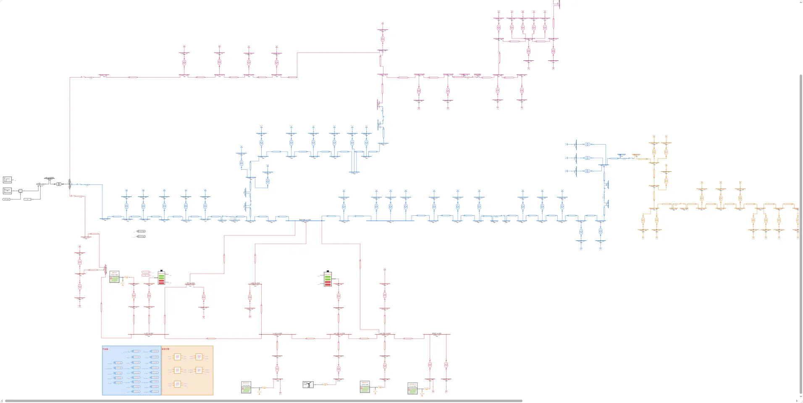
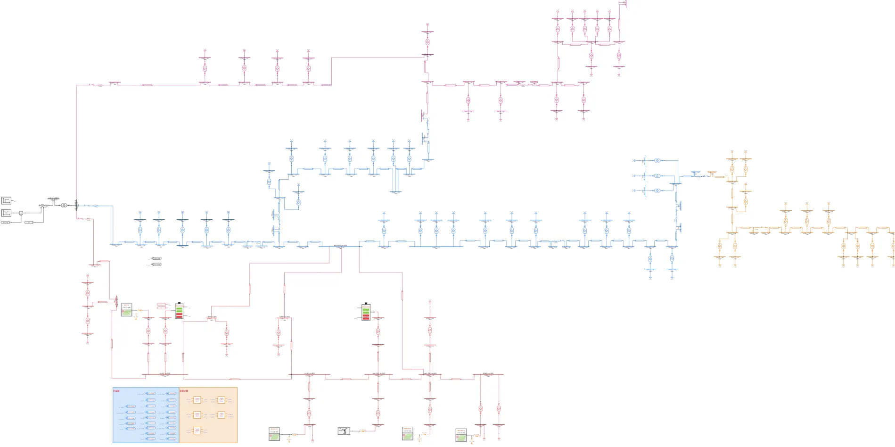
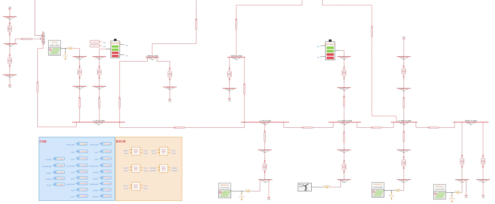
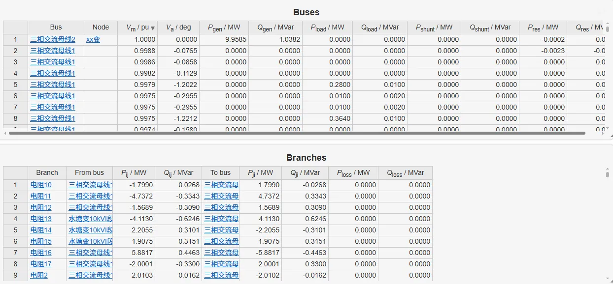
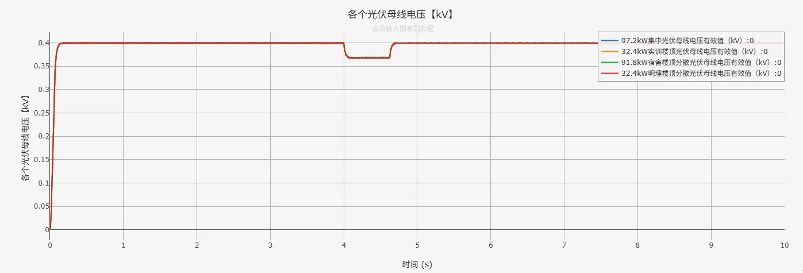
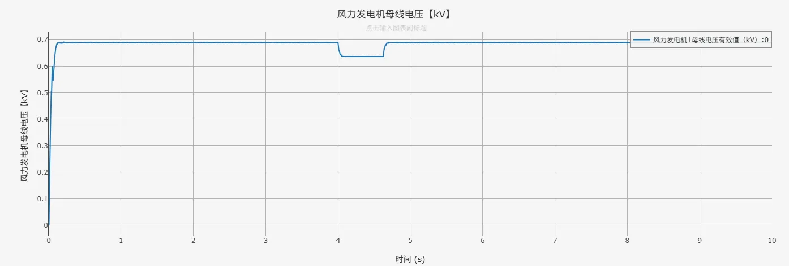
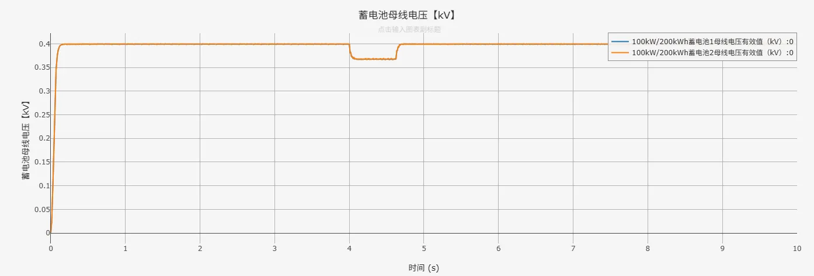
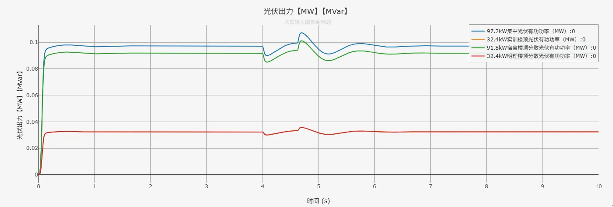
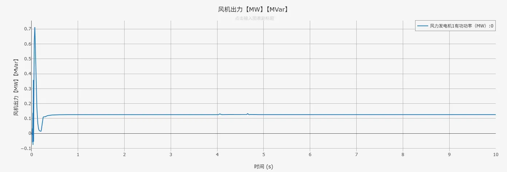
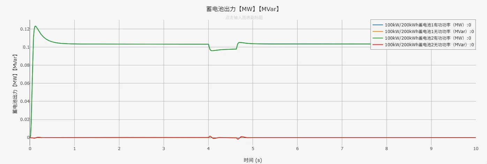

## 描述

交流微电网是一种基于交流配电的局部电力网络，能够灵活集成分布式电源（如光伏、风电）、储能系统及多样化交流负载，适用于现代智能社区、工业园区及偏远地区供电。相较于传统电网，交流微电网具备更高的供电可靠性和电能质量调节能力，支持并网/离网无缝切换，并可实现可再生能源的高效消纳与能量优化管理。

## 模型介绍

该交流微电网包含 1 个 35kV 变电站内的 5 条 10 kV 馈线和分布式光伏、风机、储能等设备，是一个典型的中低压环型配网模型。

<!--  -->

## 仿真

先启动潮流计算，将潮流计算结果写回模型。

在此潮流断面下启动电磁暂态仿真，设定`运行`标签页参数方案列表中的`电压跌落时间 [s]`为4，`电压恢复时间 [s]`为4.625，`电压跌落值 [s]`为0.2，设定一个高压侧的电压跌落事件，配置`电磁暂态仿真方案`，点击`启动任务`，可得到仿真结果如下图所示。

可以发现，外部电压发生跌落时，各设备母线电压恢复速度很快。

分布式光伏、风机、储能等设备出力稳定。

## 算例文件

算例文件下载链接：[model_admin_ac-microgrid.zip](./model_admin_ac-microgrid.zip "算例文件")  