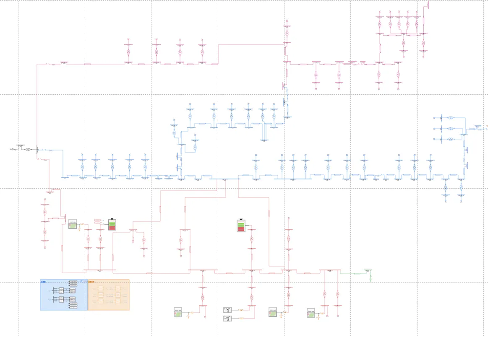
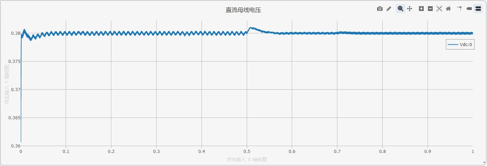
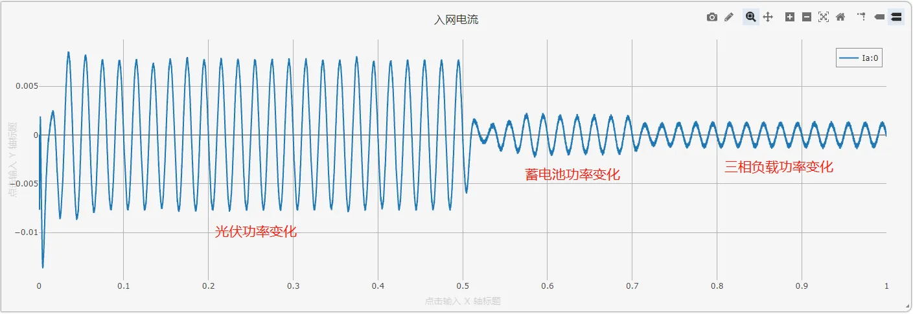
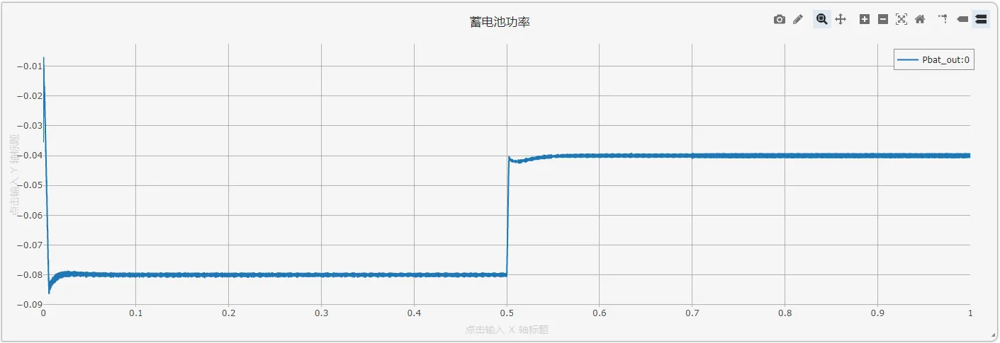
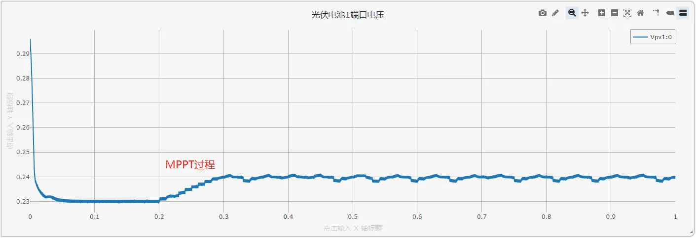
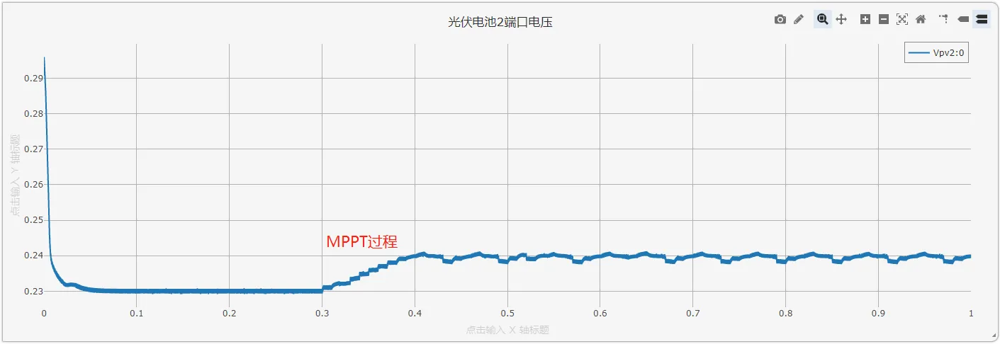
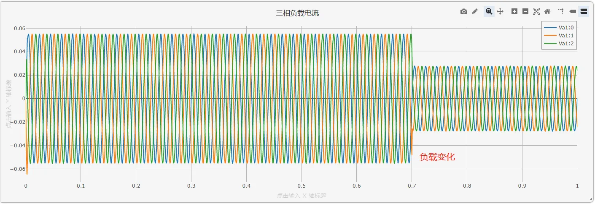

## 描述

交流微电网是一种基于交流配电的局部电力网络，能够灵活集成分布式电源（如光伏、风电）、储能系统及多样化交流负载，适用于现代智能社区、工业园区及偏远地区供电。相较于传统电网，交流微电网具备更高的供电可靠性和电能质量调节能力，支持并网/离网无缝切换，并可实现可再生能源的高效消纳与能量优化管理。

本算例构建了一个典型的交流微电网仿真模型，包含分布式光伏发电系统、风机、储能变流器，以及动态交流负载。通过协调控制逆变器、储能系统与电网接口，模拟微电网在并网模式下的经济调度或离网模式下的孤岛运行，验证其对电压/频率的主动支撑能力与多能源协同优化策略。

## 模型介绍

该交流微电网模型包含三个变电站的 5 条 10 kV 馈线和分布式光伏、风机、储能等设备。

<!--  -->

## 仿真

设定`运行`标签页参数方案列表中的`光伏电池1的MPPT使能时间 [s]`为0.2，`光伏电池2的MPPT使能时间 [s]`为0.3，`储能有功控制参考切换时间 [s]`为0.5，`三相负载大小切换时间 [s]`为0.7。配置`电磁暂态仿真方案`，点击`启动任务`，可得到仿真结果如下图所示。

<!--  -->

可以发现，负载(PV，蓄电池，三相负载)变化时，直流母线基本维持恒定。

入网电流具有较好的正弦度，负载变化时，入网电流跟随变化，响应速度快。
l

蓄电池功率按照给定参考变化，响应速度快。

<!--  -->

MPPT 通过扰动输入电压，使光伏电池输出功率在最大功率点振动。

负载电阻变化导致负载电流随之变化，可以看出电流环的响应速度快，电流正弦度高。