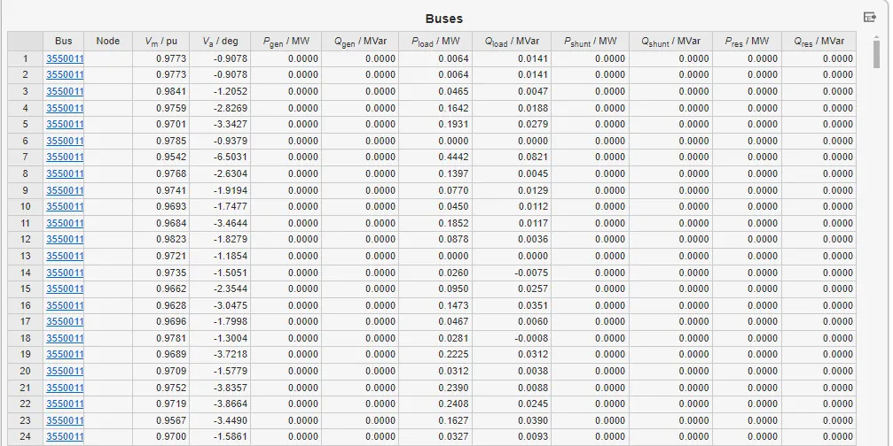

## 案例介绍

包含交流配电系统、直流配电系统、直流楼宇、直流数据中心、充电堆、直流负荷，以及VSC换流站等设备的**交直流混合微电网**的典型案例。

## 使用方法说明
   + VSC换流站直流侧至少包含一种 DC slack 或 DC droop 控制。

## 算例介绍

**交直流混合微电网**主要由交流配电系统、直流配电系统、VSC换流站三个部分组成。  

**交流配电系统**由 1 台交流电压源、383 条交流母线、157条交流传输线、42台交流变压器，以及37条交流负荷组成。

**直流配电系统**由 4 条直流母线、3 条直流传输线、 8条直流负荷组成。

**VSC换流站**由交流侧节点类型、直流侧节点类型、换流站注入交流网络的有功功率、换流站注入交流网络的无功功率、交流侧母线控制电压、变压器电阻、变压器电抗、滤波器电纳、换相电阻、换相电抗、恒定网损系数、线性网损系数、整流器二次损耗系数、逆变器二次损耗系数、直流电压下垂系数、电压下垂功率设定值、电压下垂电压设定值等参数组成。

## 算例仿真测试

对该**交直流混合微电网**模型进行了交直流潮流计算测试。

### 交直流潮流计算结果

交直流潮流计算结果如下所示。

通过交直流潮流计算结果，得出：交流母线电压保持在0.9344 ～1.0000 p.u.之间，满足运行要求；交流线路潮流水平整体较低，功率分布平衡；直流系统中功率注入与消纳相匹配，母线电压稳定在0.9969～1.000 p.u.；VSC换流站运行正常，具备稳定的有功传输与容性无功调节能力，有效支撑交直流系统协同运行。

<!-- import DocCardList from '@theme/DocCardList';

<DocCardList /> -->
