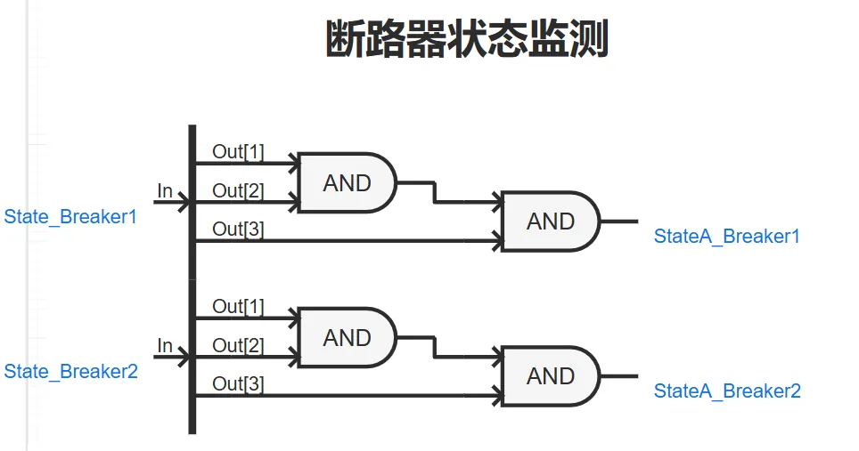
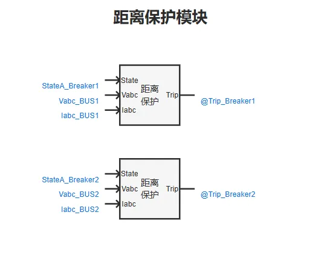
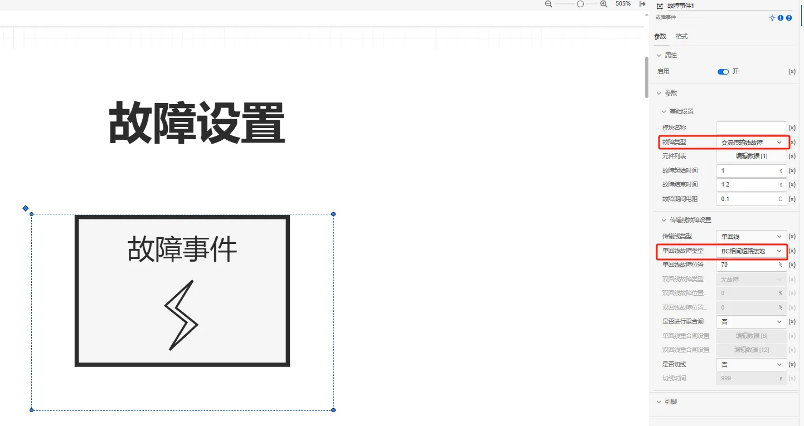
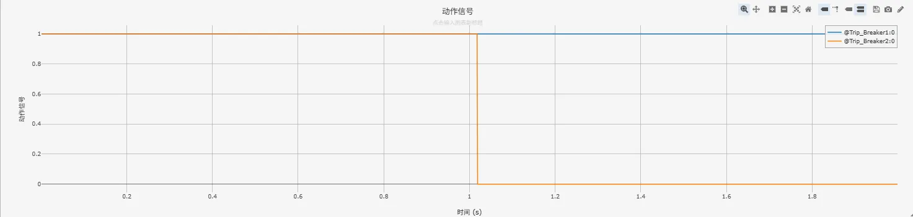
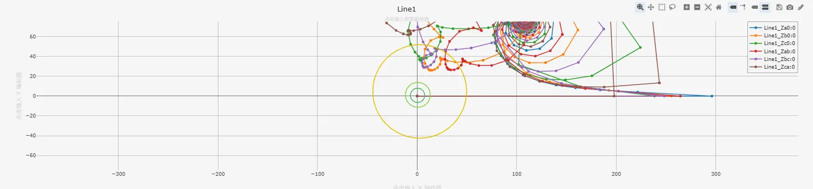

<!-- import DocCardList from '@theme/DocCardList';

<DocCardList /> -->

import Tabs from '@theme/Tabs'
import TabItem from '@theme/TabItem'

距离保护是反应故障点至保护安装地点之间距离（阻抗），并根据距离的远近而确定动作时间的一种保护装置。

## 算例介绍
该算例包含了 110kV 单电源系统、断路器状态监测、距离保护模块、故障设置模块、输出通道等，以下为各功能模块的详细介绍。

### 110kV 单电源系统

110kV 单电源系统由三相交流电压源、母线、断路器、负荷等元件组成，用于模拟一次系统的运行情况。

### 断路器状态监测

**断路器状态监测**部分用于测量被保护线路断路器开关状态信息，本算例将 3 维断路器状态信息（每一维代表断路器其中一相是否开断）取**与运算**后的结果作为断路器是否开断的标志（0：表示断开，1：表示闭合）。

### 距离保护模块

**距离保护模块**根据断路器开断状态信息，输入的三相电压、电流进行相关逻辑运算，判断故障位置是否在保护范围内，进而输出动作信号（0：使断路器断开，1：使断路器闭合）。

### 故障设置模块

**故障设置模块**用于模拟各元件的各类型故障，用户可以在其**参数面板**中选取交流传输线、交流母线等元件并进行故障类型设置。

### 输出通道

本算例中，**输出通道**部分用于可视化测量阻抗轨迹、故障录波输出等信息，其中**XY输出通道**与**辅助图形**元件配合使用用于可视化**距离保护整定边界**，**示波输出通道**用于可视化距离保护元件的测量电压、电流等模拟量以及动作信号等数字量。

### 

## 算例入门指南

### 算例地址

点击打开模型地址：[**电力系统距离保护基础案例**](cloudpss:/model/open-cloudpss/Distance_Protection-v1b1)  

### 运行

  用户设置好**故障场景**、**故障位置后**，配置好仿真时间、以及需要显示的通道数据，即可运行仿真。

### 结果

用户可在**故障设置**模块中通过设置交流传输线故障，故障线路选择为Line1或者Line2，仿真距离保护动作特性。距离保护相关日志记录、动作信号、量测信息如下图所示。

- 日志记录  

  

- 动作信号  

  

- 测量阻抗与整定边界  
  

