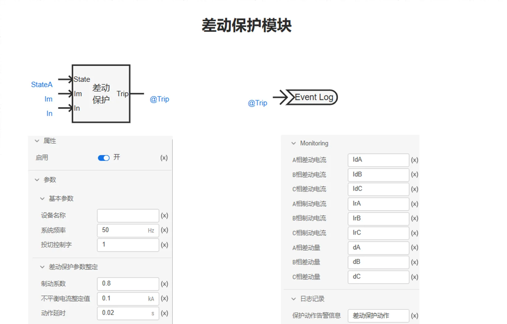
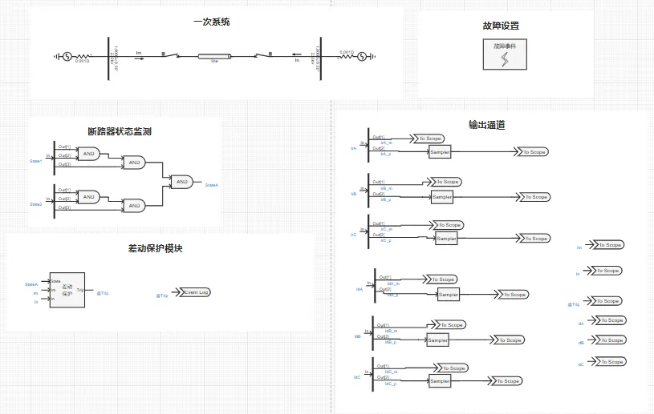
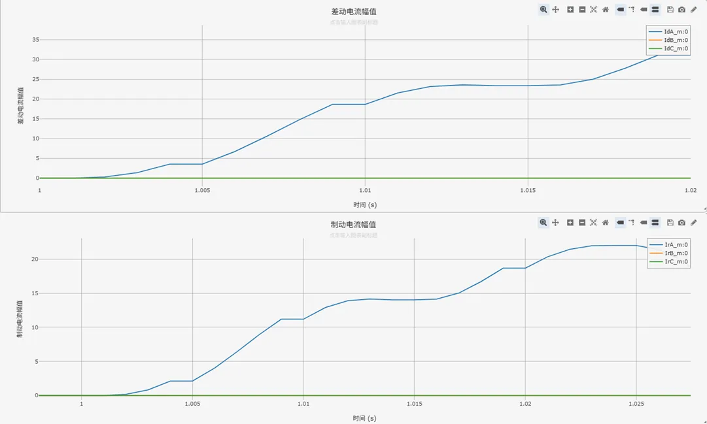

<!-- import DocCardList from '@theme/DocCardList';

<DocCardList /> -->

import Tabs from '@theme/Tabs'
import TabItem from '@theme/TabItem'

输电线路的纵联保护是将输电线路两端或各端（多端线路）的保护装置纵向连接起来，将各端的电气量（电流、功率的方向等）传送到对端并加以比较，以判断故障是在本线路范围内（**区内故障**）还是在本线路范围之外（**区外故障**），从而决定是否切断被保护线路。

## 算例介绍
该算例包含了 110kV 单电源系统、断路器状态监测、差动保护模块、故障设置模块、输出通道等，以下为各功能模块的详细介绍。
其中，一次系统部分、故障设置模块同[电力系统距离保护基础案例](docs/cases/10-emtlab/10-typical-cases/130-relay-protection-system/10-basic-protection-cases/10-distance-protection-case/index.md)中一次系统保持一致，不再赘述。

### 差动保护模块

**差动保护模块**根据断路器开断状态信息，输入的线路两端三相电流进行相关逻辑运算，判断故障位置是否在保护范围内，进而输出动作信号（0：使断路器断开，1：使断路器闭合）。

### 输出通道

本算例中，**输出通道**部分用于可视化线路两端测量电流、差动量、制动量等模拟量以及动作信号等数字量。

### 

## 算例入门指南

### 算例地址

点击打开模型地址：[**电力系统线路纵联差动保护基础案例**](http://cloudpss-calculate.local.ddns.cloudpss.net/model/open-cloudpss/Differential_Protection-v1a1)  

### 运行

  用户设置好**故障场景**、**故障位置后**，配置好仿真时间、以及需要显示的通道数据，即可运行仿真。

### 结果

用户可在**故障设置**模块中通过设置交流传输线故障，故障线路选择为Line，仿真线路差动保护动作特性。差动保护相关日志记录、动作信号、量测信息如下图所示。

- 日志记录

- 动作信号

- 差动电流与制动电流
  

