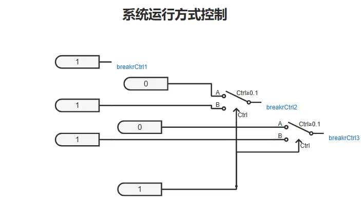
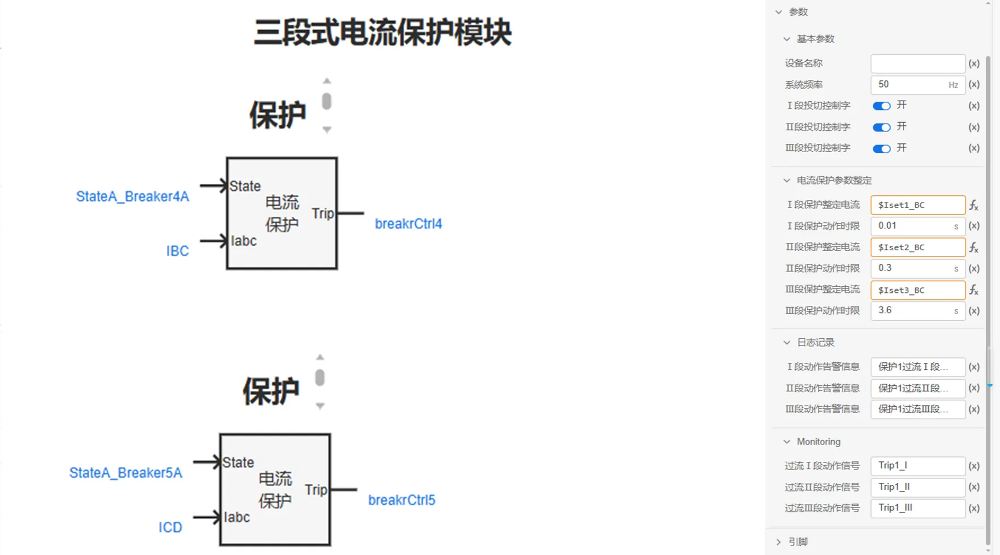
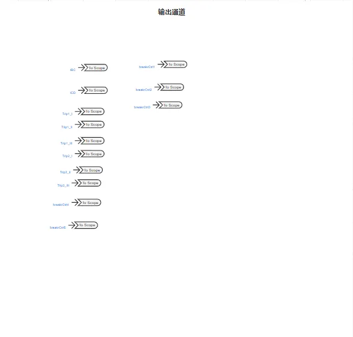
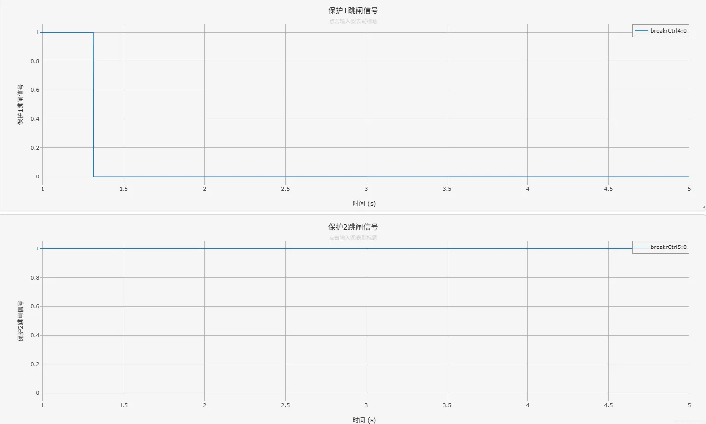
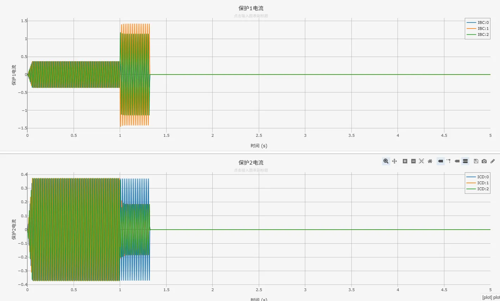

<!-- import DocCardList from '@theme/DocCardList';

<DocCardList /> -->

import Tabs from '@theme/Tabs'
import TabItem from '@theme/TabItem'

电力系统三段式电流保护是对输电线路设置具有不同动作电流和动作时限的三段保护装置。它根据短路电流的大小阶梯式整定各段保护的动作值和时限。其中，第Ⅰ段（瞬时电流速断） 以躲过本线路末端最大短路电流整定，瞬时动作切除线路近端故障；第Ⅱ段（限时电流速断） 以较小的动作电流（通常能保护本线路全长）和较短延时动作，作为第Ⅰ段的后备并切除本线路末端故障；第Ⅲ段（定时限过电流保护） 则按躲过最大负荷电流整定，以更长的时限动作，作为本线路第Ⅰ、Ⅱ段的近后备以及相邻线路的远后备保护。通过这种时限和定值的逐级配合，三段式电流保护能够有选择性地、可靠地隔离线路不同区段的短路故障。

## 算例介绍
该算例包含了 37kV 三电源系统、系统运行方式控制部分、断路器状态监测、三段式电流保护模块、故障设置模块、输出通道等，以下为各功能模块的详细介绍。
其中，断路器状态监测、故障设置模块同[电力系统距离保护基础案例](docs/cases/10-emtlab/10-typical-cases/130-relay-protection-system/10-basic-protection-cases/10-distance-protection-case/index.md)中保持一致，不再赘述。

### 37kV 三电源系统

**37kV 三电源系统**由三个戴维南等值电压源、线路、负荷、断路器等一次设备组成。

### 系统运行方式控制

本算例中，**系统运行方式控制**部分用于控制系统大、小方式运行模式。

### 三段式电流保护模块

**三段式电流保护模块**根据断路器开断状态信息，被保护线路上游（靠近电源侧）输出的三相电流进行相关逻辑运算，判断故障位置是否在保护范围内，进而输出动作信号（0：使断路器断开，1：使断路器闭合）。

### 输出通道

本算例中，**输出通道**部分用于可视化线路测量电流等模拟量以及动作信号等数字量。

### 

## 算例入门指南

### 算例地址

点击打开模型地址：[**电力系统三段式电流保护基础案例**](cloudpss:/model/open-cloudpss/Current_Protection-v1b1)  

### 运行

  用户设置好**故障场景**、**故障位置后**，配置好仿真时间、以及需要显示的通道数据，即可运行仿真。

- 运行方式修改
  
  用户可在`基本设置`中修改系统运行方式。

  

### 结果

用户可在**故障设置**模块中通过设置交流传输线故障，故障线路选择为LineBC或者LineCD，仿真线路三段式电流保护动作特性。三段式电流保护相关日志记录、动作信号、量测信息如下图所示。

- 日志记录

- 动作信号

- 被保护线路短路电流
  

