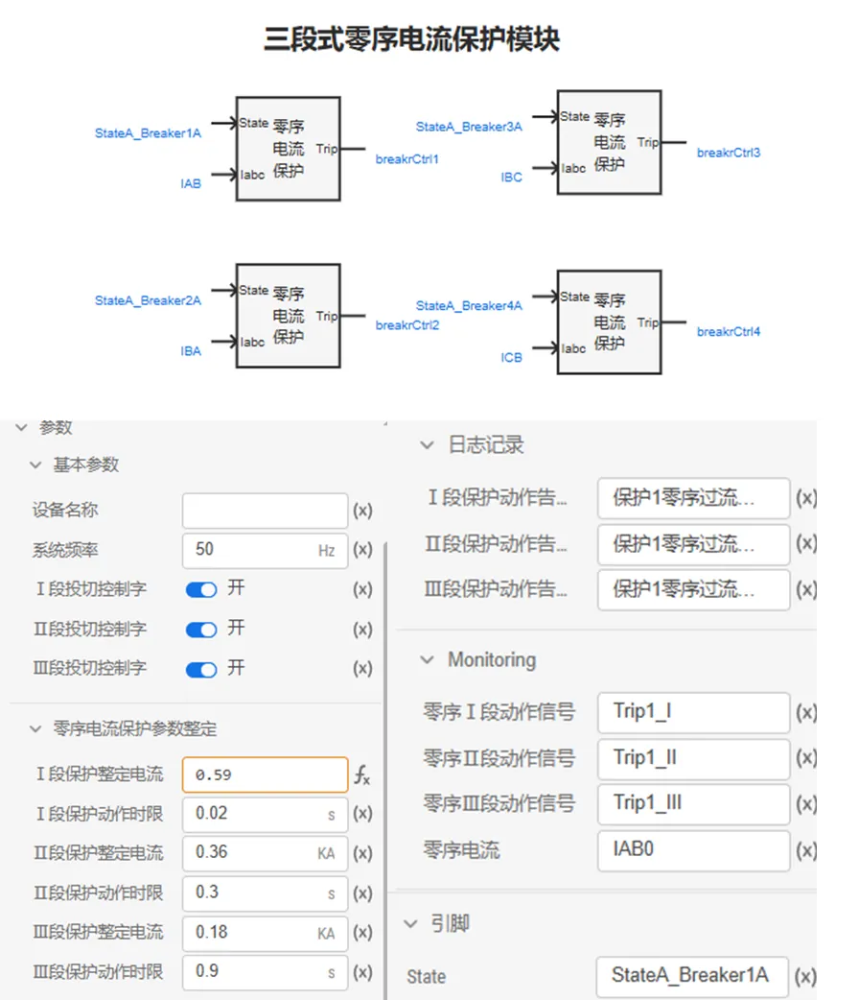
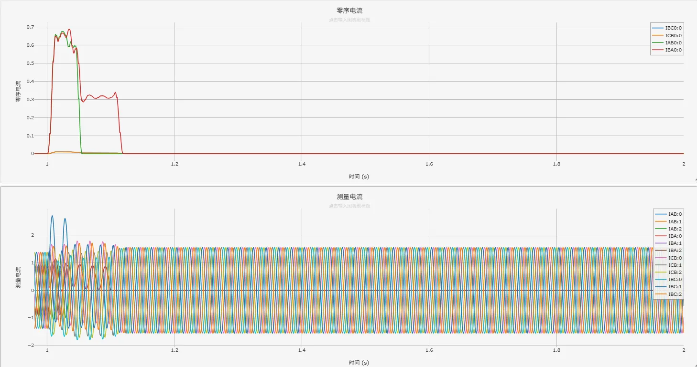

<!-- import DocCardList from '@theme/DocCardList';

<DocCardList /> -->

import Tabs from '@theme/Tabs'
import TabItem from '@theme/TabItem'

电力系统三段式零序电流保护是针对输电线路不对称接地故障（如单相接地、两相接地短路）设置的三段式保护装置。它利用故障时产生的零序电流作为动作判据，根据零序电流的大小和故障点位置，阶梯式整定各段保护的动作值和时限。其中，第Ⅰ段（零序电流速断） 以躲过被保护线路末端接地故障可能出现的最大零序电流整定，瞬时动作快速切除线路近端接地故障；第Ⅱ段（零序电流限时速断） 以较小的动作电流（通常能保护本线路全长）和较短延时动作，作为第Ⅰ段的后备并切除本线路末端接地故障；第Ⅲ段（零序过电流保护） 则按躲过线路正常运行或区外故障时可能出现的最大不平衡零序电流整定，以更长的时限动作，作为本线路第Ⅰ、Ⅱ段的近后备以及相邻线路接地故障的远后备保护。通过这种时限和定值的逐级配合，三段式零序电流保护能够灵敏、有选择性地检测和隔离输电线路上的不对称接地故障。

## 算例介绍
该算例包含了 110kV 四电源系统、断路器状态监测、三段式零序电流保护模块、故障设置模块、输出通道等，以下为各功能模块的详细介绍。
其中，断路器状态监测、故障设置模块同[电力系统距离保护基础案例](docs/cases/10-emtlab/10-typical-cases/130-relay-protection-system/10-basic-protection-cases/10-distance-protection-case/index.md)中保持一致，不再赘述。

### 110kV 四电源系统

**110kV 四电源系统**由四个戴维南等值电压源、变压器、线路、负荷、断路器等一次设备组成。

### 三段式零序电流保护模块

**三段式零序电流保护模块**根据断路器开断状态信息，被保护线路上游（靠近电源侧）输出的三相电流进行相关逻辑运算，判断故障位置是否在保护范围内，进而输出动作信号（0：使断路器断开，1：使断路器闭合）。

### 输出通道

本算例中，**输出通道**部分用于可视化线路测量三相电流、零序电流等模拟量以及动作信号等数字量。

### 

## 算例入门指南

### 新建算例

可以在**SimStudio 工作台**页面中，点击**新建**按钮，在弹出框中选择**继电保护系统**，创建**电力系统三段式零序电流保护基础案例**。

### 运行

  用户设置好**故障场景**、**故障位置后**，配置好仿真时间、以及需要显示的通道数据，即可运行仿真。

### 结果

用户可在**故障设置**模块中通过设置交流传输线故障，故障线路选择为LineAB或者LineBC，仿真线路三段式电流保护动作特性。三段式电流保护相关日志记录、动作信号、量测信息如下图所示。

- 日志记录

- 动作信号

- 被保护线路短路电流
  

