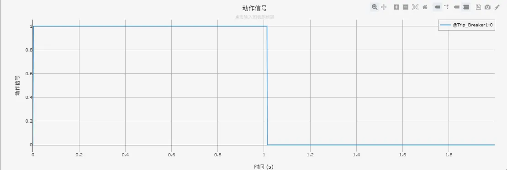
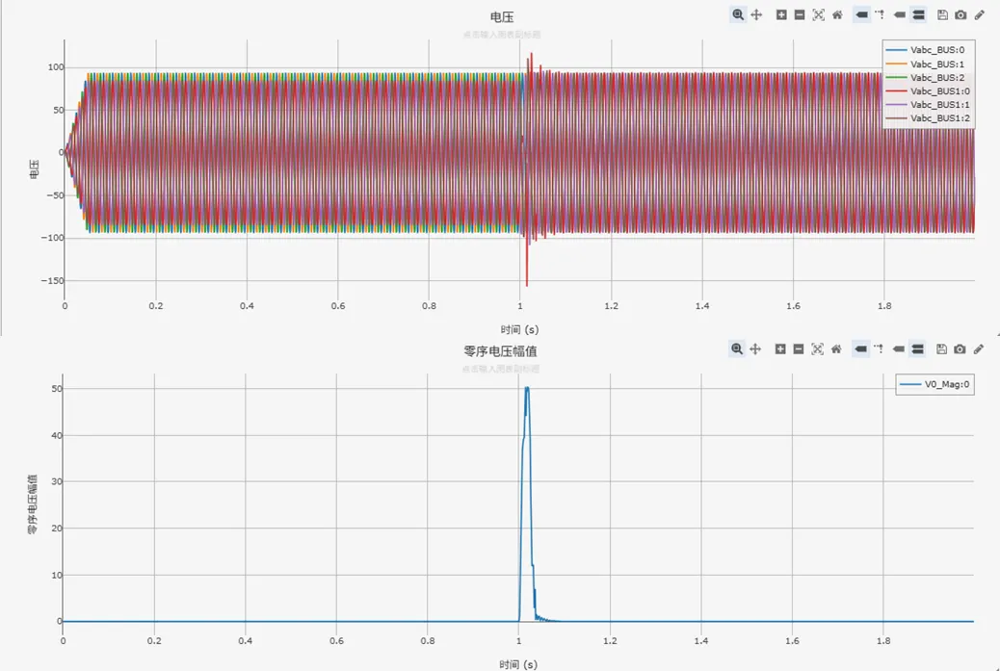

<!-- import DocCardList from '@theme/DocCardList';

<DocCardList /> -->

import Tabs from '@theme/Tabs'
import TabItem from '@theme/TabItem'

电力系统零序电压保护指在大电流接地系统发生接地故障后，利用零序电压构成保护接地短路的继电保护装置。正常情况下，UA+UB+UC的向量和为0，当系统发生单相接地后，UA+UB+UC的向量和不再为0，这个不为0的值便是零序电压，通过检测该电压能够反映系统是否发生单相接地故障。

## 算例介绍
该算例包含了 110kV 单电源系统、断路器状态监测、零序电压保护模块、故障设置模块、输出通道等，以下为各功能模块的详细介绍。
其中，110kV 单电源系统、断路器状态监测、故障设置模块同[电力系统距离保护基础案例](docs/cases/10-emtlab/10-typical-cases/130-relay-protection-system/10-basic-protection-cases/10-distance-protection-case/index.md)中保持一致，不再赘述。

### 零序电压保护模块

**零序电压保护模块**根据断路器开断状态信息，母线监测的三相电压进行相关逻辑运算，判断是否发生接地短路故障，进而输出动作信号（0：使断路器断开，1：使断路器闭合）。

### 输出通道

本算例中，**输出通道**部分用于可视化线路测量三相电压、零序电压等模拟量以及动作信号等数字量。

### 

## 算例入门指南

### 算例地址

点击打开模型地址：[**电力系统零序电压保护基础案例**](http://cloudpss-calculate.local.ddns.cloudpss.net/model/open-cloudpss/Zero_Voltage_Protection-v1a1)  

### 运行

  用户设置好**故障场景**、**故障位置后**，配置好仿真时间、以及需要显示的通道数据，即可运行仿真。

### 结果

用户可在**故障设置**模块中通过设置交流传输线故障，故障线路选择为Line1，仿真电力系统零序电压保护动作特性。电力系统零序电压保护相关日志记录、动作信号、量测信息如下图所示。

- 日志记录

- 动作信号

- 母线电压
  

