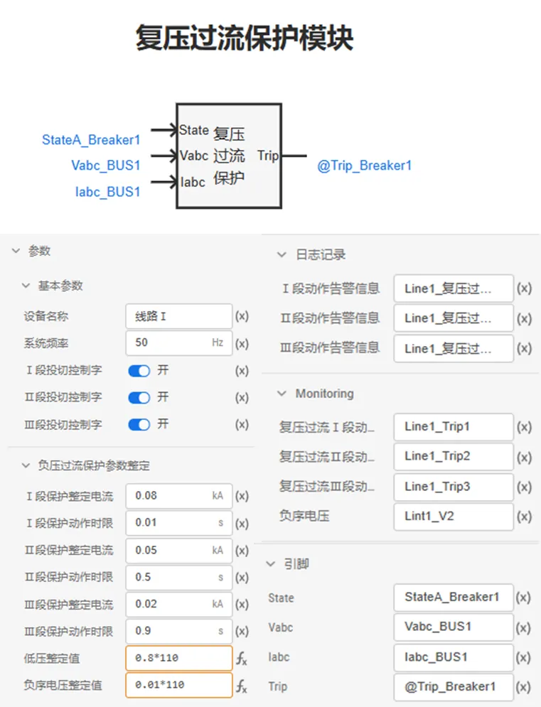
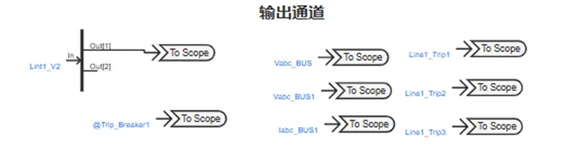
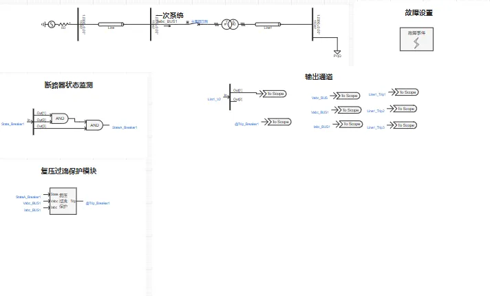
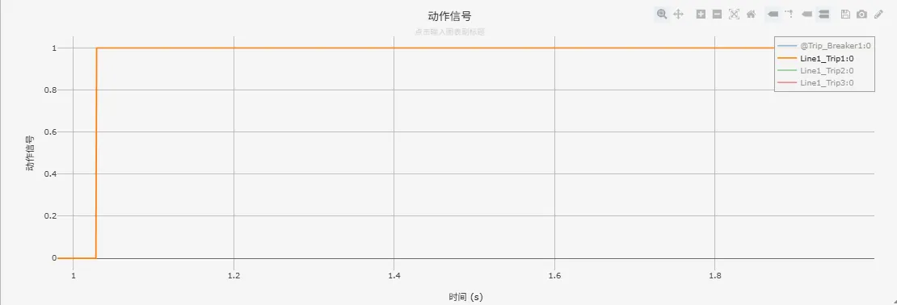
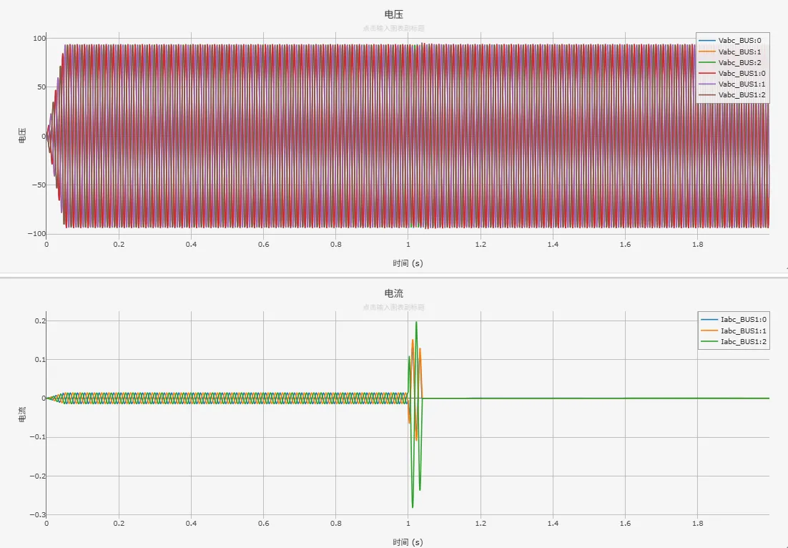

<!-- import DocCardList from '@theme/DocCardList';

<DocCardList /> -->

import Tabs from '@theme/Tabs'
import TabItem from '@theme/TabItem'

电力系统复压过流保护（又称复合电压闭锁过电流保护）是一种集低电压闭锁和负序电压闭锁功能于一体的过电流保护装置。它通过在传统过电流保护基础上引入电压判据（低电压和/或负序电压），显著提高了过流元件的动作准确性和可靠性。当系统发生不对称短路（如两相短路）或严重三相对称短路时，保护安装处的相电压会显著降低，同时负序电压会显著升高。该保护通过检测到过电流且同时满足复合电压条件（相电压低于整定值 或 负序电压高于整定值）时，经预设延时动作于跳闸。通过电压闭锁有效防止了在电动机启动、变压器励磁涌流、系统振荡等非故障性过电流情况下的误动作，使其特别适用于作为发电机、变压器、母线及高压输电线路的后备保护。

## 算例介绍
该算例包含了 110kV 单电源系统、断路器状态监测、零序电压保护模块、故障设置模块、输出通道等，以下为各功能模块的详细介绍。
其中，110kV 单电源系统、断路器状态监测、故障设置模块同[电力系统距离保护基础案例](docs/cases/10-emtlab/10-typical-cases/130-relay-protection-system/10-basic-protection-cases/10-distance-protection-case/index.md)中保持一致，不再赘述。

### 复压过流保护模块

**复压过流保护模块**根据断路器开断状态信息，变压器高压侧的三相电压、电流进行相关逻辑运算，判断是否发生接地短路故障，进而输出动作信号（0：使断路器断开，1：使断路器闭合）。

### 输出通道

本算例中，**输出通道**部分用于可视化变压器高压侧测量三相电压、零序电压等模拟量以及动作信号等数字量。

### 

## 算例入门指南

### 算例地址

点击打开模型地址：[**电力系统复压过流保护基础案例**](http://cloudpss-calculate.local.ddns.cloudpss.net/model/open-cloudpss/Compound_Voltage_Over_Current_Protection-v1a1)  

### 运行

  用户设置好**故障场景**、**故障位置后**，配置好仿真时间、以及需要显示的通道数据，即可运行仿真。

### 结果

用户可在**故障设置**模块中通过设置交流传输线故障，故障线路选择为Line1，仿真电力系统复压过流保护动作特性。电力系统零序电压保护相关日志记录、动作信号、量测信息如下图所示。

- 日志记录

- 动作信号

- 变压器高压侧电压、电流
  

