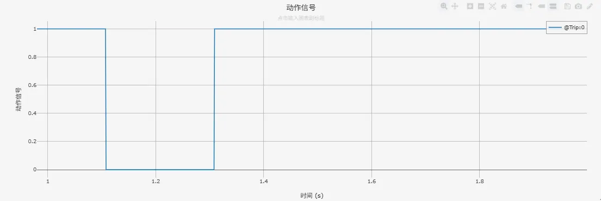
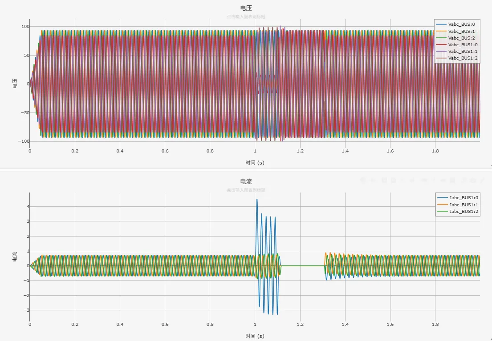

<!-- import DocCardList from '@theme/DocCardList';

<DocCardList /> -->

import Tabs from '@theme/Tabs'
import TabItem from '@theme/TabItem'

电力系统自动重合闸装置（ARC）是一种在输电线路因故障被保护装置断开后，自动、迅速地将断路器重新合闸的控制装置。其核心设计基于电力系统运行经验：线路故障中大部分（尤其是雷击、鸟害、风偏等引起的故障）属于瞬时性故障，在故障点电弧熄灭、绝缘强度恢复后，线路可恢复正常运行。重合闸通过检测断路器跳闸位置与无电流状态，经预先整定的重合闸延时（通常为0.3秒至数秒）后自动发出合闸命令。若重合于瞬时性故障上，则线路成功恢复供电，显著提高了供电连续性；若重合于永久性故障上，则保护装置会再次动作跳开断路器。根据重合策略不同，主要分为三相重合闸（全线断开后三相同时重合）和单相重合闸（仅断开故障相并重合该相，适用于高压/超高压线路）。重合闸作为电力系统重要的自愈控制手段，极大地降低了瞬时故障造成的停电影响，是提升输电线路供电可靠性和系统稳定性的关键环节。

## 算例介绍
该算例包含了 110kV 单电源系统、断路器状态监测、重合闸模块、故障设置模块、输出通道等，以下为各功能模块的详细介绍。
其中，110kV 单电源系统、断路器状态监测、故障设置模块同[电力系统距离保护基础案例](docs/cases/10-emtlab/10-typical-cases/130-relay-protection-system/10-basic-protection-cases/10-distance-protection-case/index.md)中保持一致，不再赘述。

### 重合闸模块

**重合闸模块**检测到断路器断开时（一般仿真断路器断开一定时间后，断路器即处于无流状态），自动输出合闸信号（0：使断路器断开，1：使断路器闭合），重合闸模块一般不单独使用，通常与保护元件配合。

### 输出通道

本算例中，**输出通道**部分用于可视化变压器高压侧测量三相电压、零序电压等模拟量以及动作信号等数字量。

### 

## 算例入门指南

### 算例地址

点击打开模型地址：[**电力系统重合闸基础案**](http://cloudpss-calculate.local.ddns.cloudpss.net/model/open-cloudpss/Reclose-v1a1)  

### 运行

  用户设置好**故障场景**、**故障位置后**，配置好仿真时间、以及需要显示的通道数据，即可运行仿真。

### 结果

用户可在**故障设置**模块中通过设置交流传输线故障，故障线路选择为Line1，仿真电力系统重合闸动作特性。电力系统重合闸相关日志记录、动作信号、量测信息如下图所示。

- 日志记录

- 动作信号

- 送出线路电压、电流
  

